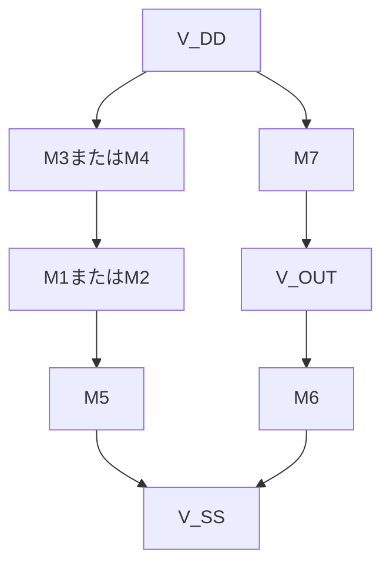

# 二段構成CMOSオペアンプ

## 序章　二段構成CMOSオペアンプとは

### 0.1　二段構成オペアンプの概要

### 0.2　第1段と第2段の役割

### 0.3　入力から出力までの信号経路

### 0.4　二段構成にする理由

### 0.5　主な要求仕様

## 第1章　オペアンプとMOSFETの基礎

### 1.1　差動入力と出力電圧

### 1.2　開ループ動作と負帰還

### 1.3　理想オペアンプと実際のオペアンプ

### 1.4　NMOSとPMOS

### 1.5　しきい値電圧とオーバードライブ電圧

### 1.6　線形領域と飽和領域

### 1.7　ドレイン電流

### 1.8　相互コンダクタンス (g_m)

### 1.9　出力抵抗 (r_o)

### 1.10　MOSFETの小信号モデル

## 第2章　二段構成オペアンプを構成する基本回路

### 2.1　ソース接地増幅回路

### 2.2　電流源負荷と能動負荷

### 2.3　NMOS・PMOS電流ミラー

### 2.4　MOS差動対

### 2.5　テール電流と電流の振り分け

### 2.6　電流ミラーによる差動－単一出力変換

### 2.7　基本回路の電圧利得と出力抵抗

## 第3章　二段構成オペアンプの全体動作

### 3.1　二段構成オペアンプの全体回路

### 3.2　第1段の差動増幅回路

### 3.3　電流ミラー能動負荷

### 3.4　第2段のソース接地増幅回路

### 3.5　バイアス電流の流れ

### 3.6　入力から出力までの信号経路

### 3.7　各MOSFETの役割


第4章　直流動作と低周波利得

4.1 直流動作点
4.2 各MOSFETの飽和条件
4.3 電圧ヘッドルーム
4.4 入力同相電圧範囲
4.5 出力電圧範囲
4.6 第1段の電圧利得
4.7 第2段の電圧利得
4.8 二段全体の開ループ利得
4.9 gm・ro・バイアス電流と利得の関係

第5章　伝達関数・極・零点・ミラー補償

5.1 二段構成オペアンプの伝達関数
5.2 極と零点の基本
5.3 極と零点が利得・位相に与える影響
5.4 第1段出力ノードと出力ノードの極
5.5 支配極と非支配極
5.6 二段構成オペアンプが不安定になりやすい理由
5.7 補償容量 Cc とミラー効果


第6章　大信号応答と主要仕様

6.1 小信号応答と大信号応答
6.2 補償容量の充放電
6.3 スルーレート
6.4 セトリング時間
6.5 開ループ利得
6.6 利得帯域幅積
6.7 位相余裕
6.8 入力同相電圧範囲
6.9 出力電圧範囲
6.10 消費電力と負荷容量
6.11 主要仕様間のトレードオフ

第7章　要求仕様を満たすための手計算設計

7.1 要求仕様の整理
7.2 電源電圧・負荷容量・消費電力の確認
7.3 補償容量 Cc の決定
7.4 スルーレートからテール電流を決める
7.5 利得帯域幅積から入力段の gm を決める
7.6 gm とバイアス電流からオーバードライブ電圧を決める
7.7 MOSFETの W/L を決める
7.8 位相余裕から第2段の gm を決める
7.9 第2段のバイアス電流と W/L を決める
7.10 電流ミラーと電流源の W/L を決める
7.11 第1段と第2段の利得を計算する
7.12 二段全体の開ループ利得を確認する
7.13 入力同相電圧範囲を確認する
7.14 出力電圧範囲を確認する
7.15 各MOSFETの飽和条件を確認する
7.16 消費電力を確認する
7.17 極・零点・位相余裕を概算する
7.18 仕様未達時の設計値の修正方法
7.19 手計算結果のまとめと設計表の作成


## 序章　二段構成CMOSオペアンプとは

# 小さな信号を、次の回路へ

## オペアンプ

センサやマイクから出てくる信号は、とても小さい。
その小さな変化を受け取り、扱いやすい電圧に変える。
オペアンプは、電子機器の中でそんな仕事をしている。
オペアンプには、非反転入力と反転入力という2つの入力がある。オペアンプは、この2つの入力電圧の差を受け取り、その差を大きくして出力する。

```text
差動入力電圧 = 非反転入力電圧 − 反転入力電圧
```

例えば、2つの入力電圧の差がわずか1 mVであっても、オペアンプの電圧利得が大きければ、より大きな出力電圧の変化として


参考：[オペアンプとは｜東芝デバイス＆ストレージ](https://toshiba.semicon-storage.com/jp/semiconductor/knowledge/faq/linear_opamp/what-is-an-operational-amplifier.html)

## 0.1　二段構成オペアンプの概要

### わずかな電圧の違いを大きくする


取り出せる。


### NMOSとPMOSを組み合わせる

二段構成CMOSオペアンプは、NMOSとPMOSという2種類のMOSFETを組み合わせて作られる。

MOSFETは、ゲートに加えられた電圧によって、ドレイン電流の流れ方を調整する部品である。

* NMOS：ゲート電圧が高くなると電流を流しやすくなる
* PMOS：ゲート電圧が低くなると電流を流しやすくなる

NMOSとPMOSは反対の電圧変化に対して電流を流しやすくなる。この2種類を組み合わせることで、差動入力回路、電流源、増幅回路などを1つのIC内に作ることができる。


### 二段構成オペアンプが使われる場所

二段構成オペアンプは、アナログ信号を増幅する回路や、出力電圧を一定に保つ制御回路などに使用される。

| 使用例        | オペアンプの役割                    |
| ---------- | --------------------------- |
| センサー信号処理回路 | 温度、圧力、光などの小さな信号を増幅する        |
| A/D変換回路    | 入力信号を増幅または保持し、ADCへ渡す        |
| D/A変換回路    | DACの出力電流や出力電圧を扱いやすい電圧へ変換する  |
| アクティブフィルタ  | 必要な周波数成分を通し、不要な成分を減らす       |
| LDOレギュレータ  | 出力電圧と基準電圧を比較し、出力電圧を一定に保つ    |
| DC/DCコンバータ | 出力電圧の誤差を増幅し、PWMのデューティ比を調整する |
| 基準電圧回路     | 基準となる電圧を安定させる               |
| オーディオ回路    | 音声信号を増幅したり、周波数特性を調整したりする    |
| 医療・計測用IC   | 生体信号や測定信号などの小さな電圧を増幅する      |


**結論**

二段構成CMOSオペアンプは、2つの入力電圧の小さな差を、センサー信号処理、ADC、DAC、アクティブフィルタ、LDO、DC/DCコンバータなど、さまざまなアナログ・ミックスドシグナル回路で使用される。


## 0.2　第1段と第2段の役割

### 前半で入力を受け取り、後半で大きくする

第1段は、2つの入力電圧の違いを受け取る部分である。

第2段は、第1段から渡された信号をさらに大きくして、出力へ送る部分である。

```text
入力 → 第1段 → 第2段 → 出力
```

**結論**

第1段が入力を受け取り、第2段が出力に必要な大きさまで増幅する。

---

## 0.3　入力から出力までの信号経路

### 信号は二つの増幅段を順番に通る

入力された信号は、まず第1段に入る。

第1段で変化した信号は第2段へ渡され、さらに増幅される。最後に、オペアンプの出力端子から外へ出ていく。

```text
2つの入力
    ↓
第1段
    ↓
第2段
    ↓
出力
```

**結論**

入力信号は、第1段から第2段へ順番に伝わり、最後に出力信号になる。

---

## 0.4　二段構成にする理由

### 二つの回路で仕事を分ける

一つの増幅回路だけで、小さな入力を受け取り、大きな出力を作るのは難しい。

そこで、入力を受け取る部分と、出力を大きくする部分に仕事を分ける。二段に分けることで、それぞれの役割に合った回路を作りやすくなる。

**結論**

二段構成にする理由は、入力と出力の仕事を分け、十分な増幅を得やすくするためである。

---

## 0.5　主な要求仕様

### 大きく、速く、安定して動くことが求められる

オペアンプは、ただ信号を大きくできればよいわけではない。

* 信号を十分に増幅できること
* 入力の変化にすばやく反応できること
* 出力が不安定にならないこと
* 必要な範囲の電圧を扱えること
* 消費する電力が大きすぎないこと

これらの性能を、使う目的に合わせて決めていく。

**結論**

オペアンプの設計では、増幅の大きさだけでなく、速度、安定性、電圧範囲、消費電力も重要になる。

---

## 序章の結論

二段構成CMOSオペアンプは、小さな入力電圧の差を受け取り、二つの増幅段を通して大きな出力信号に変える回路である。

第1段と第2段がどのような回路で作られ、どのように信号を増幅するのかを、次の章から順番に見ていく。


# 第1章　オペアンプとMOSFETの基礎

## Fundamentals of Operational Amplifiers and MOSFETs

二段構成CMOSオペアンプは、NMOSとPMOSを組み合わせて作られている。

この章では、オペアンプの基本的な使い方と、MOSFETで信号を増幅するために必要な内容を学ぶ。式は、回路でよく使う形に絞って説明する。

---

## 1.1　差動入力と出力電圧

### 2つの入力電圧の差を増幅する

オペアンプには、非反転入力と反転入力がある。オペアンプが増幅するのは、2つの入力電圧の差である。


~~~text
v_id = v_in+ - v_in-
~~~

| 記号 | 意味 |
|---|---|
| v_in+ | 非反転入力の電圧 |
| v_in- | 反転入力の電圧 |
| v_id | 2つの入力電圧の差 |

開ループ利得をA_0とすると、出力電圧は次のようになる。

~~~text
v_out = A_0 × v_id
~~~

| 記号 | 意味 |
|---|---|
| A_0 | 負帰還をかけていないときの電圧利得 |
| v_out | オペアンプの出力電圧 |

- v_in+ が高いと、出力は高くなる
- v_in- が高いと、出力は低くなる
- 出力できる電圧は、電源電圧によって制限される

**結論**

オペアンプは、非反転入力と反転入力の電圧差を増幅する。

---

## 1.2　開ループ動作と負帰還

### 開ループ動作

出力を入力側へ戻さない状態を、開ループ動作という。

オペアンプの開ループ利得は非常に大きい。そのため、わずかな入力差でも出力が電源電圧付近まで動き、それ以上変化できなくなる。この状態を出力の飽和という。

### 負帰還

出力の一部を反転入力へ戻す接続を、負帰還という。

負帰還が正常に働き、出力が飽和していないときは、2つの入力電圧をほぼ同じと考えられる。

~~~text
v_in+ ≈ v_in-
~~~


この関係を使うと、反転増幅回路と非反転増幅回路の利得を簡単に求められる。

### 反転増幅回路


反転増幅回路では、入力信号を抵抗R_1を通して反転入力へ加える。非反転入力はGNDへ接続する。抵抗R_2は、出力と反転入力の間に接続する。

負帰還によって反転入力もほぼ0 Vになる。この状態を仮想接地という。ただし、反転入力が実際にGNDへ接続されているわけではない。

電圧利得は次のようになる。

~~~text
A_v = -R_2 / R_1
~~~


| 記号 | 意味 |
|---|---|
| A_v | 入力電圧に対する出力電圧の倍率 |
| R_1 | 入力と反転入力の間の抵抗 |
| R_2 | 出力と反転入力の間の帰還抵抗 |
| - | 入力と出力の向きが反対になることを表す |

出力電圧は次の式で求められる。

~~~text
v_out = A_v × v_in
~~~

たとえば、R_1 = 10 kΩ、R_2 = 40 kΩの場合は次のようになる。

~~~text
A_v = -40 kΩ / 10 kΩ = -4
~~~

入力が0.2 Vなら、出力は次の値になる。

~~~text
v_out = -4 × 0.2 V = -0.8 V
~~~

反転増幅回路では、入力が正方向に変化すると、出力は負方向に変化する。

### 非反転増幅回路


非反転増幅回路では、入力信号を非反転入力へ加える。

R_1は反転入力とGNDの間、R_2は出力と反転入力の間に接続する。

電圧利得は次のようになる。

~~~text
A_v = 1 + R_2 / R_1
~~~

| 記号 | 意味 |
|---|---|
| A_v | 入力電圧に対する出力電圧の倍率 |
| R_1 | 反転入力とGNDの間の抵抗 |
| R_2 | 出力と反転入力の間の帰還抵抗 |
| 1 | 非反転増幅回路の利得が1倍より小さくならないことを表す |

たとえば、R_1 = 10 kΩ、R_2 = 40 kΩの場合は次のようになる。

~~~text
A_v = 1 + 40 kΩ / 10 kΩ = 5
~~~

入力が0.2 Vなら、出力は次の値になる。

~~~text
v_out = 5 × 0.2 V = 1.0 V
~~~

非反転増幅回路では、入力と出力が同じ方向に変化する。

### 反転増幅と非反転増幅の違い

| 項目 | 反転増幅 | 非反転増幅 |
|---|---|---|
| 入力を加える端子 | 反転入力 | 非反転入力 |
| 出力の向き | 入力と反対 | 入力と同じ |
| 利得 | -R_2 / R_1 | 1 + R_2 / R_1 |
| 入力抵抗 | 主にR_1で決まる | オペアンプの入力抵抗が高いため大きい |

**結論**

負帰還を使うと、抵抗の比によって回路の利得を決められる。反転増幅では出力の向きが反対になり、非反転増幅では同じ向きになる。

---

## 1.3　理想オペアンプと実際のオペアンプ

### 理想オペアンプの基本ルール

理想オペアンプは、回路を簡単に計算するためのモデルである。

負帰還が働いているときは、次の2つのルールを使う。

~~~text
入力電流：i_+ = i_- = 0
~~~

~~~text
入力電圧：v_in+ ≈ v_in-
~~~

| 記号 | 意味 |
|---|---|
| i_+ | 非反転入力へ流れ込む電流 |
| i_- | 反転入力へ流れ込む電流 |
| v_in+ | 非反転入力の電圧 |
| v_in- | 反転入力の電圧 |

### 実際のオペアンプの限界

| 項目 | 理想 | 実際 |
|---|---|---|
| 開ループ利得 | 無限大 | 大きいが有限 |
| 入力電流 | 0 | わずかに流れる |
| 出力電圧 | 制限なし | 電源電圧で制限される |
| 周波数範囲 | 制限なし | 上限がある |
| 入力オフセット電圧 | 0 | わずかに存在する |

v_in+ ≈ v_in- と考えられるのは、負帰還が働き、出力が飽和していない場合だけである。

**結論**

基本計算では理想オペアンプを使い、実際の設計では電圧、電流、周波数の限界を確認する。

---

## 1.4　NMOSとPMOS

### MOSFETの役割

MOSFETは、ゲート電圧によってドレイン電流を調整する部品である。

主な端子は次の4つである。

| 端子 | 記号 | 役割 |
|---|---|---|
| ゲート | G | 電流を調整する入力 |
| ドレイン | D | 電流経路の一方 |
| ソース | S | 電流経路のもう一方 |
| バルク | B | MOSFETが作られている基板側 |

---

* Behzad Razavi著、黒田忠広監訳『[アナログCMOS集積回路の設計 第2版 基礎編](https://www.maruzenjunkudo.co.jp/products/9784621310366)』丸善出版、2025年
* Behzad Razavi, *[Design of Analog CMOS Integrated Circuits, 2nd Edition](https://www.mheducation.com/highered/product/design-of-analog-cmos-integrated-circuits-razavi.html)*, McGraw Hill

### NMOS

NMOSは、ゲート電圧がソース電圧より十分に高くなると電流を流しやすくなる。

~~~text
V_GS = V_G - V_S
~~~

~~~text
V_GS > V_THn
~~~

| 記号 | 意味 |
|---|---|
| V_G | ゲート電圧 |
| V_S | ソース電圧 |
| V_GS | ゲートとソースの電圧差 |
| V_THn | NMOSのしきい値電圧 |

### PMOS

PMOSは、ゲート電圧がソース電圧より十分に低くなると電流を流しやすくなる。

~~~text
V_SG = V_S - V_G
~~~

~~~text
V_SG > abs(V_THp)
~~~

| 記号 | 意味 |
|---|---|
| V_SG | ソースとゲートの電圧差 |
| V_THp | PMOSのしきい値電圧 |
| abs(V_THp) | V_THpの大きさ |

### NMOSとPMOSの違い

| 項目 | NMOS | PMOS |
|---|---|---|
| オンになりやすい条件 | ゲートが高い | ゲートが低い |
| 主なキャリア | 電子 | 正孔 |
| 電流の向き | ドレインからソース | ソースからドレイン |

**結論**

NMOSとPMOSは反対のゲート電圧で動作し、CMOS回路では両方を組み合わせて使う。

### MOSFETは小さな入力電力で大きな出力電流を制御する

MOSFETは、入力側のゲート・ソース間電圧`V_GS`によって、出力側のドレイン電流`I_D`を制御する部品である。


```text
入力側                       出力側

ゲート電圧 V_GS              ドレイン電流 I_D
ゲート電流 I_G ≈ 0     →     ドレイン電圧 V_DS
        制御                    電力を扱う
```

| 側   | 電圧     | 電流        | 役割          |
| --- | ------ | --------- | ----------- |
| 入力側 | `V_GS` | `I_G ≈ 0` | MOSFETを制御する |
| 出力側 | `V_DS` | `I_D`     | 負荷へ電力を供給する  |


### なぜ省エネルギーなのか

MOSFETのゲートは酸化膜によって絶縁されているため、理想的にはゲートへ直流電流が流れない。

```text
I_G ≈ 0
```

したがって、入力側で消費される直流電力は非常に小さい。

```text
P_IN = V_GS × I_G ≈ 0
```

小さな入力電力で、出力側の大きなドレイン電流を制御できることがMOSFETの特徴である。


### 結論

```text
MOSFETは、ほとんど電流を必要としないゲート電圧V_GSによって、
出力側のドレイン電流I_Dを制御できる。
```

```text
V_GS：MOSFETを制御する入力電圧
V_DS：出力側に加わる電圧
I_D ：MOSFETによって制御される出力電流
```

MOSFETは、小さな入力電力で大きな出力電流を制御できる。MOSFETは省エネ。

---

## 1.5　しきい値電圧とオーバードライブ電圧

### しきい値電圧

しきい値電圧は、MOSFETに電流が流れやすくなる目安である。

- V_THn：NMOSのしきい値電圧
- V_THp：PMOSのしきい値電圧

### オーバードライブ電圧

オーバードライブ電圧は、ゲート電圧がしきい値をどれだけ超えているかを表す。

NMOSでは次のようになる。

~~~text
V_OV = V_GS - V_THn
~~~

PMOSでは次のようになる。

~~~text
V_OVp = V_SG - abs(V_THp)
~~~

| 記号 | 意味 |
|---|---|
| V_OV | NMOSのオーバードライブ電圧 |
| V_OVp | PMOSのオーバードライブ電圧 |
| V_GS | NMOSのゲート・ソース間電圧 |
| V_SG | PMOSのソース・ゲート間電圧 |

V_OVが大きいほど電流を流しやすくなるが、回路を動かすために必要な電圧も大きくなる。


**結論**

オーバードライブ電圧は、MOSFETがどれくらい強く動作しているかを表す。

---

## 1.6　線形領域と飽和領域

### NMOSの動作領域

| 動作領域 | 条件 | 主な使い方 |
|---|---|---|
| カットオフ領域 | V_GS ≤ V_THn | オフ状態 |
| 線形領域 | V_GS > V_THn、V_DS < V_OV | スイッチ、可変抵抗 |
| 飽和領域 | V_GS > V_THn、V_DS ≥ V_OV | 増幅回路、電流源 |

| 記号 | 意味 |
|---|---|
| V_DS | NMOSのドレイン・ソース間電圧 |
| V_OV | NMOSのオーバードライブ電圧 |

アナログ増幅回路では、MOSFETを主に飽和領域で使う。

PMOSではV_SGとV_SDを使い、V_SDがV_OVp以上なら飽和領域になる。

~~~text
PMOSの飽和条件：V_SD ≥ V_OVp
~~~


**結論**

増幅回路では、MOSFETが飽和領域に入っていることを確認する。

---

## 1.7　ドレイン電流

### 飽和領域のドレイン電流

長チャネルNMOSの基本式は次のようになる。

~~~text
I_D = (1 / 2) × k_n × V_OV^2
~~~

k_nは、製造プロセスとMOSFETの大きさをまとめた値である。

~~~text
k_n = μ_n × C_ox × (W / L)
~~~

| 記号 | 意味 |
|---|---|
| I_D | ドレイン電流 |
| k_n | NMOSの電流の流しやすさを表す係数 |
| μ_n | 電子の移動度 |
| C_ox | 単位面積当たりのゲート酸化膜容量 |
| W | MOSFETのチャネル幅 |
| L | MOSFETのチャネル長 |
| V_OV | オーバードライブ電圧 |

式から、次の関係が分かる。

- Wを大きくすると、I_Dは増える
- Lを長くすると、I_Dは減る
- V_OVを大きくすると、I_Dは増える

実際には、V_DSが増えるとI_Dも少し増える。この現象をチャネル長変調という。


### マルチフィンガー(雑談)

1つのMOSFETを`N_f`本の細いMOSFETに分割し、並列接続するレイアウト方法である。

```text
W = N_f × W_f
I_D = N_f × I_Df
```

全体の`W/L`を保ちながら、ゲート抵抗と面積を抑え、素子の整合性を高められる。

---

**参考文献**

* Mizuki Mori「[SKY130で学ぶLSI回路設計](https://www.noritsuna.jp/download/lec240921.pdf)」2024年9月21日、スライド124–130「マルチフィンガーについて・ミスマッチシミュレーション」（2026年8月8日閲覧）


**結論**

ドレイン電流は、オーバードライブ電圧、MOSFETの大きさ、製造プロセスによって決まる。

---


## 1.8　相互コンダクタンス g_m

### MOSFETは電圧で電流を変える

MOSFETでは、ゲート・ソース間電圧`V_GS`を大きくすると、ドレイン電流`I_D`が増える。

つまりMOSFETは、「入力の電圧」を「出力の電流」に変える働きをもつ素子である。

```text
入力電圧 V_GS
      ↓
   MOSFET
      ↓
出力電流 I_D
```

ここで重要なのは、`V_GS`を少しだけ変えたときに、`I_D`がどれくらい変化するかである。

この「電流の変わりやすさ」を表す量が、相互コンダクタンス`g_m`である。

---

### まずは小さな変化で考える

ゲート・ソース間電圧を`ΔV_GS`だけ少し変えたとき、ドレイン電流が`ΔI_D`だけ変化したとする。

このとき、`g_m`は次のように定義できる。

```text
g_m ≈ ΔI_D / ΔV_GS
```

例えば、次のような場合を考える。

```text
V_GSを10 mV変化 → I_Dが10 μA変化
```

```text
g_m ≈ 10 μA / 10 mV
```

```text
g_m ≈ 1 mS
```

この結果は次の意味をもつ。

```text
V_GSが1 mV変化すると
I_Dが約1 μA変化する
```

| `g_m` | MOSFETの性質              |
| ----- | ---------------------- |
| 大きい   | 少しの電圧で電流が大きく変わる（感度が高い） |
| 小さい   | 電圧を変えても電流があまり変わらない     |

---

### `g_m`はグラフの傾きである

MOSFETの`I_D–V_GS`特性は直線ではなく、曲線になる。

そのため、どの電圧で動作しているかによって、電流の変わりやすさは変化する。

```text
V_GSが小さい領域
→ 曲線の傾きが小さい
→ g_mが小さい
```

```text
V_GSが大きい領域
→ 曲線の傾きが大きい
→ g_mが大きい
```

このとき、実際にMOSFETが動作している基準の点を**動作点**という。

`g_m`は、この動作点における「局所的な傾き」である。

---

### なぜ微分（偏微分）を使うのか

`I_D–V_GS`特性は曲線なので、広い範囲で平均の傾きを取ると正確ではない。

そこで、動作点のごく近くの「非常に小さな変化」だけを取り出して傾きを定義する。

これが微分の考え方である。

さらに重要なのは、ドレイン電流`I_D`は本来2つの変数に依存することである。

```text
I_D = I_D(V_GS, V_DS)
```

つまり`V_GS`だけでなく`V_DS`にも影響される。

そのため、`V_DS`を一定に固定し、「`V_GS`だけを変えたときの変化率」を見る必要がある。

これが偏微分である。

```text
g_m = (∂I_D / ∂V_GS) |_(V_DS一定)
```

```text
V_DSを一定にして、動作点で評価する
```

| 記号           | 意味                    |
| ------------ | --------------------- |
| `∂I_D/∂V_GS` | `V_DS`を一定にしたときの電流の変化率 |
| 動作点          | 実際にMOSFETが動作している基準点   |
| `g_m`        | 動作点における局所的な傾き         |

---

### 平方則モデルから`g_m`を求める

飽和領域の長チャネルNMOSでは、ドレイン電流は次で表される。

```text
I_D = (1 / 2) × k_n × (V_GS - V_THn)^2
```

ここで次の量を定義する。

```text
V_OV = V_GS - V_THn
```

すると式は次のように書ける。

```text
I_D = (1 / 2) × k_n × V_OV^2
```

この式を`V_GS`で微分すると、`g_m`は次のようになる。

```text
g_m = ∂I_D / ∂V_GS
```

```text
g_m = k_n × V_OV
```

さらに`I_D`を使うと、次の形にもできる。

```text
g_m = 2 × I_D / V_OV
```

この式から次のことが分かる。

* 同じ電流なら`V_OV`が小さいほど`g_m`は大きい
* 電流を増やすと`g_m`も大きくなる

---

### 動作点から`g_m`を計算する

次の動作点を考える。

```text
I_D = 100 μA
V_OV = 0.20 V
```

```text
g_m = 2 × I_D / V_OV
```

```text
g_m = 2 × 100 μA / 0.20 V
```

```text
g_m = 1.0 mS
```

このときの意味は次の通りである。

```text
V_GSが1 mV変化すると
I_Dが約1 μA変化する
```

---

### 小信号電圧と小信号電流

動作点のまわりの小さな電圧変化を`v_gs`、それによる電流変化を`i_d`とする。

```text
i_d = g_m × v_gs
```

例えば、

```text
g_m = 1.0 mS
v_gs = 1 mV
```

```text
i_d = 1.0 mS × 1 mV
```

```text
i_d = 1.0 μA
```

```text
小信号電圧 v_gs
       ↓
      g_m
       ↓
小信号電流 i_d
```

| 記号     | 意味              |
| ------ | --------------- |
| `V_GS` | 動作点を決める直流電圧     |
| `I_D`  | 動作点の直流電流        |
| `v_gs` | 動作点まわりの微小な電圧変化  |
| `i_d`  | 微小電圧による電流変化     |
| `g_m`  | 電圧変化を電流変化に変える係数 |

---

### `g_m`は電圧利得ではない

`g_m`は「電圧 → 電流」の変換係数である。

出力電圧を得るには、抵抗が必要になる。

```text
v_out ≈ -i_d × R_out
```

```text
i_d = g_m × v_gs
```

より、

```text
v_out ≈ -g_m × R_out × v_gs
```

したがって電圧利得は次のようになる。

```text
A_v ≈ -g_m × R_out
```

---

### まとめ

| 段階 | 内容                            |
| -- | ----------------------------- |
| 1  | `V_GS`の変化で`I_D`が変わる           |
| 2  | その変化のしやすさを`g_m`で表す            |
| 3  | `g_m`は偏微分 `∂I_D/∂V_GS` で定義される |
| 4  | 小信号では `v_gs → i_d` の関係になる     |
| 5  | 抵抗によって電流が電圧に変換される             |


**結論**

相互コンダクタンス`g_m`は、動作点において「ゲート電圧のわずかな変化がドレイン電流にどれだけ影響するか」を表す量である。

MOSFET増幅は、まず`g_m`で電圧を電流に変え、その電流を抵抗で電圧に変換することで成り立っている。
---

## 1.9　出力抵抗 r_o

### MOSFETは完全な電流源ではない


理想的な電流源では、出力電圧が変化しても電流は変化しない。

しかし、実際のMOSFETでは、飽和領域でもV_DSが変化するとI_Dが少し変化する。主な原因はチャネル長変調である。

この影響を小信号の抵抗として表したものが出力抵抗r_oである。

r_oは回路に実際に接続した抵抗ではなく、MOSFETの電圧と電流の関係を表すためのモデルである。

### 変化量から出力抵抗を考える

V_DSがΔV_DSだけ変化し、I_DがΔI_Dだけ変化したとする。

~~~text
r_o ≈ ΔV_DS / ΔI_D
~~~

| 記号 | 意味 |
|---|---|
| ΔV_DS | ドレイン・ソース間電圧の変化量 |
| ΔI_D | V_DSの変化によって生じるドレイン電流の変化量 |
| r_o | MOSFETの小信号出力抵抗 |

同じ電圧変化に対して電流がほとんど変わらなければ、r_oは大きくなる。

### 出力コンダクタンスg_o

先に電流の変化率を求める場合は、出力コンダクタンスg_oを使う。

~~~text
g_o = ∂I_D / ∂V_DS　（V_GSを一定にする）
~~~

g_oは、V_GSを一定にして、V_DSだけを変化させたときのI_Dの傾きである。

出力抵抗r_oは、g_oの逆数になる。

~~~text
r_o = 1 / g_o
~~~

| 記号 | 意味 |
|---|---|
| g_o | 出力電圧の変化を出力電流の変化へ変換する割合 |
| r_o | g_oの逆数で表される小信号出力抵抗 |

g_mとg_oは、どちらもI_Dの偏微分から求める。ただし、変化させる電圧が異なる。

| パラメータ | 変化させる電圧 | 一定にする電圧 |
|---|---|---|
| g_m | V_GS | V_DS |
| g_o | V_DS | V_GS |

### チャネル長変調からr_oを求める

チャネル長変調を含む簡単な式は、次のようになる。

~~~text
I_D ≈ I_D0 × (1 + λ × V_DS)
~~~

| 記号 | 意味 |
|---|---|
| I_D0 | チャネル長変調を無視したドレイン電流 |
| λ | チャネル長変調係数 |
| V_DS | ドレイン・ソース間電圧 |

この式をV_DSで偏微分すると、次の関係が得られる。

~~~text
g_o ≈ λ × I_D
~~~

したがって、r_oは次のようになる。

~~~text
r_o ≈ 1 / (λ × I_D)
~~~

λの単位は1 / Vである。λが小さいMOSFETほど、V_DSが変化してもI_Dが変化しにくく、r_oが大きくなる。

### r_oの計算例

次の値を考える。

~~~text
λ = 0.05 / V
I_D = 100 μA
~~~

~~~text
r_o = 1 / (0.05 / V × 100 μA)
~~~

~~~text
r_o = 200 kΩ
~~~

V_DSが小信号として0.10 V変化したときの電流変化は、次のようになる。

~~~text
ΔI_D ≈ ΔV_DS / r_o
~~~

~~~text
ΔI_D ≈ 0.10 V / 200 kΩ
~~~

~~~text
ΔI_D ≈ 0.5 μA
~~~

### r_oと電圧利得

MOSFET単体の電圧利得の目安を固有利得という。

~~~text
固有利得 ≈ g_m × r_o
~~~

先ほどの例でg_m = 1.0 mS、r_o = 200 kΩなら、次のようになる。

~~~text
固有利得 ≈ 1.0 mS × 200 kΩ
~~~

~~~text
固有利得 ≈ 200
~~~

実際の回路では、負荷の抵抗や別のMOSFETのr_oが並列に接続されるため、得られる利得はこの値より小さくなることが多い。

**結論**

出力抵抗r_oは、V_GSを一定にしたままV_DSを変化させたときの電流変化から求める。r_oが大きいほどMOSFETは理想的な電流源に近づき、高い電圧利得を得やすくなる。

---

## 1.10　MOSFETの小信号モデル

### なぜ小信号モデルを使うのか

MOSFETのI_DとV_GSの関係は曲線であり、そのままでは増幅回路の計算が複雑になる。

そこで、最初に直流電圧と直流電流で動作点を決める。その動作点の周りにある小さな変化だけを直線として考える。

この考え方を小信号モデルという。

### 直流値と小信号値

ゲート・ソース間電圧を、直流値と小信号値に分ける。

~~~text
実際のゲート・ソース間電圧 = V_GS + v_gs
~~~

ドレイン・ソース間電圧も同じように分ける。

~~~text
実際のドレイン・ソース間電圧 = V_DS + v_ds
~~~

ドレイン電流は、直流値と小信号値に分ける。

~~~text
実際のドレイン電流 = I_D + i_d
~~~

| 大文字 | 小文字 | 意味 |
|---|---|---|
| V_GS | v_gs | ゲート・ソース間電圧の動作点と小さな変化 |
| V_DS | v_ds | ドレイン・ソース間電圧の動作点と小さな変化 |
| I_D | i_d | ドレイン電流の動作点と小さな変化 |

大文字は動作点を表し、小文字は動作点からの小さな変化を表す。

### 曲線を直線で近似する

I_Dは、V_GSとV_DSなどによって決まる。

~~~text
I_D = I_D(V_GS, V_DS)
~~~

動作点の周りでV_GSがv_gs、V_DSがv_dsだけ変化したとする。

非常に小さな変化だけを考えると、ドレイン電流の変化は、それぞれの偏微分を使って次のように近似できる。

~~~text
i_d
≈
(∂I_D / ∂V_GS) × v_gs
+
(∂I_D / ∂V_DS) × v_ds
~~~

ここで、2つの偏微分をg_mとg_oへ置き換える。

~~~text
g_m = ∂I_D / ∂V_GS
~~~

~~~text
g_o = ∂I_D / ∂V_DS
~~~

したがって、小信号ドレイン電流は次のようになる。

~~~text
i_d = g_m × v_gs + g_o × v_ds
~~~

g_o = 1 / r_oなので、次の形でも表せる。

~~~text
i_d = g_m × v_gs + v_ds / r_o
~~~

| 項 | 意味 |
|---|---|
| g_m × v_gs | ゲート電圧の変化によって生じる電流変化 |
| v_ds / r_o | ドレイン電圧の変化によって生じる電流変化 |
| i_d | 2つの変化を合わせた小信号ドレイン電流 |

これは、曲線を動作点の近くで直線に置き換えた式である。

### 基本的な小信号等価回路


低周波におけるMOSFETの基本的な小信号モデルは、次の3つで考えられる。

1. ゲートへ流れる電流はほぼ0
2. ドレインとソースの間に制御電流源g_m × v_gsがある
3. ドレインとソースの間に出力抵抗r_oがある

| 要素 | 役割 |
|---|---|
| 開放されたゲート | MOSFETの高い入力抵抗を表す |
| g_m × v_gs | 入力電圧で制御される出力電流を表す |
| r_o | V_DSによるI_Dの変化を表す |


### 小信号モデルを使う手順

1. 直流のV_GS、V_DS、I_Dを求める
2. MOSFETが飽和領域にあることを確認する
3. 動作点からg_mとr_oを求める
4. MOSFETをg_m × v_gsとr_oのモデルへ置き換える
5. 小信号回路から電圧利得を求める

小信号モデルを使えるのは、信号の変化が動作点の周りで十分に小さい場合である。信号が大きく、MOSFETが別の動作領域へ移る場合は、この近似をそのまま使えない。


**結論**

小信号モデルは、非線形なMOSFETを動作点の近くで直線として扱う方法である。g_mは入力電圧による電流変化を表し、r_oは出力電圧による電流変化を表す。この2つを使うと、MOSFET増幅回路の電圧利得を求められる。

---

## 第1章のまとめ

- オペアンプは、2つの入力電圧の差を増幅する
- 負帰還によって、抵抗の比から利得を決められる
- 反転増幅では入力と出力の向きが反対になる
- 非反転増幅では入力と出力が同じ方向に変化する
- CMOSオペアンプは、NMOSとPMOSで作られる
- 増幅に使うMOSFETは、主に飽和領域で動作させる
- g_mは入力電圧を電流変化へ変換する能力を表す
- r_oはMOSFETが電流源にどれだけ近いかを表す
- 電圧利得は、おおよそg_mと出力抵抗の積で決まる


# 第2章　二段構成オペアンプを構成する基本回路

## Basic Circuits for a Two-Stage CMOS Operational Amplifier

二段構成CMOSオペアンプは、ソース接地回路、電流源、電流ミラー、差動対を組み合わせて作られる。

この章では、それぞれの回路がどのように電圧と電流を変化させるかを確認する。最後に、各段の電圧利得を倍率とdBの両方で表す。

---
## 2.1　ソース接地増幅回路

### 入力と反対向きの出力を作る

ソース接地増幅回路では、入力をMOSFETのゲートへ加え、出力をドレインから取り出す。ソースは小信号的にGNDへ接続される。


```text
入力：ゲート電圧
出力：ドレイン電圧
```

NMOSでは、次の順番で信号が変化する。

```text
ゲート電圧が上がる
        ↓
ドレイン電流が増える
        ↓
負荷の電圧降下が増える
        ↓
出力電圧が下がる
```

したがって、入力と出力は反対方向に変化する。これを反転増幅という。

### 直流動作点と小信号

MOSFETには、直流のバイアス電圧と、その周りで変化する小さな信号が加わる。

```text
V_GS,total = V_GS + v_gs
I_D,total  = I_D + i_d
V_OUT,total = V_OUT + v_out
```

| 記号                   | 意味          |
| -------------------- | ----------- |
| `V_GS`、`I_D`、`V_OUT` | 直流動作点の電圧と電流 |
| `v_gs`、`i_d`、`v_out` | 動作点周辺の小さな変化 |

小信号のゲート電圧とドレイン電流の関係は、次のようになる。

```text
i_d = g_m × v_gs
```

`g_m`は、入力電圧の変化をドレイン電流の変化へ変換する相互コンダクタンスである。

### 電圧利得

ドレイン電流の変化が出力抵抗`R_out`へ流れると、出力電圧が変化する。

```text
v_out = -i_d × R_out
```

`i_d = g_m × v_gs`を代入すると、次のようになる。

```text
v_out = -g_m × v_gs × R_out
```

したがって、電圧利得は次のようになる。

```text
A_v = v_out / v_gs
```

```text
A_v ≈ -g_m × R_out
```

マイナス記号は、入力と出力が反対方向に変化することを表す。

### 抵抗負荷の場合


ドレインに抵抗`R_D`を接続し、MOSFETの出力抵抗を`r_o`とすると、出力抵抗は次のようになる。

```text
R_out = parallel(R_D, r_o)
```

```text
R_out = R_D × r_o / (R_D + r_o)
```

したがって、電圧利得は次のようになる。

```text
A_v ≈ -g_m × parallel(R_D, r_o)
```

`r_o`が`R_D`より十分大きい場合は、次のように近似できる。

```text
A_v ≈ -g_m × R_D
```

### 入力抵抗と出力抵抗

MOSFETのゲートには、理想的には直流電流が流れない。そのため、入力抵抗は非常に大きい。

```text
R_in ≈ 無限大
```

出力抵抗は、ドレインから回路内部を見た抵抗である。

```text
R_out = parallel(R_D, r_o)
```

| 特性   | ソース接地増幅回路  |
| ---- | ---------- |
| 入力抵抗 | 大きい        |
| 出力抵抗 | 比較的大きい     |
| 電圧利得 | 大きくできる     |
| 位相   | 入力に対して反転する |

### 飽和領域の確認

増幅に使用するNMOSは、飽和領域で動作させる。

```text
V_DS ≥ V_OV
```

```text
V_OV = V_GS - V_THn
```

ソースがGNDへ接続されている場合は、`V_DS = V_OUT`となるため、次の条件が必要である。

```text
V_OUT ≥ V_OV
```

出力電圧が下がりすぎるとMOSFETが線形領域へ入り、電圧利得が低下して波形がひずむ。

**結論**

ソース接地増幅回路は、ゲート電圧の変化をドレイン電流へ変換し、出力抵抗によって出力電圧へ変換する。

```text
入力電圧
   ↓ g_m
電流変化
   ↓ R_out
出力電圧
```

電圧利得は`A_v ≈ -g_mR_out`であり、入力と出力は反対方向に変化する。

---

## 2.2　電流源負荷と能動負荷

### MOSFETを負荷として使う

ICの中に大きな抵抗を作ると、多くの面積が必要になる。そこで、飽和領域のMOSFETを電流源や負荷として使用する。

MOSFETで作られた負荷を能動負荷という。電流源負荷は、能動負荷の代表的な構成である。

| 負荷    | 特徴                    |
| ----- | --------------------- |
| 抵抗負荷  | 分かりやすいが、大きな抵抗は面積を使う   |
| 能動負荷  | 小さな面積で大きな出力抵抗を作りやすい   |
| 電流源負荷 | バイアス電流を決めながら能動負荷として働く |

### PMOS電流源負荷

NMOSを増幅素子、PMOSを電流源負荷として使う場合を考える。


直流動作点では、NMOSとPMOSにほぼ同じ電流が流れる。

```text
I_Dn ≈ abs(I_Dp)
```

入力電圧が上がるとNMOSの電流が増加する。出力ノードからGNDへ引き込む電流が増えるため、出力電圧は低下する。

したがって、PMOS電流源負荷を使用しても、ソース接地増幅回路の出力は反転する。

### 能動負荷で利得が大きくなる理由

飽和領域のMOSFETは、ドレイン側から見ると大きな出力抵抗`r_o`を持つ。

```text
r_o ≈ 1 / (λ × I_D)
```

NMOSとPMOSが同じ出力ノードへ接続される場合、出力抵抗は次のようになる。

```text
R_out ≈ parallel(r_on, r_op)
```

```text
R_out ≈ r_on × r_op / (r_on + r_op)
```

| 記号     | 意味        |
| ------ | --------- |
| `r_on` | NMOSの出力抵抗 |
| `r_op` | PMOSの出力抵抗 |
| `λ`    | チャネル長変調係数 |

電圧利得は次のようになる。

```text
A_v ≈ -g_mn × parallel(r_on, r_op)
```

能動負荷は大きな`R_out`を作りやすいため、抵抗負荷よりも大きな電圧利得を得やすい。

### 出力電圧の範囲

NMOSとPMOSの両方を飽和領域に保つ必要がある。

NMOSの飽和条件は、次のようになる。

```text
V_OUT ≥ V_OVn
```

PMOSの飽和条件は、次のようになる。

```text
V_DD - V_OUT ≥ V_OVp
```

したがって、増幅できる出力電圧の範囲は、おおよそ次のようになる。

```text
V_OVn ≤ V_OUT ≤ V_DD - V_OVp
```

出力電圧が下がりすぎるとNMOSが線形領域へ入り、上がりすぎるとPMOSが線形領域へ入る。どちらの場合も出力抵抗と電圧利得が低下し、波形がひずむ。

### 能動負荷の特徴

| 長所                | 短所              |
| ----------------- | --------------- |
| 小さな面積で大きな出力抵抗を作れる | 飽和領域を保つための電圧が必要 |
| 大きな電圧利得を得やすい      | 出力電圧範囲が制限される    |
| バイアス電流を設定できる      | 素子のばらつきの影響を受ける  |

**結論**

能動負荷は、MOSFETの大きな出力抵抗を利用して、増幅回路の電圧利得を高くする。

```text
A_v ≈ -g_mn × parallel(r_on, r_op)
```

ただし、高い利得を得るには、NMOSとPMOSの両方が飽和領域に入る出力電圧範囲を確保する必要がある。


## 2.3　NMOS・PMOS電流ミラー

### 基準電流をコピーする


電流ミラーは、基準となる電流を別の回路へコピーする。

基本的な動作は次のようになる。

1. 基準側MOSFETのゲートとドレインを接続する
2. 基準電流I_REFによってゲート電圧が決まる
3. 同じゲート電圧を出力側MOSFETへ加える
4. 出力側にI_OUTが流れる

ゲートとドレインを接続することをダイオード接続という。

同じ種類、同じ大きさのMOSFETを使う場合は、次のようになる。

~~~text
I_OUT ≈ I_REF
~~~

| 記号 | 意味 |
|---|---|
| I_REF | 基準側に流す電流 |
| I_OUT | 出力側へコピーされる電流 |

MOSFETのW / Lを変えると、電流比も変えられる。

~~~text
I_OUT / I_REF
≈
(W / L)_OUT / (W / L)_REF
~~~

たとえば、出力側のW / Lを基準側の2倍にすると、理想的には2倍の電流が流れる。

~~~text
I_OUT ≈ 2 × I_REF
~~~


**結論**

電流ミラーは基準電流を別の枝へコピーし、W / Lによって電流比を決める。

---
## 2.4　差動増幅回路の基礎


## 2.4　差動増幅回路の基礎

### 2つのソース接地回路で入力を比べる

差動増幅回路は、2つのソース接地回路を組み合わせた回路である。

`MN1`には`V_IN1`、`MN2`には`V_IN2`が入力される。`MN1`と`MN2`は、`MN3`が作る一定のテール電流を分け合う。

```text
I_D1 + I_D2 ≈ I_TAIL
```

2つの入力電圧が等しいときは、左右にほぼ同じ電流が流れる。

```text
V_IN1 = V_IN2
→ I_D1 ≈ I_D2
→ V_OUT1 ≈ V_OUT2
```

`V_IN1`が高くなると、`MN1`の電流が増える。テール電流はほぼ一定なので、`MN2`の電流は減る。

各枝はソース接地回路と同じように動作する。

```text
V_IN1が上がる
→ I_D1が増える
→ V_OUT1が下がる
```

反対側では、次の変化が起こる。

```text
I_D2が減る
→ V_OUT2が上がる
```

`V_IN2`が高くなった場合は、左右が反対に動く。

```text
V_IN2が上がる
→ I_D2が増える
→ V_OUT2が下がる
```

```text
I_D1が減る
→ V_OUT1が上がる
```

| 入力の状態           | `V_OUT1` | `V_OUT2` |
| --------------- | -------: | -------: |
| `V_IN1 = V_IN2` |     ほぼ同じ |     ほぼ同じ |
| `V_IN1 > V_IN2` |      下がる |      上がる |
| `V_IN1 < V_IN2` |      上がる |      下がる |

### 増幅の仕組みもソース接地回路と同じ

差動増幅回路でも、入力電圧を`g_m`によって電流へ変え、その電流を負荷抵抗`R`によって出力電圧へ変える。

```text
入力電圧差
    ↓ g_m
左右の電流差
    ↓ R
左右の出力電圧差
```

したがって、差動電圧利得の大きさは、おおよそ次のように考えられる。

```text
abs(A_vd) ≈ g_m × R
```

これは、ソース接地回路の利得が`g_m`と出力抵抗の積で決まることと同じである。

**結論**

差動増幅回路は、2つのソース接地回路でテール電流を分け合い、入力電圧の差を左右反対向きの出力電圧へ変換する。

比較のためにMOSFETを2個使うが、電圧を増幅する仕組みはソース接地回路と同じである。


## 2.5　基本回路の電圧利得と出力抵抗

### 利得はg_mとR_outで決まる

MOSFET増幅回路では、入力電圧をg_mによって電流へ変え、その電流をR_outによって出力電圧へ変える。

~~~text
入力電圧
→ g_m
→ 出力電流
→ R_out
→ 出力電圧
~~~

電圧利得の大きさは、おおよそ次のようになる。

~~~text
abs(A_v) ≈ G_m × R_out
~~~

| 記号 | 意味 |
|---|---|
| A_v | 小信号電圧利得 |
| G_m | 回路全体で入力電圧を出力電流へ変える係数 |
| R_out | 出力ノードから見た合成抵抗 |

差動対と電流ミラー能動負荷を組み合わせた第1段では、次のようになる。

~~~text
abs(A_v1) ≈ g_m1 × R_out1
~~~

第2段のソース接地回路では、次のようになる。

~~~text
abs(A_v2) ≈ g_m2 × R_out2
~~~

二段構成オペアンプ全体の低周波開ループ利得は、各段の利得を掛けて求める。

~~~text
abs(A_0) ≈ abs(A_v1) × abs(A_v2)
~~~

| 記号 | 意味 |
|---|---|
| A_v1 | 第1段の電圧利得 |
| A_v2 | 第2段の電圧利得 |
| g_m1、g_m2 | 第1段と第2段の相互コンダクタンス |
| R_out1、R_out2 | 第1段と第2段の出力抵抗 |
| A_0 | オペアンプ全体の低周波開ループ利得 |

### dBとは

dBは、非常に大きな利得や小さな利得を短い数値で表すために使う。

電圧利得をdBへ変換する式は、次のようになる。

~~~text
A_v[dB] = 20 × log10(abs(A_v))
~~~

| 記号 | 意味 |
|---|---|
| A_v[dB] | dBで表した電圧利得 |
| abs(A_v) | 電圧利得の大きさ |
| log10 | 10を底とする対数 |

log10は「10を何乗するとその値になるか」を表す。

~~~text
log10(100) = 2
~~~

したがって、100倍の電圧利得は40 dBになる。

~~~text
20 × log10(100)
=
20 × 2
=
40 dB
~~~

反対に、dBから倍率へ戻す式は次のようになる。

~~~text
abs(A_v) = 10^(A_v[dB] / 20)
~~~

### よく使う倍率とdB

| 電圧利得の大きさ | dB |
|---:|---:|
| 0.5倍 | 約-6 dB |
| 1倍 | 0 dB |
| 2倍 | 約6 dB |
| 10倍 | 20 dB |
| 100倍 | 40 dB |
| 1,000倍 | 60 dB |

- 0 dBは1倍を表す
- 正のdBは1倍より大きい
- 負のdBは1倍より小さい
- 反転増幅の負号はdBには含めず、利得の大きさを使う

電力の比をdBで表す場合は、20ではなく10を掛ける。

~~~text
電力利得[dB]
=
10 × log10(P_OUT / P_IN)
~~~

### 二段の利得をdBで表す

倍率では、第1段と第2段の利得を掛ける。

~~~text
abs(A_0)
≈
abs(A_v1) × abs(A_v2)
~~~

dBでは、各段の利得を足す。

~~~text
A_0[dB]
≈
A_v1[dB] + A_v2[dB]
~~~

たとえば、第1段が50倍、第2段が20倍の場合を考える。

~~~text
第1段：50倍 ≈ 34 dB
第2段：20倍 ≈ 26 dB
~~~

倍率で求めると、全体利得は1,000倍になる。

~~~text
abs(A_0) ≈ 50 × 20 = 1,000
~~~

dBで求めると、全体利得は60 dBになる。

~~~text
A_0[dB] ≈ 34 dB + 26 dB = 60 dB
~~~

~~~text
1,000倍 = 60 dB
~~~

実際の利得は、MOSFETの出力抵抗、負荷、動作領域、周波数によって変化する。

**結論**

各段の電圧利得は主にg_mとR_outの積で決まる。二段の倍率は掛け算し、dBで表す場合は足し算する。

---

## 第2章のまとめ

- ソース接地回路は、入力と反対向きの出力電圧を作る
- 能動負荷は、大きな出力抵抗を作って利得を高くする
- 電流ミラーは、基準電流を別の枝へコピーする
- MOS差動対は、入力電圧の差を電流差へ変換する
- 各段の電圧利得は、主にg_mとR_outの積で決まる
- 二段の利得は倍率では掛け算し、dBでは足し算する

次の章では、これらの基本回路を組み合わせた二段構成CMOSオペアンプ全体の動作を確認する。

# 第3章　二段構成オペアンプの全体動作

二段構成オペアンプの動作は、次の流れで考えると分かりやすい。

最初にバイアス回路が各MOSFETを動作できる状態にする。次に、第1段が2つの入力電圧を比べ、その結果を中間電圧`v_1`として第2段へ伝える。最後に、第2段が`v_1`をさらに増幅して、出力電圧`v_out`を作る。

---

## 3.1　二段構成オペアンプの全体回路

この回路には、入力から出力まで4つの役割がある。

最初に、抵抗`R`と`M8`が基準となる電流を作る。この電流によって、第1段と第2段が信号を受け取れる状態になる。

次に、第1段の`M1`から`M5`が、2つの入力電圧の差を検出する。検出した結果は、中間電圧`v_1`として第2段へ渡される。

第2段の`M6`と`M7`は、`v_1`の変化をさらに大きくして、最終的な出力電圧`v_out`を作る。

補償容量`C_C`は、回路が急激に動きすぎないようにして、オペアンプの発振を防ぐ。

---

## 3.2　第1段の差動増幅回路

まず、2つの入力電圧が`M1`と`M2`へ入る。

`M1`には`v_inn`、`M2`には`v_inp`が加えられる。

`M1`と`M2`の役割は、2つの入力電圧を比べることである。

2つの入力電圧が等しいときは、`M1`と`M2`にほぼ同じ電流が流れる。

`v_inp`が高くなると、`M2`は電流を多く流すようになり、`M1`の電流は減る。

反対に、`v_inn`が高くなると、`M1`の電流が増え、`M2`の電流は減る。

このように、第1段の入口では、入力電圧の差が左右の電流の差へ変えられる。

---

## 3.3　電流ミラー能動負荷

`M1`と`M2`で生じた電流の変化は、まだ左右2本に分かれている。

そこで、`M3`と`M4`の電流ミラーを使い、2本の電流変化を1つの中間電圧`v_1`へまとめる。

`M3`に流れた電流は、`M4`へコピーされる。この働きによって、`M1`側と`M2`側の電流の違いが`v_1`の上下として現れる。

`v_inp`が高くなると、`M2`の電流が増え、`M4`の電流が減る。その結果、`v_1`は低くなる。

`v_inn`が高くなると、`M1`と`M4`の電流が増え、`M2`の電流が減る。その結果、`v_1`は高くなる。

ここで作られた`v_1`が、第1段から第2段へ信号を渡す中継点になる。

---

## 3.4　第2段のソース接地増幅回路

中間電圧`v_1`は、第2段のPMOS `M6`のゲートへ入る。

`M6`の役割は、第1段から受け取った小さな`v_1`の変化を、さらに大きな出力電圧の変化へ変えることである。

`v_1`が低くなると、`M6`は電流を多く流すようになり、出力電圧`v_out`は高くなる。

反対に、`v_1`が高くなると、`M6`の電流は減る。すると、下側の`M7`が出力を引き下げるため、`v_out`は低くなる。

`M6`が出力を上げる側を担当し、`M7`が一定の電流で出力を下側へ引くことで、最終的な`v_out`が決まる。

---

## 3.5　バイアス電流の流れ

ここまでの増幅動作を行うには、入力信号が来る前から各MOSFETへ適切な電流を流しておく必要がある。

その準備を行うのが、抵抗`R`と`M8`で作られたバイアス回路である。

`R`と`M8`が基準となる電流を作り、その情報を`M5`と`M7`へ伝える。

`M5`は、第1段の`M1`と`M2`に流す電流を決める。

`M7`は、第2段の`M6`に流す電流を決める。

このバイアス電流があることで、入力信号が加わったときに、各MOSFETがすぐに増幅動作を始められる。

---

## 3.6　入力から出力までの信号経路

ここで、`v_inp`が高くなった場合の信号の流れを最初から追う。

まず、`M2`の電流が増え、`M1`の電流が減る。

次に、`M3`と`M4`が左右の電流変化を1つにまとめる。その結果、中間電圧`v_1`は低くなる。

`v_1`が低くなると、第2段の`M6`が多くの電流を流すようになる。

その結果、最終的な出力電圧`v_out`は高くなる。

反対に、`v_inn`が高くなると、`M1`の電流が増え、`v_1`は高くなる。すると`M6`の電流が減り、`v_out`は低くなる。

| 入力の変化        | 第1段の動き      | 中間電圧`v_1` | 出力電圧`v_out` |
| ------------ | ----------- | --------: | ----------: |
| `v_inp`が高くなる | `M2`の電流が増える |      低くなる |        高くなる |
| `v_inn`が高くなる | `M1`の電流が増える |      高くなる |        低くなる |

補償容量`C_C`は、`v_1`と`v_out`の間に接続されている。

出力が急激に変化しようとしたとき、`C_C`がその変化を`v_1`へ戻すことで、回路の動きを緩やかにする。これによって、負帰還をかけたときにオペアンプが発振しにくくなる。

---

## 3.7　各MOSFETの役割

| 回路部分   | 素子        | 一言で表した役割       |
| ------ | --------- | -------------- |
| バイアス回路 | `R`、`M8`  | 回路を動かす準備をする    |
| 差動入力   | `M1`、`M2` | 2つの入力電圧を比べる    |
| 電流ミラー  | `M3`、`M4` | 左右の電流差を1つにまとめる |
| テール電流源 | `M5`      | 第1段に流す電流を決める   |
| 第2段    | `M6`      | 中間信号をさらに大きくする  |
| 電流源負荷  | `M7`      | 第2段に一定の電流を流す   |
| 位相補償   | `C_C`     | 回路の発振を防ぐ       |

---

## 第3章のまとめ

二段構成オペアンプでは、最初に`R`と`M8`が回路を動かすための基準電流を作る。

次に、`M1`と`M2`が2つの入力電圧を比べ、`M3`と`M4`がその結果を中間電圧`v_1`へまとめる。

中間電圧`v_1`は`M6`へ渡され、さらに増幅されて出力電圧`v_out`になる。

`M5`と`M7`は各段に必要な電流を流し、`C_C`はオペアンプが安定して動作するようにする。

# 第4章　直流動作と低周波利得

## DC Operation and Low-Frequency Gain

MOSFET増幅回路は、最初に直流の動作点を決め、その動作点の周りに加わる小さな信号を増幅する。

直流動作点が適切でなければ、MOSFETが飽和領域から外れ、十分な利得を得られない。また、入力電圧や出力電圧にも、正しく増幅できる範囲がある。

この章では、第3章と同じ回路構成を使う。

- M1、M2：NMOS差動対
- M3、M4：PMOS電流ミラー能動負荷
- M5：NMOSテール電流源
- M6：第2段のNMOSソース接地増幅回路
- M7：第2段のPMOS電流源負荷

下側の電源をV_SS、上側の電源をV_DDとする。単電源回路では、V_SSを0 Vとして考えればよい。

---

## 4.1　直流動作点

### 信号がないときの電圧と電流を決める

直流動作点とは、入力信号による変化がないときの各部の電圧と電流である。バイアス電圧とバイアス電流によって決まる。

この章では、直流値と小信号を次のように区別する。

| 表記 | 意味 | 例 |
|---|---|---|
| 大文字 | 直流の動作点 | V_GS、I_D、V_OUT |
| 小文字 | 動作点の周りの小さな変化 | v_gs、i_d、v_out |

実際の瞬間的な値は、直流値と小信号を足したものになる。

~~~text
実際のゲート・ソース間電圧
=
V_GS + v_gs
~~~

~~~text
実際のドレイン電流
=
I_D + i_d
~~~

2つの入力電圧が等しいとき、差動入力電圧は0 Vである。

~~~text
V_ID = V_IN+ - V_IN- = 0
~~~

M1とM2の特性が等しければ、テール電流I_TAILはほぼ半分ずつ流れる。

~~~text
I_D1 ≈ I_D2 ≈ I_TAIL / 2
~~~

PMOS電流ミラーM3、M4にも、ほぼ同じ大きさの電流が流れる。

~~~text
I_D3 ≈ I_D4 ≈ I_TAIL / 2
~~~

第2段では、動作点においてM6が引く電流とM7が供給する電流がほぼ等しくなる。

~~~text
I_D6 ≈ I_D7 ≈ I_BIAS2
~~~

| 記号 | 意味 |
|---|---|
| I_TAIL | M5が決める差動対全体の電流 |
| I_BIAS2 | 第2段へ流すバイアス電流 |
| V_1 | 第1段出力ノードの直流電圧 |
| V_OUT | 最終出力ノードの直流電圧 |

V_1とV_OUTは、上側のPMOSが供給する電流と、下側のNMOSが引く電流がつり合う位置に決まる。

開ループ利得は非常に大きいため、素子のわずかなばらつきでもV_OUTは大きく動く。実際には負帰還をかけ、V_OUTの直流値を必要な位置に落ち着かせる。

**結論**

直流動作点は、各MOSFETを増幅に使える状態へ置くための基準となる電圧と電流である。

---

## 4.2　各MOSFETの飽和条件

### 増幅に使うMOSFETを飽和領域に保つ

MOSFETを電圧制御電流源として使うには、基本的に飽和領域で動作させる。

NMOSの飽和条件は次のようになる。

~~~text
V_DS ≥ V_OVn
~~~

~~~text
V_OVn = V_GS - V_THn
~~~

PMOSの飽和条件は、電圧の向きを入れ替えて表す。

~~~text
V_SD ≥ V_OVp
~~~

~~~text
V_OVp = V_SG - abs(V_THp)
~~~

| 記号 | 意味 |
|---|---|
| V_OVn | NMOSのオーバードライブ電圧 |
| V_OVp | PMOSのオーバードライブ電圧 |
| V_THn | NMOSのしきい値電圧 |
| V_THp | PMOSのしきい値電圧。通常は負の値 |
| abs(V_THp) | PMOSしきい値電圧の大きさ |

M1とM2の共通ソース電圧をV_S12、M1のドレイン電圧をV_D1とする。M2とM4のドレインは、第1段出力V_1へ接続されている。

各MOSFETの飽和条件は、次のようになる。

| MOSFET | 飽和条件 |
|---|---|
| M1 | V_D1 - V_S12 ≥ V_OV1 |
| M2 | V_1 - V_S12 ≥ V_OV2 |
| M3 | V_DD - V_D1 ≥ V_OV3 |
| M4 | V_DD - V_1 ≥ V_OV4 |
| M5 | V_S12 - V_SS ≥ V_OV5 |
| M6 | V_OUT - V_SS ≥ V_OV6 |
| M7 | V_DD - V_OUT ≥ V_OV7 |

M3はゲートとドレインを接続したダイオード接続である。M3がオンしている場合、基本的に飽和領域になる。

どれか1個でも飽和領域から外れると、そのMOSFETの出力抵抗r_oが小さくなり、増幅段の利得が低下しやすい。

**結論**

直流設計では、入力電圧と出力電圧が変化しても、必要なMOSFETが飽和領域を保てるか確認する。

---

## 4.3　電圧ヘッドルーム

### MOSFETが正しく動くための電圧を確保する

電圧ヘッドルームとは、MOSFETをオン状態や飽和領域に保つために必要な電圧の余裕である。

回路では、V_DDとV_SSの間に複数のMOSFETが縦に接続される。それぞれのMOSFETが必要とする電圧を確保しなければならない。



第1段では、PMOS負荷、入力NMOS、テール電流源が縦に並ぶ。そのため、入力同相電圧を高くしすぎても低くしすぎても、どれかのMOSFETが飽和領域から外れる。

第2段では、M7とM6がV_DDとV_SSの間に並ぶ。出力電圧は、M6とM7の両方に必要なV_OVを残さなければならない。

出力に利用できる電圧幅の目安は、次のようになる。

~~~text
出力に利用できる電圧幅
≈
V_DD - V_SS - V_OV6 - V_OV7
~~~

V_OVを小さくすると必要なヘッドルームを減らせる。しかし、同じ電流を流したままV_OVを小さくするには、MOSFETのWを大きくする必要があり、面積や寄生容量が増える。

**結論**

電圧ヘッドルームは、入力範囲と出力範囲を決める。低い電源電圧ほど、各MOSFETへ割り当てる電圧の管理が重要になる。

---

## 4.4　入力同相電圧範囲

### 2つの入力を同時に動かせる範囲

入力同相電圧V_CMは、2つの入力電圧の平均である。

~~~text
V_CM = (V_IN+ + V_IN-) / 2
~~~

入力同相電圧範囲とは、M1とM2が正常に差動増幅できるV_CMの範囲である。

### 下限

入力電圧が等しいとき、M1とM2の共通ソース電圧は、おおよそ次のようになる。

~~~text
V_S12 ≈ V_CM - V_GS1
~~~

M5を飽和領域に保つには、次の条件が必要である。

~~~text
V_S12 - V_SS ≥ V_OV5
~~~

したがって、入力同相電圧の下限は次のようになる。

~~~text
V_CM,min
≈
V_SS + V_GS1 + V_OV5
~~~

NMOSのV_GS1を、しきい値電圧とオーバードライブ電圧に分けると、次のように表せる。

~~~text
V_CM,min
≈
V_SS + V_THn + V_OV1 + V_OV5
~~~

入力電圧をこれより下げると、M5が飽和領域を保てなくなるか、M1とM2へ必要なV_GSを与えられなくなる。

### 上限

M3はダイオード接続されているため、M1のドレイン電圧はおおよそ次のようになる。

~~~text
V_D1 ≈ V_DD - V_SG3
~~~

M1を飽和領域に保つには、V_D1とV_S12の間にV_OV1以上の電圧が必要である。

この条件から、入力同相電圧の上限は次のように表せる。

~~~text
V_CM,max
≈
V_DD - V_SG3 + V_THn
~~~

PMOSのV_SG3を分けて書くと、次のようになる。

~~~text
V_CM,max
≈
V_DD - abs(V_THp) - V_OV3 + V_THn
~~~

したがって、入力同相電圧は次の範囲に入れる。

~~~text
V_CM,min ≤ V_CM ≤ V_CM,max
~~~

実際の範囲は、ボディ効果、MOSFETのばらつき、M2側の電圧V_1、必要な設計余裕によって狭くなる。

**結論**

NMOS入力差動対では、入力同相電圧の下限を主にM5が決め、上限を主に入力NMOSとPMOS能動負荷が決める。

---

## 4.5　出力電圧範囲

### M6とM7を飽和領域に保てる範囲

出力ノードV_OUTは、上側のPMOS M7と下側のNMOS M6の間にある。

M6を飽和領域に保つには、次の条件が必要である。

~~~text
V_OUT - V_SS ≥ V_OV6
~~~

したがって、出力電圧の下限は次のようになる。

~~~text
V_OUT,min ≈ V_SS + V_OV6
~~~

M7を飽和領域に保つには、次の条件が必要である。

~~~text
V_DD - V_OUT ≥ V_OV7
~~~

したがって、出力電圧の上限は次のようになる。

~~~text
V_OUT,max ≈ V_DD - V_OV7
~~~

出力電圧範囲は、次のようにまとめられる。

~~~text
V_SS + V_OV6
≤
V_OUT
≤
V_DD - V_OV7
~~~

直流出力電圧をV_OUT,Qとすると、上下へ同じ大きさで振幅を取れる最大値は次のようになる。

~~~text
V_peak,max
≈
min(
  V_OUT,Q - V_OUT,min,
  V_OUT,max - V_OUT,Q
)
~~~

| 記号 | 意味 |
|---|---|
| V_OUT,Q | 信号がないときの出力電圧 |
| V_peak,max | ひずみを避けて上下へ動かせる出力振幅の目安 |
| min | 複数の値から最も小さい値を選ぶ操作 |

実際には、負荷へ流す電流、MOSFETのばらつき、ひずみの許容値を考え、理論上の限界より内側に設計する。

**結論**

出力電圧の下限はM6、上限はM7の飽和条件によって決まる。

---

## 4.6　第1段の電圧利得

### 差動入力を中間電圧へ変える

第1段は、M1、M2の差動対と、M3、M4の電流ミラー能動負荷で構成される。

差動入力電圧v_idによって、M1とM2の電流が反対方向に変化する。電流ミラーによって2本の電流変化が1つの出力へまとめられるため、第1段全体の相互コンダクタンスは、おおよそ入力MOSFETのg_m1になる。

~~~text
G_m1 ≈ g_m1
~~~

第1段の出力抵抗は、おおよそM2とM4の出力抵抗の並列値になる。

~~~text
R_out1 ≈ parallel(r_o2, r_o4)
~~~

第3章で決めた入力接続では、v_in+が高くなるとV_1は低くなる。したがって、第1段の電圧利得は負になる。

~~~text
A_v1
=
v_1 / v_id
≈
-g_m1 × R_out1
~~~

~~~text
A_v1
≈
-g_m1 × parallel(r_o2, r_o4)
~~~

| 記号 | 意味 |
|---|---|
| G_m1 | 第1段全体の相互コンダクタンス |
| g_m1 | 入力MOSFETの相互コンダクタンス |
| R_out1 | 第1段出力ノードから見た抵抗 |
| A_v1 | 第1段の小信号電圧利得 |
| v_1 | 第1段出力電圧の小さな変化 |

たとえば、g_m1が0.20 mS、R_out1が200 kΩの場合、利得の大きさは40倍になる。

~~~text
abs(A_v1)
≈
0.20 mS × 200 kΩ
=
40
~~~

dBで表すと、約32 dBである。

~~~text
A_v1[dB]
=
20 × log10(40)
≈
32 dB
~~~

**結論**

第1段の低周波利得は、入力MOSFETのg_m1と、第1段出力抵抗R_out1の積で決まる。

---

## 4.7　第2段の電圧利得

### 中間電圧を反転してさらに増幅する

第2段は、NMOS M6のソース接地増幅回路と、PMOS M7の電流源負荷で構成される。

M6のゲート電圧v_1が高くなるとM6のドレイン電流が増え、出力電圧v_outは低くなる。このため、第2段の利得も負になる。

第2段の出力抵抗は、負荷抵抗R_Lも含めると次のようになる。

~~~text
R_out2
≈
parallel(r_o6, r_o7, R_L)
~~~

第2段の電圧利得は、次のようになる。

~~~text
A_v2
=
v_out / v_1
≈
-g_m6 × R_out2
~~~

| 記号 | 意味 |
|---|---|
| g_m6 | M6の相互コンダクタンス |
| r_o6 | M6の小信号出力抵抗 |
| r_o7 | M7の小信号出力抵抗 |
| R_L | 出力へ接続される負荷抵抗 |
| R_out2 | 第2段出力ノードから見た合成抵抗 |
| A_v2 | 第2段の小信号電圧利得 |

たとえば、g_m6が1.0 mS、R_out2が50 kΩの場合、利得の大きさは50倍になる。

~~~text
abs(A_v2)
≈
1.0 mS × 50 kΩ
=
50
~~~

dBで表すと、約34 dBである。

~~~text
A_v2[dB]
=
20 × log10(50)
≈
34 dB
~~~

負荷抵抗R_Lが小さくなるとR_out2も小さくなるため、第2段の利得は低下する。

**結論**

第2段の低周波利得は、M6のg_m6と、第2段出力抵抗R_out2の積で決まる。

---

## 4.8　二段全体の開ループ利得

### 各段の利得を掛ける

負帰還をかけていないときのオペアンプの利得を、開ループ利得という。

オペアンプ全体の低周波開ループ利得A_0は、第1段と第2段の利得を掛けた値になる。

~~~text
A_0 = A_v1 × A_v2
~~~

この章の接続では、第1段と第2段がどちらも反転する。

~~~text
負 × 負 = 正
~~~

したがって、v_in+から最終出力までの利得は正になる。v_in+が上がるとv_outも上がる。

利得の大きさは、次のように表せる。

~~~text
abs(A_0)
≈
g_m1 × R_out1 × g_m6 × R_out2
~~~

第1段が40倍、第2段が50倍の場合、全体利得は2,000倍になる。

~~~text
abs(A_0)
≈
40 × 50
=
2,000
~~~

dBへ変換すると、約66 dBになる。

~~~text
A_0[dB]
=
20 × log10(2,000)
≈
66 dB
~~~

dBでは、各段の利得を足しても求められる。

~~~text
A_0[dB]
≈
A_v1[dB] + A_v2[dB]
~~~

~~~text
A_0[dB]
≈
32 dB + 34 dB
=
66 dB
~~~

この式で求めるのは、容量の影響が小さい低周波での利得である。周波数が高くなると、MOSFETの寄生容量や補償容量によって利得は低下する。

**結論**

二段全体の低周波開ループ利得は、倍率では各段の利得を掛け、dBでは各段の利得を足して求める。

---

## 4.9　g_m・r_o・バイアス電流と利得の関係

### 電流を増やすだけでは利得は大きくならない

MOSFET増幅段の利得は、主にg_mとR_outの積で決まる。

~~~text
abs(A_v) ≈ g_m × R_out
~~~

飽和領域の平方則モデルでは、g_mは次のように表せる。

~~~text
g_m = 2 × I_D / V_OV
~~~

~~~text
g_m / I_D = 2 / V_OV
~~~

| 記号 | 意味 |
|---|---|
| I_D | MOSFETの直流ドレイン電流 |
| V_OV | オーバードライブ電圧 |
| g_m / I_D | 電流に対してどれだけg_mを得られるかを表す値 |

チャネル長変調を考えると、MOSFETの出力抵抗はおおよそ次のようになる。

~~~text
r_o ≈ 1 / (λ × I_D)
~~~

または、アーリー電圧V_Aを使って次のように表せる。

~~~text
r_o ≈ V_A / I_D
~~~

| 記号 | 意味 |
|---|---|
| λ | チャネル長変調係数 |
| V_A | MOSFETのアーリー電圧 |

1個のMOSFETが持つ利得の目安を固有利得という。

~~~text
固有利得 ≈ g_m × r_o
~~~

g_mとr_oの式を掛けると、次の関係が得られる。

~~~text
g_m × r_o
≈
2 / (λ × V_OV)
~~~

~~~text
g_m × r_o
≈
2 × V_A / V_OV
~~~

この式から、V_OVを小さくし、λを小さくすると、固有利得を大きくしやすいことが分かる。

### バイアス電流を変えたとき

MOSFETのW / Lを変えずにI_Dを増やすと、一般に次の変化が起こる。

- g_mは大きくなる
- r_oは小さくなる
- 動作速度とスルーレートは高くなりやすい
- 消費電力は増える
- g_mとr_oの積は、必ずしも大きくならない

平方則モデルでW / Lを固定した場合、変化の目安は次のようになる。

~~~text
g_m ∝ sqrt(I_D)
~~~

~~~text
r_o ∝ 1 / I_D
~~~

したがって、固有利得は次のように変化する。

~~~text
g_m × r_o ∝ 1 / sqrt(I_D)
~~~

電流を増やすとg_mは増えるが、r_oの低下のほうが強いため、低周波利得は下がる場合がある。

### 設計パラメータの主な影響

| 変更 | 主な利点 | 主な注意点 |
|---|---|---|
| I_Dを増やす | g_m、速度、スルーレートを上げやすい | r_oが下がり、消費電力が増える |
| V_OVを小さくする | g_m / I_D、利得、電圧ヘッドルームを改善しやすい | 大きなWが必要になり、容量が増える |
| Wを大きくする | 同じI_DでV_OVを下げ、g_mを上げやすい | 面積と寄生容量が増える |
| Lを長くする | λを小さくし、r_oと利得を上げやすい | 面積と寄生容量が増え、速度が下がる場合がある |
| R_Lを小さくする | 重い抵抗負荷を駆動できる | R_outが下がり、電圧利得が低下する |

利得だけを最大にすればよいわけではない。バイアス電流、W / L、V_OV、チャネル長Lを調整し、利得、速度、出力範囲、消費電力のバランスを取る。

**結論**

高い低周波利得には、大きなg_mと大きなr_oが必要である。ただし、バイアス電流を増やすとg_mだけでなくr_oや消費電力も変化するため、回路全体で設計する必要がある。

---

## 第4章のまとめ

- 直流動作点は、信号がないときの電圧と電流である
- 増幅に使うMOSFETは、基本的に飽和領域へ置く
- 電圧ヘッドルームは、入力範囲と出力範囲を制限する
- NMOS入力差動対の同相入力下限は主にM5、上限は入力NMOSとPMOS負荷が決める
- 出力電圧の下限はM6、上限はM7の飽和条件が決める
- 第1段と第2段の低周波利得は、主にg_mとR_outの積で決まる
- 二段全体の利得は倍率では掛け算し、dBでは足し算する
- バイアス電流を増やすと速度は上げやすいが、r_oの低下と消費電力の増加が起こる

直流動作点と飽和条件を確認したうえでg_mとr_oを求めると、二段構成CMOSオペアンプの低周波開ループ利得を計算できる。


だMOSFETを組み合わせ、ソース接地回路、電流ミラー、差動対などの基本回路を作っていく。
