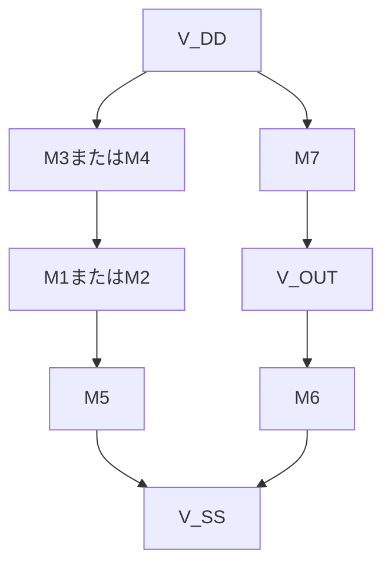

# はじめに

本資料は、CMOSアナログ回路を初めて学ぶ人が、MOSFETの動作から二段構成オペアンプの設計までを順番に理解するための補足資料である。
本資料では、次の3点を理解しやすくすることを重視する。

* 回路が何をしているのか
* なぜその式を使うのか
* どの順番で設計するのか

対象読者は、理系高校3年生程度の数学を学んだ人を想定している。高校数学だけでは分かりにくい用語や式については、本資料の該当部分を生成AIへ示して質問しながら読み進めることで、内容を理解できる構成を目指している。

本資料だけで学習を完結させることは目的としていない。次の書籍を手元に置き、対応する内容を確認しながら読み進めることを前提としている。
これらの書籍には、MOSFETの物理、回路式の導出、各増幅回路の解析、周波数特性、安定性、雑音、ばらつき、レイアウトなどが詳しく説明されている。

* Behzad Razavi 著、黒田忠広 監訳
  [『アナログCMOS集積回路の設計』](https://ci.nii.ac.jp/ncid/BA61598887)

* 谷口研二 著
  [『CMOSアナログ回路入門―LSI設計者のための』](https://www.amazon.co.jp/LSI%E8%A8%AD%E8%A8%88%E3%81%AE%E3%81%9F%E3%82%81%E3%81%AECMOS%E3%82%A2%E3%83%8A%E3%83%AD%E3%82%B0%E5%9B%9E%E8%B7%AF%E5%85%A5%E9%96%80-%E5%8D%8A%E5%B0%8E%E4%BD%93%E3%82%B7%E3%83%AA%E3%83%BC%E3%82%BA-%E8%B0%B7%E5%8F%A3-%E7%A0%94%E4%BA%8C/dp/4789830373)

* 吉澤浩和 著
  [『CMOS OPアンプ回路 実務設計の基礎―これからアナログIC設計を学ぶ人のための』](https://shop.cqpub.co.jp/detail/1981/)


## 各章で説明すること

| 章   | 主な内容                 | この章で分かること                                      |
| --- | -------------------- | ---------------------------------------------- |
| 序章  | 二段構成CMOSオペアンプの概要と使用例 | オペアンプが何のために使われ、なぜ二段構成にするのか                     |
| 第1章 | オペアンプとMOSFETの基礎      | MOSFETの電圧、電流、動作領域、`g_m`、`r_o`の意味               |
| 第2章 | オペアンプを構成する基本回路       | ソース接地回路、電流ミラー、能動負荷、差動対の動作                      |
| 第3章 | 二段構成オペアンプの全体動作       | 入力電圧差が、どのように出力電圧まで伝わるのか                        |
| 第4章 | 直流設計と低周波利得           | 電流、`V_OV`、`W/L`、直流動作点、飽和条件、低周波利得の求め方           |
| 第5章 | 二段構成CMOSオペアンプに使う制御工学 | AC解析、ラプラス変換、伝達関数、極と零点、ボード線図、負帰還、位相余裕、ミラー補償の考え方 |


## 序章　二段構成CMOSオペアンプとは

# 小さな信号を、次の回路へ増幅

## オペアンプ

センサやマイクから出てくる信号は、とても小さい。
その小さな変化を受け取り、扱いやすい電圧に変える。
オペアンプは、電子機器の中でそんな仕事をしている。
オペアンプには、非反転入力と反転入力という2つの入力がある。オペアンプは、この2つの入力電圧の差を受け取り、その差を大きくして出力する。

```text
差動入力電圧 = 非反転入力電圧 − 反転入力電圧
```

例えば、2つの入力電圧の差がわずか1 mVであっても、オペアンプの電圧利得が大きければ、より大きな出力電圧の変化として


参考：[オペアンプとは｜東芝デバイス＆ストレージ](https://toshiba.semicon-storage.com/jp/semiconductor/knowledge/faq/linear_opamp/what-is-an-operational-amplifier.html)

## 0.1　二段構成オペアンプの概要

### わずかな電圧の違いを大きくする


### NMOSとPMOSを組み合わせる

二段構成CMOSオペアンプは、NMOSとPMOSという2種類のMOSFETを組み合わせて作られる。

MOSFETは、ゲートに加えられた電圧によって、ドレイン電流の流れ方を調整する部品である。

* NMOS：ゲート電圧が高くなると電流を流しやすくなる
* PMOS：ゲート電圧が低くなると電流を流しやすくなる

NMOSとPMOSは反対の電圧変化に対して電流を流しやすくなる。この2種類を組み合わせることで、差動入力回路、電流源、増幅回路などを1つのIC内に作ることができる。


### 二段構成オペアンプが使われる場所

二段構成オペアンプは、アナログ信号を増幅する回路や、出力電圧を一定に保つ制御回路などに使用される。

| 使用例        | オペアンプの役割                    |
| ---------- | --------------------------- |
| センサー信号処理回路 | 温度、圧力、光などの小さな信号を増幅する        |
| A/D変換回路    | 入力信号を増幅または保持し、ADCへ渡す        |
| D/A変換回路    | DACの出力電流や出力電圧を扱いやすい電圧へ変換する  |
| アクティブフィルタ  | 必要な周波数成分を通し、不要な成分を減らす       |
| LDOレギュレータ  | 出力電圧と基準電圧を比較し、出力電圧を一定に保つ    |
| DC/DCコンバータ | 出力電圧の誤差を増幅し、PWMのデューティ比を調整する |
| 基準電圧回路     | 基準となる電圧を安定させる               |
| オーディオ回路    | 音声信号を増幅したり、周波数特性を調整したりする    |
| 医療・計測用IC   | 生体信号や測定信号などの小さな電圧を増幅する      |


**結論**

二段構成CMOSオペアンプは、2つの入力電圧の小さな差を、センサー信号処理、ADC、DAC、アクティブフィルタ、LDO、DC/DCコンバータなど、さまざまなアナログ・ミックスドシグナル回路で使用される。


## 0.2　第1段と第2段の役割

### 前半で入力を受け取り、後半で大きくする

第1段は、2つの入力電圧の違いを受け取る部分である。

第2段は、第1段から渡された信号をさらに大きくして、出力へ送る部分である。

```text
入力 → 第1段 → 第2段 → 出力
```

**結論**

第1段が入力を受け取り、第2段が出力に必要な大きさまで増幅する。

---

## 0.3　入力から出力までの信号経路

### 信号は二つの増幅段を順番に通る

入力された信号は、まず第1段に入る。

第1段で変化した信号は第2段へ渡され、さらに増幅される。最後に、オペアンプの出力端子から外へ出ていく。

```text
2つの入力
    ↓
第1段
    ↓
第2段
    ↓
出力
```

**結論**

入力信号は、第1段から第2段へ順番に伝わり、最後に出力信号になる。

---

## 0.4　二段構成にする理由

### 二つの回路で仕事を分ける

一つの増幅回路だけで、小さな入力を受け取り、大きな出力を作るのは難しい。

そこで、入力を受け取る部分と、出力を大きくする部分に仕事を分ける。二段に分けることで、それぞれの役割に合った回路を作りやすくなる。

**結論**

二段構成にする理由は、入力と出力の仕事を分け、十分な増幅を得やすくするためである。

---

## 0.5　主な要求仕様

### 大きく、速く、安定して動くことが求められる

オペアンプは、ただ信号を大きくできればよいわけではない。

* 信号を十分に増幅できること
* 入力の変化にすばやく反応できること
* 出力が不安定にならないこと
* 必要な範囲の電圧を扱えること
* 消費する電力が大きすぎないこと

これらの性能を、使う目的に合わせて決めていく。

**結論**

オペアンプの設計では、増幅の大きさだけでなく、速度、安定性、電圧範囲、消費電力も重要になる。

---

## 序章の結論

二段構成CMOSオペアンプは、小さな入力電圧の差を受け取り、二つの増幅段を通して大きな出力信号に変える回路である。

第1段と第2段がどのような回路で作られ、どのように信号を増幅するのかを、次の章から順番に見ていく。


# 第1章　オペアンプとMOSFETの基礎

## Fundamentals of Operational Amplifiers and MOSFETs

二段構成CMOSオペアンプは、NMOSとPMOSを組み合わせて作られている。

この章では、オペアンプの基本的な使い方と、MOSFETで信号を増幅するために必要な内容を学ぶ。式は、回路でよく使う形に絞って説明する。

---

## 1.1　差動入力と出力電圧

### 2つの入力電圧の差を増幅する

オペアンプには、非反転入力と反転入力がある。オペアンプが増幅するのは、2つの入力電圧の差である。


~~~text
v_id = v_in+ - v_in-
~~~

| 記号 | 意味 |
|---|---|
| v_in+ | 非反転入力の電圧 |
| v_in- | 反転入力の電圧 |
| v_id | 2つの入力電圧の差 |

開ループ利得をA_0とすると、出力電圧は次のようになる。

~~~text
v_out = A_0 × v_id
~~~

| 記号 | 意味 |
|---|---|
| A_0 | 負帰還をかけていないときの電圧利得 |
| v_out | オペアンプの出力電圧 |

- v_in+ が高いと、出力は高くなる
- v_in- が高いと、出力は低くなる
- 出力できる電圧は、電源電圧によって制限される

**結論**

オペアンプは、非反転入力と反転入力の電圧差を増幅する。

---

## 1.2　開ループ動作と負帰還

### 開ループ動作

出力を入力側へ戻さない状態を、開ループ動作という。

オペアンプの開ループ利得は非常に大きい。そのため、わずかな入力差でも出力が電源電圧付近まで動き、それ以上変化できなくなる。この状態を出力の飽和という。

### 負帰還

出力の一部を反転入力へ戻す接続を、負帰還という。

負帰還が正常に働き、出力が飽和していないときは、2つの入力電圧をほぼ同じと考えられる。

~~~text
v_in+ ≈ v_in-
~~~


この関係を使うと、反転増幅回路と非反転増幅回路の利得を簡単に求められる。

### 反転増幅回路


反転増幅回路では、入力信号を抵抗R_1を通して反転入力へ加える。非反転入力はGNDへ接続する。抵抗R_2は、出力と反転入力の間に接続する。

負帰還によって反転入力もほぼ0 Vになる。この状態を仮想接地という。ただし、反転入力が実際にGNDへ接続されているわけではない。

電圧利得は次のようになる。

~~~text
A_v = -R_2 / R_1
~~~


| 記号 | 意味 |
|---|---|
| A_v | 入力電圧に対する出力電圧の倍率 |
| R_1 | 入力と反転入力の間の抵抗 |
| R_2 | 出力と反転入力の間の帰還抵抗 |
| - | 入力と出力の向きが反対になることを表す |

出力電圧は次の式で求められる。

~~~text
v_out = A_v × v_in
~~~

たとえば、R_1 = 10 kΩ、R_2 = 40 kΩの場合は次のようになる。

~~~text
A_v = -40 kΩ / 10 kΩ = -4
~~~

入力が0.2 Vなら、出力は次の値になる。

~~~text
v_out = -4 × 0.2 V = -0.8 V
~~~

反転増幅回路では、入力が正方向に変化すると、出力は負方向に変化する。

### 非反転増幅回路


非反転増幅回路では、入力信号を非反転入力へ加える。

R_1は反転入力とGNDの間、R_2は出力と反転入力の間に接続する。

電圧利得は次のようになる。

~~~text
A_v = 1 + R_2 / R_1
~~~

| 記号 | 意味 |
|---|---|
| A_v | 入力電圧に対する出力電圧の倍率 |
| R_1 | 反転入力とGNDの間の抵抗 |
| R_2 | 出力と反転入力の間の帰還抵抗 |
| 1 | 非反転増幅回路の利得が1倍より小さくならないことを表す |

たとえば、R_1 = 10 kΩ、R_2 = 40 kΩの場合は次のようになる。

~~~text
A_v = 1 + 40 kΩ / 10 kΩ = 5
~~~

入力が0.2 Vなら、出力は次の値になる。

~~~text
v_out = 5 × 0.2 V = 1.0 V
~~~

非反転増幅回路では、入力と出力が同じ方向に変化する。

### 反転増幅と非反転増幅の違い

| 項目 | 反転増幅 | 非反転増幅 |
|---|---|---|
| 入力を加える端子 | 反転入力 | 非反転入力 |
| 出力の向き | 入力と反対 | 入力と同じ |
| 利得 | -R_2 / R_1 | 1 + R_2 / R_1 |
| 入力抵抗 | 主にR_1で決まる | オペアンプの入力抵抗が高いため大きい |

**結論**

負帰還を使うと、抵抗の比によって回路の利得を決められる。反転増幅では出力の向きが反対になり、非反転増幅では同じ向きになる。

---

## 1.3　理想オペアンプと実際のオペアンプ

### 理想オペアンプの基本ルール

理想オペアンプは、回路を簡単に計算するためのモデルである。

負帰還が働いているときは、次の2つのルールを使う。

~~~text
入力電流：i_+ = i_- = 0
~~~

~~~text
入力電圧：v_in+ ≈ v_in-
~~~

| 記号 | 意味 |
|---|---|
| i_+ | 非反転入力へ流れ込む電流 |
| i_- | 反転入力へ流れ込む電流 |
| v_in+ | 非反転入力の電圧 |
| v_in- | 反転入力の電圧 |

### 実際のオペアンプの限界

| 項目 | 理想 | 実際 |
|---|---|---|
| 開ループ利得 | 無限大 | 大きいが有限 |
| 入力電流 | 0 | わずかに流れる |
| 出力電圧 | 制限なし | 電源電圧で制限される |
| 周波数範囲 | 制限なし | 上限がある |
| 入力オフセット電圧 | 0 | わずかに存在する |

v_in+ ≈ v_in- と考えられるのは、負帰還が働き、出力が飽和していない場合だけである。

**結論**

基本計算では理想オペアンプを使い、実際の設計では電圧、電流、周波数の限界を確認する。

---

## 1.4　NMOSとPMOS

### MOSFETの役割

MOSFETは、ゲート電圧によってドレイン電流を調整する部品である。

主な端子は次の4つである。

| 端子 | 記号 | 役割 |
|---|---|---|
| ゲート | G | 電流を調整する入力 |
| ドレイン | D | 電流経路の一方 |
| ソース | S | 電流経路のもう一方 |
| バルク | B | MOSFETが作られている基板側 |

---

* Behzad Razavi著、黒田忠広監訳『[アナログCMOS集積回路の設計 第2版 基礎編](https://www.maruzenjunkudo.co.jp/products/9784621310366)』丸善出版、2025年
* Behzad Razavi, *[Design of Analog CMOS Integrated Circuits, 2nd Edition](https://www.mheducation.com/highered/product/design-of-analog-cmos-integrated-circuits-razavi.html)*, McGraw Hill

### NMOS

NMOSは、ゲート電圧がソース電圧より十分に高くなると電流を流しやすくなる。

~~~text
V_GS = V_G - V_S
~~~

~~~text
V_GS > V_THn
~~~

| 記号 | 意味 |
|---|---|
| V_G | ゲート電圧 |
| V_S | ソース電圧 |
| V_GS | ゲートとソースの電圧差 |
| V_THn | NMOSのしきい値電圧 |

### PMOS

PMOSは、ゲート電圧がソース電圧より十分に低くなると電流を流しやすくなる。

~~~text
V_SG = V_S - V_G
~~~

~~~text
V_SG > abs(V_THp)
~~~

| 記号 | 意味 |
|---|---|
| V_SG | ソースとゲートの電圧差 |
| V_THp | PMOSのしきい値電圧 |
| abs(V_THp) | V_THpの大きさ |

### NMOSとPMOSの違い

| 項目 | NMOS | PMOS |
|---|---|---|
| オンになりやすい条件 | ゲートが高い | ゲートが低い |
| 主なキャリア | 電子 | 正孔 |
| 電流の向き | ドレインからソース | ソースからドレイン |

**結論**

NMOSとPMOSは反対のゲート電圧で動作し、CMOS回路では両方を組み合わせて使う。

### MOSFETは小さな入力電力で大きな出力電流を制御する

MOSFETは、入力側のゲート・ソース間電圧`V_GS`によって、出力側のドレイン電流`I_D`を制御する部品である。


```text
入力側                       出力側

ゲート電圧 V_GS              ドレイン電流 I_D
ゲート電流 I_G ≈ 0     →     ドレイン電圧 V_DS
        制御                    電力を扱う
```

| 側   | 電圧     | 電流        | 役割          |
| --- | ------ | --------- | ----------- |
| 入力側 | `V_GS` | `I_G ≈ 0` | MOSFETを制御する |
| 出力側 | `V_DS` | `I_D`     | 負荷へ電力を供給する  |


### なぜ省エネルギーなのか

MOSFETのゲートは酸化膜によって絶縁されているため、理想的にはゲートへ直流電流が流れない。

```text
I_G ≈ 0
```

したがって、入力側で消費される直流電力は非常に小さい。

```text
P_IN = V_GS × I_G ≈ 0
```

小さな入力電力で、出力側の大きなドレイン電流を制御できることがMOSFETの特徴である。


### 結論

```text
MOSFETは、ほとんど電流を必要としないゲート電圧V_GSによって、
出力側のドレイン電流I_Dを制御できる。
```

```text
V_GS：MOSFETを制御する入力電圧
V_DS：出力側に加わる電圧
I_D ：MOSFETによって制御される出力電流
```

MOSFETは、小さな入力電力で大きな出力電流を制御できる。MOSFETは省エネ。

---

## 1.5　しきい値電圧とオーバードライブ電圧

### しきい値電圧

しきい値電圧は、MOSFETのゲートにどの程度の電圧を加えると、チャネルが形成されて電流が流れやすくなるかを示す目安である。

* `V_THn`：NMOSのしきい値電圧
* `V_THp`：PMOSのしきい値電圧

一般に、NMOSのしきい値電圧は正、PMOSのしきい値電圧は負の値で表される。

```text
V_THn > 0

V_THp < 0
```

例えば、次のような値を考える。

```text
V_THn = 0.5 V

V_THp = -0.5 V
```

NMOSでは、ゲート電圧がソース電圧より高くなり、次の条件を満たすと電流が流れやすくなる。

```text
V_GS > V_THn
```

PMOSでは、ソース電圧がゲート電圧より高くなり、次の条件を満たすと電流が流れやすくなる。

```text
V_SG > abs(V_THp)
```

ここで、`abs(V_THp)`はPMOSのしきい値電圧の絶対値を表す。

しきい値電圧より低い場合でも、実際には微小な電流が流れる。この電流をサブスレッショルド電流という。そのため、しきい値電圧は「完全に電流が0から流れ始める境界」ではなく、「MOSFETにチャネルが形成され、電流が大きくなり始める目安」と考える。

また、しきい値電圧は、製造ばらつき、温度、ソースと基板の電位差などによって変化する。本章では、まず一定値として扱う。

### オーバードライブ電圧

オーバードライブ電圧は、ゲートに加えた電圧がしきい値電圧をどれだけ超えているかを表す。

しきい値を超えた部分が、MOSFETに電流を流すために実際に使われる電圧と考えられる。

### NMOSのオーバードライブ電圧

NMOSでは、オーバードライブ電圧を次のように定義する。

```text
V_OV = V_GS - V_THn
```

例えば、次の条件を考える。

```text
V_GS  = 0.8 V
V_THn = 0.5 V
```

このとき、オーバードライブ電圧は次のようになる。

```text
V_OV
= V_GS - V_THn
= 0.8 - 0.5
= 0.3 V
```

これは、ゲート・ソース間電圧が、しきい値電圧を`0.3 V`だけ超えていることを表す。

### PMOSのオーバードライブ電圧

PMOSでは、ソース・ゲート間電圧`V_SG`を使う。

```text
V_OVp = V_SG - abs(V_THp)
```

例えば、次の条件を考える。

```text
V_SG  = 0.9 V
V_THp = -0.5 V
```

しきい値電圧の絶対値は次のようになる。

```text
abs(V_THp) = 0.5 V
```

したがって、PMOSのオーバードライブ電圧は次のようになる。

```text
V_OVp
= V_SG - abs(V_THp)
= 0.9 - 0.5
= 0.4 V
```

### 各電圧の意味

| 記号           | 意味                 |
| ------------ | ------------------ |
| `V_THn`      | NMOSのしきい値電圧        |
| `V_THp`      | PMOSのしきい値電圧。通常は負の値 |
| `abs(V_THp)` | PMOSのしきい値電圧の絶対値    |
| `V_OV`       | NMOSのオーバードライブ電圧    |
| `V_OVp`      | PMOSのオーバードライブ電圧    |
| `V_GS`       | NMOSのゲート・ソース間電圧    |
| `V_SG`       | PMOSのソース・ゲート間電圧    |

### オーバードライブ電圧とドレイン電流

長チャネルMOSFETの飽和領域を簡単な式で表すと、NMOSのドレイン電流は次のようになる。

```text
I_D
≈
(1/2)μnCox(W/L)V_OV^2
```

したがって、トランジスタ寸法`W/L`が同じ場合、`V_OV`が大きくなるとドレイン電流はおおよそ2乗に比例して増加する。

```text
V_OVが大きい
→ チャネルが強く形成される
→ I_Dが大きくなる
```

### オーバードライブ電圧と飽和条件

MOSFETを増幅回路として使用するときは、一般に飽和領域で動作させる。

NMOSの飽和条件は、次のように表せる。

```text
V_DS >= V_OV
```

PMOSの飽和条件は、次のようになる。

```text
V_SD >= V_OVp
```

したがって、`V_OV`を大きくすると電流を流しやすくなる一方、飽和領域を維持するために必要なドレイン・ソース間電圧も大きくなる。

```text
V_OVが大きい
→ 電流を流しやすい
→ 必要なV_DSも大きい
→ 使用できる出力電圧範囲が狭くなる
```

この「回路を正しく動作させるために必要な電圧の余裕」を、電圧ヘッドルームという。

### 回路設計における意味

オーバードライブ電圧には、次のようなトレードオフがある。

```text
V_OVを大きくする
→ 同じW/LならI_Dが増える
→ 必要な電圧ヘッドルームが大きくなる
→ 低電源電圧では使いにくくなる
```

一方、同じドレイン電流で比較すると、相互コンダクタンスは次の式で表される。

```text
g_m = 2I_D / V_OV
```

したがって、同じ`I_D`であれば、`V_OV`を小さくした方が`g_m`は大きくなる。

```text
同じI_Dの場合

V_OVが小さい
→ g_mが大きい
→ 増幅能力が高くなる
→ 必要なW/Lは大きくなる
```

オーバードライブ電圧は、単に大きくすればよいものではない。電流、利得、消費電力、トランジスタ寸法、出力電圧範囲を考えながら決める必要がある。

```text
しきい値電圧
＝ MOSFETが電流を流しやすくなる基準

オーバードライブ電圧
＝ ゲート電圧がしきい値を超えた量
```


**結論**

オーバードライブ電圧は、MOSFETがどれくらい強く動作しているかを表す。

---

## 1.6　線形領域と飽和領域

### NMOSの動作領域

| 動作領域 | 条件 | 主な使い方 |
|---|---|---|
| カットオフ領域 | V_GS ≤ V_THn | オフ状態 |
| 線形領域 | V_GS > V_THn、V_DS < V_OV | スイッチ、可変抵抗 |
| 飽和領域 | V_GS > V_THn、V_DS ≥ V_OV | 増幅回路、電流源 |

| 記号 | 意味 |
|---|---|
| V_DS | NMOSのドレイン・ソース間電圧 |
| V_OV | NMOSのオーバードライブ電圧 |

アナログ増幅回路では、MOSFETを主に飽和領域で使う。

PMOSではV_SGとV_SDを使い、V_SDがV_OVp以上なら飽和領域になる。

~~~text
PMOSの飽和条件：V_SD ≥ V_OVp
~~~


**結論**

増幅回路では、MOSFETが飽和領域に入っていることを確認する。

---

## 1.7　ドレイン電流

### 飽和領域のドレイン電流

長チャネルNMOSの基本式は次のようになる。

~~~text
I_D = (1 / 2) × k_n × V_OV^2
~~~

k_nは、製造プロセスとMOSFETの大きさをまとめた値である。

~~~text
k_n = μ_n × C_ox × (W / L)
~~~

| 記号 | 意味 |
|---|---|
| I_D | ドレイン電流 |
| k_n | NMOSの電流の流しやすさを表す係数 |
| μ_n | 電子の移動度 |
| C_ox | 単位面積当たりのゲート酸化膜容量 |
| W | MOSFETのチャネル幅 |
| L | MOSFETのチャネル長 |
| V_OV | オーバードライブ電圧 |

式から、次の関係が分かる。

- Wを大きくすると、I_Dは増える
- Lを長くすると、I_Dは減る
- V_OVを大きくすると、I_Dは増える

実際には、V_DSが増えるとI_Dも少し増える。この現象をチャネル長変調という。


**参考文献**
[チャネル長変調の解説](https://sawazawablog.com/channel_length_modulation/)


### マルチフィンガー(雑談)

1つのMOSFETを`N_f`本の細いMOSFETに分割し、並列接続するレイアウト方法である。

```text
W = N_f × W_f
I_D = N_f × I_Df
```

全体の`W/L`を保ちながら、ゲート抵抗と面積を抑え、素子の整合性を高められる。

---

**参考文献**

* Mizuki Mori「[SKY130で学ぶLSI回路設計](https://www.noritsuna.jp/download/lec240921.pdf)」2024年9月21日、スライド124–130「マルチフィンガーについて・ミスマッチシミュレーション」（2026年8月8日閲覧）


**結論**

ドレイン電流は、オーバードライブ電圧、MOSFETの大きさ、製造プロセスによって決まる。

---
## 1.8　相互コンダクタンス `g_m`

### MOSFETは電圧で電流を変える

ここでは、NMOSを例に考える。

NMOSでは、ゲート・ソース間電圧`V_GS`を大きくすると、ドレイン電流`I_D`が増える。

```text
入力：ゲート・ソース間電圧 V_GS
              ↓
            NMOS
              ↓
出力：ドレイン電流 I_D
```

つまりMOSFETは、入力側の電圧によって、出力側の電流を制御する素子である。

例えば、`V_GS`を少し上げたとき、`I_D`が大きく増えるMOSFETもあれば、あまり増えないMOSFETもある。

```text
V_GSを少し変えたとき
I_Dがどれくらい変わるか
```

この「ゲート電圧に対するドレイン電流の変わりやすさ」を表す量が、相互コンダクタンス`g_m`である。

---

### なぜ「相互コンダクタンス」と呼ぶのか

抵抗の逆数をコンダクタンスという。コンダクタンスは、電圧を加えたときに電流がどれだけ流れやすいかを表す。

```text
コンダクタンス
=
電流
/
電圧
```

相互コンダクタンスでは、同じ場所の電圧と電流ではなく、入力側のゲート電圧と、出力側のドレイン電流の関係を見る。

```text
入力側の電圧 V_GS
        ↓
出力側の電流 I_D
```

入力側と出力側という異なる部分の関係を表すため、「相互コンダクタンス」と呼ばれる。

---

### まずは変化量で考える

ゲート・ソース間電圧を`ΔV_GS`だけ変えたとき、ドレイン電流が`ΔI_D`だけ変化したとする。

このとき、`g_m`は次のように考えられる。

```text
g_m ≈ ΔI_D / ΔV_GS
```

この式は、ゲート電圧を1 V変化させたとき、ドレイン電流が何A変化するかを表している。

| 記号      | 意味               |
| ------- | ---------------- |
| `ΔV_GS` | ゲート・ソース間電圧の変化量   |
| `ΔI_D`  | ドレイン電流の変化量       |
| `g_m`   | 電圧変化を電流変化へ変換する割合 |

例えば、`V_GS`を`10 mV`増やしたとき、`I_D`が`10 μA`増えたとする。

```text
ΔV_GS = 10 mV
ΔI_D  = 10 μA
```

これらの値を`g_m`の式へ代入する。

```text
g_m
≈
10 μA / 10 mV
```

この計算結果は次のようになる。

```text
g_m ≈ 1 mS
```

`1 mS`は、次の関係を表している。

```text
1 mS
=
1 mA / 1 V
=
1 μA / 1 mV
```

したがって、`g_m = 1 mS`のMOSFETでは、ゲート電圧が`1 mV`変化すると、ドレイン電流が約`1 μA`変化する。

```text
V_GSが1 mV増える
        ↓
I_Dが約1 μA増える
```

---

### `g_m`が大きいとはどういうことか

`g_m`が大きいMOSFETは、ゲート電圧の小さな変化に対して、ドレイン電流が大きく変化する。

| `g_m` | MOSFETの動作            |
| ----- | -------------------- |
| 大きい   | 小さな入力電圧で電流が大きく変わる    |
| 小さい   | 入力電圧を変えても電流があまり変わらない |

増幅回路では、小さな入力電圧から大きな電流変化を作りたい。そのため、一般に`g_m`が大きいほど増幅しやすい。

ただし、`g_m`を大きくするために電流を増やすと、消費電力も増える。

```text
電流を増やす
      ↓
g_mが大きくなる
      ↓
増幅しやすくなる
      ↓
消費電力も増える
```

---

### `g_m`はグラフの傾きである

MOSFETの`I_D`と`V_GS`の関係をグラフにすると、直線ではなく曲線になる。

横軸を`V_GS`、縦軸を`I_D`とする。

```text
横軸：V_GS
縦軸：I_D
```

直線であれば、どの場所でも傾きは同じである。しかし、MOSFETの特性は曲線なので、傾きは動作する場所によって変わる。

```text
V_GSが比較的小さい
        ↓
グラフの傾きが小さい
        ↓
g_mが小さい
```

```text
V_GSが比較的大きい
        ↓
グラフの傾きが大きい
        ↓
g_mが大きい
```

この関係は、長チャネルMOSFETの平方則モデルを使った場合に成り立つ。

---

### 動作点とは何か

MOSFETを増幅回路として使うときは、入力信号を加える前から一定の電圧と電流を与えておく。

この基準となる電圧と電流の組を動作点という。

```text
動作点
=
信号がないときの基準電圧と基準電流
```

例えば、次の状態を動作点とする。

```text
V_GSQ = 0.70 V
I_DQ  = 100 μA
```

添字`Q`は、動作点を表している。

実際のゲート・ソース間電圧は、動作点の直流電圧と、その周りの小さな電圧変化を足したものになる。

```text
V_GS = V_GSQ + v_gs
```

この式で、`V_GSQ`は基準となる直流電圧、`v_gs`は入力信号による小さな電圧変化である。

ドレイン電流も同じように考えられる。

```text
I_D = I_DQ + i_d
```

この式で、`I_DQ`は動作点の直流電流、`i_d`は入力信号によって生じる小さな電流変化である。

| 記号      | 意味             |
| ------- | -------------- |
| `V_GSQ` | 動作点のゲート・ソース間電圧 |
| `I_DQ`  | 動作点のドレイン電流     |
| `v_gs`  | 動作点の周りの小さな電圧変化 |
| `i_d`   | 動作点の周りの小さな電流変化 |

`g_m`は、この動作点における曲線の傾きである。


---

### なぜ微分を使うのか

最初に、変化量を使って次のように表した。

```text
g_m ≈ ΔI_D / ΔV_GS
```

しかし、この式で求められるのは、ある範囲における平均的な傾きである。

MOSFETの特性は曲線なので、変化させる範囲が広いと、動作点における正確な傾きとは異なる値になる。

そこで、`ΔV_GS`を非常に小さくして、動作点のすぐ近くの傾きを求める。

```text
g_m
=
ΔV_GSを0へ近づけたときの
ΔI_D / ΔV_GS
```

これが微分の考え方である。

1つの変数だけを考える場合は、次のように書ける。

```text
g_m = dI_D / dV_GS
```

この式は、`I_D–V_GS`グラフの動作点に引いた接線の傾きを表している。

```text
曲線上の動作点
        ↓
その場所に接線を引く
        ↓
接線の傾きがg_m
```

---

### なぜ偏微分を使うのか

ドレイン電流`I_D`は、`V_GS`だけで決まるわけではない。実際には、ドレイン・ソース間電圧`V_DS`などの影響も受ける。

```text
I_D = I_D(V_GS, V_DS)
```

この式は、`I_D`が`V_GS`と`V_DS`の両方によって決まることを表している。

`g_m`では、`V_DS`を一定にして、`V_GS`だけを変化させたときの`I_D`の変化を見る。

複数の変数のうち、1つだけを変化させる微分を偏微分という。

```text
g_m
=
(∂I_D / ∂V_GS)
```

この式の`∂`は、ほかの変数を一定にして、指定した変数だけを変化させることを表している。

より正確には、次のように書く。

```text
g_m
=
(∂I_D / ∂V_GS)
V_DSを一定にして動作点で求める
```

したがって、`g_m`は「`V_DS`を固定した状態で、動作点の`V_GS`を少し変えたときの`I_D`の変化率」である。

---

### 平方則モデルから`g_m`を求める

飽和領域にある長チャネルNMOSのドレイン電流は、次の式で表される。

```text
I_D
=
(1 / 2) × k_n × (V_GS - V_THn)^2
```

この式は、しきい値電圧を超えた分の電圧によって、ドレイン電流が決まることを表している。

| 記号      | 意味                 |
| ------- | ------------------ |
| `I_D`   | ドレイン電流             |
| `k_n`   | NMOSの電流の流しやすさを表す係数 |
| `V_GS`  | ゲート・ソース間電圧         |
| `V_THn` | NMOSのしきい値電圧        |

`k_n`は、製造プロセスとMOSFETの大きさによって決まる。

```text
k_n = μ_n × C_ox × (W / L)
```

この式は、電子の移動度`μ_n`、ゲート酸化膜容量`C_ox`、MOSFETの寸法比`W/L`によって、電流の流しやすさが決まることを表している。

ここで、オーバードライブ電圧`V_OV`を使う。

```text
V_OV = V_GS - V_THn
```

`V_OV`は、ゲート・ソース間電圧がしきい値電圧をどれだけ超えているかを表す。

この定義を使うと、ドレイン電流の式は次のようになる。

```text
I_D
=
(1 / 2) × k_n × V_OV^2
```

この式から、ドレイン電流は`V_OV`の2乗に比例することが分かる。

---

### ドレイン電流の式を微分する

`g_m`は、`I_D`を`V_GS`で微分した値である。

```text
g_m = ∂I_D / ∂V_GS
```

2乗の式を微分するときは、次の関係を使う。

```text
x^2をxで微分すると2x
```

ドレイン電流の式を`V_GS`で微分する。

```text
I_D
=
(1 / 2) × k_n × (V_GS - V_THn)^2
```

`(V_GS - V_THn)^2`を微分すると、`2 × (V_GS - V_THn)`になる。

したがって、次の式が得られる。

```text
g_m
=
k_n × (V_GS - V_THn)
```

ここで、`V_GS - V_THn`は`V_OV`である。

```text
g_m = k_n × V_OV
```

この式は、平方則モデルでは、`V_OV`が大きいほど`g_m`が大きくなることを表している。

---

### `I_D`と`V_OV`から`g_m`を求める

ドレイン電流は次の式で表される。

```text
I_D
=
(1 / 2) × k_n × V_OV^2
```

この式を2倍する。

```text
2 × I_D
=
k_n × V_OV^2
```

両辺を`V_OV`で割る。

```text
2 × I_D / V_OV
=
k_n × V_OV
```

右辺の`k_n × V_OV`は`g_m`であるため、次の式が得られる。

```text
g_m = 2 × I_D / V_OV
```

この式は、動作点のドレイン電流`I_D`とオーバードライブ電圧`V_OV`が分かっているときに使いやすい。

この式から、次のことが分かる。

* 同じ`V_OV`なら、`I_D`が大きいほど`g_m`は大きい
* 同じ`I_D`なら、`V_OV`が小さいほど`g_m`は大きい

---

### `g_m`の計算例

次の動作点を考える。

```text
I_D = 100 μA
V_OV = 0.20 V
```

このMOSFETには直流で`100 μA`が流れ、ゲート電圧はしきい値を`0.20 V`超えている。

`g_m`を求める。

```text
g_m = 2 × I_D / V_OV
```

数値を代入する。

```text
g_m
=
2 × 100 μA / 0.20 V
```

計算すると、次のようになる。

```text
g_m = 1.0 mS
```

この結果は、動作点の周りでゲート電圧が`1 mV`変化すると、ドレイン電流が約`1 μA`変化することを表している。

---

### 小さな入力電圧から電流変化を求める

動作点の周りに加わる小さなゲート・ソース間電圧を`v_gs`とする。

このときに生じるドレイン電流の小さな変化を`i_d`とする。

両者の関係は次のようになる。

```text
i_d = g_m × v_gs
```

この式は、入力電圧`v_gs`を`g_m`倍すると、出力電流の変化`i_d`になることを表している。

例えば、次の値を考える。

```text
g_m = 1.0 mS
v_gs = 1 mV
```

数値を代入する。

```text
i_d
=
1.0 mS × 1 mV
```

計算結果は次のようになる。

```text
i_d = 1.0 μA
```

したがって、ゲート電圧が`1 mV`変化すると、ドレイン電流は`1 μA`変化する。

```text
小さな入力電圧 v_gs
          ↓
     g_mで変換
          ↓
小さな出力電流 i_d
```

---

### `g_m`は電圧利得ではない

`g_m`が直接表すのは、入力電圧から出力電流への変換である。

```text
入力電圧
    ↓
  g_m
    ↓
出力電流
```

したがって、`g_m`だけでは出力電圧は得られない。

出力電流を出力電圧へ変えるには、出力ノードに抵抗が必要になる。

```text
v_out = -i_d × R_out
```

この式は、電流変化`i_d`が出力抵抗`R_out`へ流れることで、出力電圧`v_out`が変化することを表している。

負号は、ソース接地増幅回路で入力と出力が反対方向に変化することを表している。

```text
ゲート電圧が上がる
        ↓
ドレイン電流が増える
        ↓
負荷の電圧降下が増える
        ↓
出力電圧が下がる
```

先ほどの関係を使う。

```text
i_d = g_m × v_gs
```

これを出力電圧の式へ代入する。

```text
v_out
=
-g_m × v_gs × R_out
```

入力電圧に対する出力電圧の比が、電圧利得`A_v`である。

```text
A_v = v_out / v_gs
```

したがって、ソース接地増幅回路の電圧利得は次のようになる。

```text
A_v ≈ -g_m × R_out
```

この式は、`g_m`と出力抵抗`R_out`の両方が大きいほど、電圧利得が大きくなることを表している。

---

### 電圧利得の計算例

次の値を考える。

```text
g_m = 1.0 mS
R_out = 100 kΩ
```

電圧利得を求める。

```text
A_v
≈
-g_m × R_out
```

数値を代入する。

```text
A_v
≈
-1.0 mS × 100 kΩ
```

計算すると、次のようになる。

```text
A_v ≈ -100
```

この結果は、入力電圧の変化を約100倍にして、反対方向の出力電圧を作ることを表している。

入力電圧が`1 mV`増えた場合、出力電圧の変化は次のようになる。

```text
v_out
=
-100 × 1 mV
=
-100 mV
```

したがって、入力が`1 mV`上がると、出力は約`100 mV`下がる。

---

### 設計では何を考えるのか

`g_m`を大きくすると増幅しやすくなるが、ほかの性能も変化する。

| 変更           | `g_m`への影響   | 注意点            |
| ------------ | ----------- | -------------- |
| `I_D`を増やす    | 大きくなる       | 消費電力が増える       |
| `V_OV`を小さくする | 同じ電流なら大きくなる | 必要な`W/L`が大きくなる |
| `W`を大きくする    | 同じ電圧なら大きくなる | 面積と寄生容量が増える    |

したがって、設計では`g_m`だけを大きくするのではなく、利得、速度、消費電力、面積のバランスを考える必要がある。

---

### まとめ

| 段階 | 内容                                  |
| -- | ----------------------------------- |
| 1  | `V_GS`を変えると`I_D`が変わる                |
| 2  | 電流の変わりやすさを`g_m`で表す                  |
| 3  | `g_m`は動作点における`I_D–V_GS`曲線の傾きである     |
| 4  | `V_DS`を一定にして考えるため偏微分を使う             |
| 5  | 平方則モデルでは`g_m = 2I_D / V_OV`となる      |
| 6  | 小さな入力電圧は`i_d = g_m v_gs`によって電流変化になる |
| 7  | 出力抵抗によって電流変化が出力電圧へ変わる               |
| 8  | ソース接地回路の利得は`A_v ≈ -g_mR_out`となる     |


**結論**

相互コンダクタンス`g_m`は、動作点において「ゲート電圧のわずかな変化がドレイン電流にどれだけ影響するか」を表す量である。

MOSFET増幅は、まず`g_m`で電圧を電流に変え、その電流を抵抗で電圧に変換することで成り立っている。
---

## 1.9　出力抵抗 r_o

### MOSFETは完全な電流源ではない


理想的な電流源では、出力電圧が変化しても電流は変化しない。

実際のMOSFETでは、飽和領域であっても、V_DSが変化するとI_Dもわずかに変化する。この主な原因がチャネル長変調である。

この影響を小信号の抵抗として表したものが、出力抵抗r_oである。

ただし、r_oは回路に実際に接続されている抵抗ではない。V_DSの変化によってI_Dがどの程度変化するかを、抵抗として表した小信号モデルである。

### 変化量から出力抵抗を考える

V_DSがΔV_DSだけ変化したとき、I_DがΔI_Dだけ変化したとする。このとき、出力抵抗r_oは次のように表される。

```text
r_o ≈ ΔV_DS / ΔI_D
```

| 記号    | 意味                       |
| ----- | ------------------------ |
| ΔV_DS | ドレイン・ソース間電圧の変化量          |
| ΔI_D  | V_DSの変化によって生じるドレイン電流の変化量 |
| r_o   | MOSFETの小信号出力抵抗           |

同じ大きさのΔV_DSを加えた場合でも、I_Dがほとんど変化しなければ、ΔI_Dは小さくなる。

```text
r_o ≈ ΔV_DS / ΔI_D
```

この式から、ΔI_Dが小さいほどr_oは大きくなることが分かる。

### 出力コンダクタンスg_o

V_DSに対するI_Dの変化の割合を先に求める場合は、出力コンダクタンスg_oを用いる。

```text
g_o = ∂I_D / ∂V_DS　（V_GSを一定にする）
```

g_oは、V_GSを一定にしたままV_DSだけを変化させたとき、I_Dがどの程度変化するかを表している。言い換えると、V_DSとI_Dの関係を表すグラフにおける傾きである。

出力抵抗r_oは、g_oの逆数である。

```text
r_o = 1 / g_o
```

| 記号  | 意味                     |
| --- | ---------------------- |
| g_o | 出力電圧の変化を出力電流の変化に変換する割合 |
| r_o | g_oの逆数で表される小信号出力抵抗     |

g_oが小さいということは、V_DSが変化してもI_Dがあまり変化しないということである。そのため、g_oが小さいほどr_oは大きくなる。

g_mとg_oは、どちらもI_Dを電圧で偏微分することによって求められる。ただし、変化させる電圧と一定にする電圧が異なる。

| パラメータ | 変化させる電圧 | 一定にする電圧 |
| ----- | ------- | ------- |
| g_m   | V_GS    | V_DS    |
| g_o   | V_DS    | V_GS    |

g_mを求めるときは、V_DSを一定にしてV_GSを変化させる。一方、g_oを求めるときは、V_GSを一定にしてV_DSを変化させる。

### チャネル長変調からr_oを求める

チャネル長変調を含めたドレイン電流I_Dは、簡単には次の式で表される。

```text
I_D ≈ I_D0 × (1 + λ × V_DS)
```

| 記号   | 意味                 |
| ---- | ------------------ |
| I_D0 | チャネル長変調を無視したドレイン電流 |
| λ    | チャネル長変調係数          |
| V_DS | ドレイン・ソース間電圧        |

この式から、V_DSが大きくなると、I_Dもわずかに大きくなることが分かる。

この式をV_DSで偏微分すると、出力コンダクタンスg_oは次のように表される。

```text
g_o ≈ λ × I_D
```

出力抵抗r_oはg_oの逆数であるため、次のようになる。

```text
r_o ≈ 1 / (λ × I_D)
```

λの単位は1/Vである。

λが小さいMOSFETでは、V_DSが変化してもI_Dがあまり変化しない。そのため、λが小さいほどg_oは小さくなり、r_oは大きくなる。

### r_oの計算例

次の値を考える。

```text
λ = 0.05 / V
I_D = 100 μA
```

出力抵抗r_oは、次の式から求められる。

```text
r_o = 1 / (λ × I_D)
```

値を代入すると、次のようになる。

```text
r_o = 1 / (0.05 / V × 100 μA)
```

したがって、r_oは次の値になる。

```text
r_o = 200 kΩ
```

次に、V_DSが小信号として0.10 V変化した場合を考える。このときの電流変化ΔI_Dは、次の式で求められる。

```text
ΔI_D ≈ ΔV_DS / r_o
```

値を代入すると、次のようになる。

```text
ΔI_D ≈ 0.10 V / 200 kΩ
```

したがって、電流の変化量は次の値になる。

```text
ΔI_D ≈ 0.5 μA
```

この例では、V_DSが0.10 V変化したとき、I_Dは約0.5 μA変化することになる。

### r_oと電圧利得

MOSFET単体で得られる電圧利得の目安を固有利得という。固有利得は、g_mとr_oの積によって表される。

```text
固有利得 ≈ g_m × r_o
```

先ほどの例において、g_mとr_oが次の値であるとする。

```text
g_m = 1.0 mS
r_o = 200 kΩ
```

固有利得は次のようになる。

```text
固有利得 ≈ 1.0 mS × 200 kΩ
```

したがって、固有利得は次の値になる。

```text
固有利得 ≈ 200
```

ただし、実際の回路では、負荷抵抗や別のMOSFETのr_oが並列に接続される。そのため、実際に得られる電圧利得は、この固有利得よりも小さくなることが多い。

**結論**

出力抵抗r_oは、V_GSを一定にしたままV_DSを変化させたときのI_Dの変化から求められる小信号抵抗である。

V_DSが変化してもI_Dがほとんど変化しないMOSFETほど、r_oは大きい。r_oが大きいMOSFETは理想的な電流源に近く、高い電圧利得を得やすい。

## 1.10　MOSFETの小信号モデル

### なぜ小信号モデルを使うのか

MOSFETのI_DとV_GSの関係は曲線であり、そのままでは増幅回路の計算が複雑になる。

そこで、最初に直流電圧と直流電流で動作点を決める。その動作点の周りにある小さな変化だけを直線として考える。

この考え方を小信号モデルという。

### 直流値と小信号値

ゲート・ソース間電圧を、直流値と小信号値に分ける。

~~~text
実際のゲート・ソース間電圧 = V_GS + v_gs
~~~

ドレイン・ソース間電圧も同じように分ける。

~~~text
実際のドレイン・ソース間電圧 = V_DS + v_ds
~~~

ドレイン電流は、直流値と小信号値に分ける。

~~~text
実際のドレイン電流 = I_D + i_d
~~~

| 大文字 | 小文字 | 意味 |
|---|---|---|
| V_GS | v_gs | ゲート・ソース間電圧の動作点と小さな変化 |
| V_DS | v_ds | ドレイン・ソース間電圧の動作点と小さな変化 |
| I_D | i_d | ドレイン電流の動作点と小さな変化 |

大文字は動作点を表し、小文字は動作点からの小さな変化を表す。

### 曲線を直線で近似する

I_Dは、V_GSとV_DSなどによって決まる。

~~~text
I_D = I_D(V_GS, V_DS)
~~~

動作点の周りでV_GSがv_gs、V_DSがv_dsだけ変化したとする。

非常に小さな変化だけを考えると、ドレイン電流の変化は、それぞれの偏微分を使って次のように近似できる。

~~~text
i_d
≈
(∂I_D / ∂V_GS) × v_gs
+
(∂I_D / ∂V_DS) × v_ds
~~~

ここで、2つの偏微分をg_mとg_oへ置き換える。

~~~text
g_m = ∂I_D / ∂V_GS
~~~

~~~text
g_o = ∂I_D / ∂V_DS
~~~

したがって、小信号ドレイン電流は次のようになる。

~~~text
i_d = g_m × v_gs + g_o × v_ds
~~~

g_o = 1 / r_oなので、次の形でも表せる。

~~~text
i_d = g_m × v_gs + v_ds / r_o
~~~

| 項 | 意味 |
|---|---|
| g_m × v_gs | ゲート電圧の変化によって生じる電流変化 |
| v_ds / r_o | ドレイン電圧の変化によって生じる電流変化 |
| i_d | 2つの変化を合わせた小信号ドレイン電流 |

これは、曲線を動作点の近くで直線に置き換えた式である。

### 基本的な小信号等価回路


低周波におけるMOSFETの基本的な小信号モデルは、次の3つで考えられる。

1. ゲートへ流れる電流はほぼ0
2. ドレインとソースの間に制御電流源g_m × v_gsがある
3. ドレインとソースの間に出力抵抗r_oがある

| 要素 | 役割 |
|---|---|
| 開放されたゲート | MOSFETの高い入力抵抗を表す |
| g_m × v_gs | 入力電圧で制御される出力電流を表す |
| r_o | V_DSによるI_Dの変化を表す |


### 小信号モデルを使う手順

1. 直流のV_GS、V_DS、I_Dを求める
2. MOSFETが飽和領域にあることを確認する
3. 動作点からg_mとr_oを求める
4. MOSFETをg_m × v_gsとr_oのモデルへ置き換える
5. 小信号回路から電圧利得を求める

小信号モデルを使えるのは、信号の変化が動作点の周りで十分に小さい場合である。信号が大きく、MOSFETが別の動作領域へ移る場合は、この近似をそのまま使えない。


**結論**

小信号モデルは、非線形なMOSFETを動作点の近くで直線として扱う方法である。g_mは入力電圧による電流変化を表し、r_oは出力電圧による電流変化を表す。この2つを使うと、MOSFET増幅回路の電圧利得を求められる。

---

## 第1章のまとめ

- オペアンプは、2つの入力電圧の差を増幅する
- 負帰還によって、抵抗の比から利得を決められる
- 反転増幅では入力と出力の向きが反対になる
- 非反転増幅では入力と出力が同じ方向に変化する
- CMOSオペアンプは、NMOSとPMOSで作られる
- 増幅に使うMOSFETは、主に飽和領域で動作させる
- g_mは入力電圧を電流変化へ変換する能力を表す
- r_oはMOSFETが電流源にどれだけ近いかを表す
- 電圧利得は、おおよそg_mと出力抵抗の積で決まる


# 第2章　二段構成オペアンプを構成する基本回路

## Basic Circuits for a Two-Stage CMOS Operational Amplifier

二段構成CMOSオペアンプは、ソース接地回路、電流源、電流ミラー、差動対を組み合わせて作られる。

この章では、それぞれの回路がどのように電圧と電流を変化させるかを確認する。最後に、各段の電圧利得を倍率とdBの両方で表す。

---
## 2.1　ソース接地増幅回路

### 入力と反対向きの出力を作る

ソース接地増幅回路では、入力をMOSFETのゲートへ加え、出力をドレインから取り出す。ソースは小信号的にGNDへ接続される。


```text
入力：ゲート電圧
出力：ドレイン電圧
```

NMOSでは、次の順番で信号が変化する。

```text
ゲート電圧が上がる
        ↓
ドレイン電流が増える
        ↓
負荷の電圧降下が増える
        ↓
出力電圧が下がる
```

したがって、入力と出力は反対方向に変化する。これを反転増幅という。

### 直流動作点と小信号

MOSFETには、直流のバイアス電圧と、その周りで変化する小さな信号が加わる。

```text
V_GS,total = V_GS + v_gs
I_D,total  = I_D + i_d
V_OUT,total = V_OUT + v_out
```

| 記号                   | 意味          |
| -------------------- | ----------- |
| `V_GS`、`I_D`、`V_OUT` | 直流動作点の電圧と電流 |
| `v_gs`、`i_d`、`v_out` | 動作点周辺の小さな変化 |

小信号のゲート電圧とドレイン電流の関係は、次のようになる。

```text
i_d = g_m × v_gs
```

`g_m`は、入力電圧の変化をドレイン電流の変化へ変換する相互コンダクタンスである。

### 電圧利得

ドレイン電流の変化が出力抵抗`R_out`へ流れると、出力電圧が変化する。

```text
v_out = -i_d × R_out
```

`i_d = g_m × v_gs`を代入すると、次のようになる。

```text
v_out = -g_m × v_gs × R_out
```

したがって、電圧利得は次のようになる。

```text
A_v = v_out / v_gs
```

```text
A_v ≈ -g_m × R_out
```

マイナス記号は、入力と出力が反対方向に変化することを表す。

### 抵抗負荷の場合


ドレインに抵抗`R_D`を接続し、MOSFETの出力抵抗を`r_o`とすると、出力抵抗は次のようになる。

```text
R_out = parallel(R_D, r_o)
```

```text
R_out = R_D × r_o / (R_D + r_o)
```

したがって、電圧利得は次のようになる。

```text
A_v ≈ -g_m × parallel(R_D, r_o)
```

`r_o`が`R_D`より十分大きい場合は、次のように近似できる。

```text
A_v ≈ -g_m × R_D
```

### 入力抵抗と出力抵抗

MOSFETのゲートには、理想的には直流電流が流れない。そのため、入力抵抗は非常に大きい。

```text
R_in ≈ 無限大
```

出力抵抗は、ドレインから回路内部を見た抵抗である。

```text
R_out = parallel(R_D, r_o)
```

| 特性   | ソース接地増幅回路  |
| ---- | ---------- |
| 入力抵抗 | 大きい        |
| 出力抵抗 | 比較的大きい     |
| 電圧利得 | 大きくできる     |
| 位相   | 入力に対して反転する |

### 飽和領域の確認

増幅に使用するNMOSは、飽和領域で動作させる。

```text
V_DS ≥ V_OV
```

```text
V_OV = V_GS - V_THn
```

ソースがGNDへ接続されている場合は、`V_DS = V_OUT`となるため、次の条件が必要である。

```text
V_OUT ≥ V_OV
```

出力電圧が下がりすぎるとMOSFETが線形領域へ入り、電圧利得が低下して波形がひずむ。

**結論**

ソース接地増幅回路は、ゲート電圧の変化をドレイン電流へ変換し、出力抵抗によって出力電圧へ変換する。

```text
入力電圧
   ↓ g_m
電流変化
   ↓ R_out
出力電圧
```

電圧利得は`A_v ≈ -g_mR_out`であり、入力と出力は反対方向に変化する。

---

## 2.2　電流源負荷と能動負荷

### MOSFETを負荷として使う

ICの中に大きな抵抗を作ると、多くの面積が必要になる。そこで、飽和領域のMOSFETを電流源や負荷として使用する。

MOSFETで作られた負荷を能動負荷という。電流源負荷は、能動負荷の代表的な構成である。

| 負荷    | 特徴                    |
| ----- | --------------------- |
| 抵抗負荷  | 分かりやすいが、大きな抵抗は面積を使う   |
| 能動負荷  | 小さな面積で大きな出力抵抗を作りやすい   |
| 電流源負荷 | バイアス電流を決めながら能動負荷として働く |

### PMOS電流源負荷

NMOSを増幅素子、PMOSを電流源負荷として使う場合を考える。


直流動作点では、NMOSとPMOSにほぼ同じ電流が流れる。

```text
I_Dn ≈ abs(I_Dp)
```

入力電圧が上がるとNMOSの電流が増加する。出力ノードからGNDへ引き込む電流が増えるため、出力電圧は低下する。

したがって、PMOS電流源負荷を使用しても、ソース接地増幅回路の出力は反転する。

### 能動負荷で利得が大きくなる理由

飽和領域のMOSFETは、ドレイン側から見ると大きな出力抵抗`r_o`を持つ。

```text
r_o ≈ 1 / (λ × I_D)
```

NMOSとPMOSが同じ出力ノードへ接続される場合、出力抵抗は次のようになる。

```text
R_out ≈ parallel(r_on, r_op)
```

```text
R_out ≈ r_on × r_op / (r_on + r_op)
```

| 記号     | 意味        |
| ------ | --------- |
| `r_on` | NMOSの出力抵抗 |
| `r_op` | PMOSの出力抵抗 |
| `λ`    | チャネル長変調係数 |

電圧利得は次のようになる。

```text
A_v ≈ -g_mn × parallel(r_on, r_op)
```

能動負荷は大きな`R_out`を作りやすいため、抵抗負荷よりも大きな電圧利得を得やすい。

### 出力電圧の範囲

NMOSとPMOSの両方を飽和領域に保つ必要がある。

NMOSの飽和条件は、次のようになる。

```text
V_OUT ≥ V_OVn
```

PMOSの飽和条件は、次のようになる。

```text
V_DD - V_OUT ≥ V_OVp
```

したがって、増幅できる出力電圧の範囲は、おおよそ次のようになる。

```text
V_OVn ≤ V_OUT ≤ V_DD - V_OVp
```

出力電圧が下がりすぎるとNMOSが線形領域へ入り、上がりすぎるとPMOSが線形領域へ入る。どちらの場合も出力抵抗と電圧利得が低下し、波形がひずむ。

### 能動負荷の特徴

| 長所                | 短所              |
| ----------------- | --------------- |
| 小さな面積で大きな出力抵抗を作れる | 飽和領域を保つための電圧が必要 |
| 大きな電圧利得を得やすい      | 出力電圧範囲が制限される    |
| バイアス電流を設定できる      | 素子のばらつきの影響を受ける  |

**結論**

能動負荷は、MOSFETの大きな出力抵抗を利用して、増幅回路の電圧利得を高くする。

```text
A_v ≈ -g_mn × parallel(r_on, r_op)
```

ただし、高い利得を得るには、NMOSとPMOSの両方が飽和領域に入る出力電圧範囲を確保する必要がある。


## 2.3　NMOS・PMOS電流ミラー

### 基準電流をコピーする


電流ミラーは、基準となる電流を別の回路へコピーする。

基本的な動作は次のようになる。

1. 基準側MOSFETのゲートとドレインを接続する
2. 基準電流I_REFによってゲート電圧が決まる
3. 同じゲート電圧を出力側MOSFETへ加える
4. 出力側にI_OUTが流れる

ゲートとドレインを接続することをダイオード接続という。

同じ種類、同じ大きさのMOSFETを使う場合は、次のようになる。

~~~text
I_OUT ≈ I_REF
~~~

| 記号 | 意味 |
|---|---|
| I_REF | 基準側に流す電流 |
| I_OUT | 出力側へコピーされる電流 |

MOSFETのW / Lを変えると、電流比も変えられる。

~~~text
I_OUT / I_REF
≈
(W / L)_OUT / (W / L)_REF
~~~

たとえば、出力側のW / Lを基準側の2倍にすると、理想的には2倍の電流が流れる。

~~~text
I_OUT ≈ 2 × I_REF
~~~


**結論**

電流ミラーは基準電流を別の枝へコピーし、W / Lによって電流比を決める。

---
## 2.4　差動増幅回路の基礎


## 2.4　差動増幅回路の基礎

### 2つのソース接地回路で入力を比べる

差動増幅回路は、2つのソース接地回路を組み合わせた回路である。

`MN1`には`V_IN1`、`MN2`には`V_IN2`が入力される。`MN1`と`MN2`は、`MN3`が作る一定のテール電流を分け合う。

```text
I_D1 + I_D2 ≈ I_TAIL
```

2つの入力電圧が等しいときは、左右にほぼ同じ電流が流れる。

```text
V_IN1 = V_IN2
→ I_D1 ≈ I_D2
→ V_OUT1 ≈ V_OUT2
```

`V_IN1`が高くなると、`MN1`の電流が増える。テール電流はほぼ一定なので、`MN2`の電流は減る。

各枝はソース接地回路と同じように動作する。

```text
V_IN1が上がる
→ I_D1が増える
→ V_OUT1が下がる
```

反対側では、次の変化が起こる。

```text
I_D2が減る
→ V_OUT2が上がる
```

`V_IN2`が高くなった場合は、左右が反対に動く。

```text
V_IN2が上がる
→ I_D2が増える
→ V_OUT2が下がる
```

```text
I_D1が減る
→ V_OUT1が上がる
```

| 入力の状態           | `V_OUT1` | `V_OUT2` |
| --------------- | -------: | -------: |
| `V_IN1 = V_IN2` |     ほぼ同じ |     ほぼ同じ |
| `V_IN1 > V_IN2` |      下がる |      上がる |
| `V_IN1 < V_IN2` |      上がる |      下がる |

### 増幅の仕組みもソース接地回路と同じ

差動増幅回路でも、入力電圧を`g_m`によって電流へ変え、その電流を負荷抵抗`R`によって出力電圧へ変える。

```text
入力電圧差
    ↓ g_m
左右の電流差
    ↓ R
左右の出力電圧差
```

したがって、差動電圧利得の大きさは、おおよそ次のように考えられる。

```text
abs(A_vd) ≈ g_m × R
```

これは、ソース接地回路の利得が`g_m`と出力抵抗の積で決まることと同じである。

**結論**

差動増幅回路は、2つのソース接地回路でテール電流を分け合い、入力電圧の差を左右反対向きの出力電圧へ変換する。

比較のためにMOSFETを2個使うが、電圧を増幅する仕組みはソース接地回路と同じである。


## 2.5　基本回路の電圧利得と出力抵抗

### 利得はg_mとR_outで決まる

MOSFET増幅回路では、入力電圧をg_mによって電流へ変え、その電流をR_outによって出力電圧へ変える。

~~~text
入力電圧
→ g_m
→ 出力電流
→ R_out
→ 出力電圧
~~~

電圧利得の大きさは、おおよそ次のようになる。

~~~text
abs(A_v) ≈ G_m × R_out
~~~

| 記号 | 意味 |
|---|---|
| A_v | 小信号電圧利得 |
| G_m | 回路全体で入力電圧を出力電流へ変える係数 |
| R_out | 出力ノードから見た合成抵抗 |

差動対と電流ミラー能動負荷を組み合わせた第1段では、次のようになる。

~~~text
abs(A_v1) ≈ g_m1 × R_out1
~~~

第2段のソース接地回路では、次のようになる。

~~~text
abs(A_v2) ≈ g_m2 × R_out2
~~~

二段構成オペアンプ全体の低周波開ループ利得は、各段の利得を掛けて求める。

~~~text
abs(A_0) ≈ abs(A_v1) × abs(A_v2)
~~~

| 記号 | 意味 |
|---|---|
| A_v1 | 第1段の電圧利得 |
| A_v2 | 第2段の電圧利得 |
| g_m1、g_m2 | 第1段と第2段の相互コンダクタンス |
| R_out1、R_out2 | 第1段と第2段の出力抵抗 |
| A_0 | オペアンプ全体の低周波開ループ利得 |

### dBとは

dBは、非常に大きな利得や小さな利得を短い数値で表すために使う。

電圧利得をdBへ変換する式は、次のようになる。

~~~text
A_v[dB] = 20 × log10(abs(A_v))
~~~

| 記号 | 意味 |
|---|---|
| A_v[dB] | dBで表した電圧利得 |
| abs(A_v) | 電圧利得の大きさ |
| log10 | 10を底とする対数 |

log10は「10を何乗するとその値になるか」を表す。

~~~text
log10(100) = 2
~~~

したがって、100倍の電圧利得は40 dBになる。

~~~text
20 × log10(100)
=
20 × 2
=
40 dB
~~~

反対に、dBから倍率へ戻す式は次のようになる。

~~~text
abs(A_v) = 10^(A_v[dB] / 20)
~~~

### よく使う倍率とdB

| 電圧利得の大きさ | dB |
|---:|---:|
| 0.5倍 | 約-6 dB |
| 1倍 | 0 dB |
| 2倍 | 約6 dB |
| 10倍 | 20 dB |
| 100倍 | 40 dB |
| 1,000倍 | 60 dB |

- 0 dBは1倍を表す
- 正のdBは1倍より大きい
- 負のdBは1倍より小さい
- 反転増幅の負号はdBには含めず、利得の大きさを使う

電力の比をdBで表す場合は、20ではなく10を掛ける。

~~~text
電力利得[dB]
=
10 × log10(P_OUT / P_IN)
~~~

### 二段の利得をdBで表す

倍率では、第1段と第2段の利得を掛ける。

~~~text
abs(A_0)
≈
abs(A_v1) × abs(A_v2)
~~~

dBでは、各段の利得を足す。

~~~text
A_0[dB]
≈
A_v1[dB] + A_v2[dB]
~~~

たとえば、第1段が50倍、第2段が20倍の場合を考える。

~~~text
第1段：50倍 ≈ 34 dB
第2段：20倍 ≈ 26 dB
~~~

倍率で求めると、全体利得は1,000倍になる。

~~~text
abs(A_0) ≈ 50 × 20 = 1,000
~~~

dBで求めると、全体利得は60 dBになる。

~~~text
A_0[dB] ≈ 34 dB + 26 dB = 60 dB
~~~

~~~text
1,000倍 = 60 dB
~~~

実際の利得は、MOSFETの出力抵抗、負荷、動作領域、周波数によって変化する。

**結論**

各段の電圧利得は主にg_mとR_outの積で決まる。二段の倍率は掛け算し、dBで表す場合は足し算する。

---

## 第2章のまとめ

- ソース接地回路は、入力と反対向きの出力電圧を作る
- 能動負荷は、大きな出力抵抗を作って利得を高くする
- 電流ミラーは、基準電流を別の枝へコピーする
- MOS差動対は、入力電圧の差を電流差へ変換する
- 各段の電圧利得は、主にg_mとR_outの積で決まる
- 二段の利得は倍率では掛け算し、dBでは足し算する

次の章では、これらの基本回路を組み合わせた二段構成CMOSオペアンプ全体の動作を確認する。

# 第3章　二段構成オペアンプの全体動作


二段構成オペアンプの動作は、次の流れで考えると分かりやすい。

最初にバイアス回路が各MOSFETを動作できる状態にする。次に、第1段が2つの入力電圧を比べ、その結果を中間電圧`v_1`として第2段へ伝える。最後に、第2段が`v_1`をさらに増幅して、出力電圧`v_out`を作る。

---

## 3.1　二段構成オペアンプの全体回路


この回路には、入力から出力まで4つの役割がある。

最初に、抵抗`R`と`M8`が基準となる電流を作る。この電流によって、第1段と第2段が信号を受け取れる状態になる。

次に、第1段の`M1`から`M5`が、2つの入力電圧の差を検出する。検出した結果は、中間電圧`v_1`として第2段へ渡される。

第2段の`M6`と`M7`は、`v_1`の変化をさらに大きくして、最終的な出力電圧`v_out`を作る。

補償容量`C_C`は、回路が急激に動きすぎないようにして、オペアンプの発振を防ぐ。

---

## 3.2　第1段の差動増幅回路


まず、2つの入力電圧が`M1`と`M2`へ入る。

`M1`には`v_inn`、`M2`には`v_inp`が加えられる。

`M1`と`M2`の役割は、2つの入力電圧を比べることである。

2つの入力電圧が等しいときは、`M1`と`M2`にほぼ同じ電流が流れる。

`v_inp`が高くなると、`M2`は電流を多く流すようになり、`M1`の電流は減る。

反対に、`v_inn`が高くなると、`M1`の電流が増え、`M2`の電流は減る。

このように、第1段の入口では、入力電圧の差が左右の電流の差へ変えられる。

---

## 3.3　電流ミラー能動負荷


`M1`と`M2`で生じた電流の変化は、まだ左右2本に分かれている。

そこで、`M3`と`M4`の電流ミラーを使い、2本の電流変化を1つの中間電圧`v_1`へまとめる。

`M3`に流れた電流は、`M4`へコピーされる。この働きによって、`M1`側と`M2`側の電流の違いが`v_1`の上下として現れる。

`v_inp`が高くなると、`M2`の電流が増え、`M4`の電流が減る。その結果、`v_1`は低くなる。

`v_inn`が高くなると、`M1`と`M4`の電流が増え、`M2`の電流が減る。その結果、`v_1`は高くなる。

ここで作られた`v_1`が、第1段から第2段へ信号を渡す中継点になる。

---

## 3.4　第2段のソース接地増幅回路


中間電圧`v_1`は、第2段のPMOS `M6`のゲートへ入る。

`M6`の役割は、第1段から受け取った小さな`v_1`の変化を、さらに大きな出力電圧の変化へ変えることである。

`v_1`が低くなると、`M6`は電流を多く流すようになり、出力電圧`v_out`は高くなる。

反対に、`v_1`が高くなると、`M6`の電流は減る。すると、下側の`M7`が出力を引き下げるため、`v_out`は低くなる。

`M6`が出力を上げる側を担当し、`M7`が一定の電流で出力を下側へ引くことで、最終的な`v_out`が決まる。

---

## 3.5　バイアス電流の流れ


ここまでの増幅動作を行うには、入力信号が来る前から各MOSFETへ適切な電流を流しておく必要がある。

その準備を行うのが、抵抗`R`と`M8`で作られたバイアス回路である。

`R`と`M8`が基準となる電流を作り、その情報を`M5`と`M7`へ伝える。

`M5`は、第1段の`M1`と`M2`に流す電流を決める。

`M7`は、第2段の`M6`に流す電流を決める。

このバイアス電流があることで、入力信号が加わったときに、各MOSFETがすぐに増幅動作を始められる。

---

## 3.6　入力から出力までの信号経路

ここで、`v_inp`が高くなった場合の信号の流れを最初から追う。

まず、`M2`の電流が増え、`M1`の電流が減る。

次に、`M3`と`M4`が左右の電流変化を1つにまとめる。その結果、中間電圧`v_1`は低くなる。

`v_1`が低くなると、第2段の`M6`が多くの電流を流すようになる。

その結果、最終的な出力電圧`v_out`は高くなる。

反対に、`v_inn`が高くなると、`M1`の電流が増え、`v_1`は高くなる。すると`M6`の電流が減り、`v_out`は低くなる。

| 入力の変化        | 第1段の動き      | 中間電圧`v_1` | 出力電圧`v_out` |
| ------------ | ----------- | --------: | ----------: |
| `v_inp`が高くなる | `M2`の電流が増える |      低くなる |        高くなる |
| `v_inn`が高くなる | `M1`の電流が増える |      高くなる |        低くなる |

補償容量`C_C`は、`v_1`と`v_out`の間に接続されている。

出力が急激に変化しようとしたとき、`C_C`がその変化を`v_1`へ戻すことで、回路の動きを緩やかにする。これによって、負帰還をかけたときにオペアンプが発振しにくくなる。

---

## 3.7　各MOSFETの役割

| 回路部分   | 素子        | 一言で表した役割       |
| ------ | --------- | -------------- |
| バイアス回路 | `R`、`M8`  | 回路を動かす準備をする    |
| 差動入力   | `M1`、`M2` | 2つの入力電圧を比べる    |
| 電流ミラー  | `M3`、`M4` | 左右の電流差を1つにまとめる |
| テール電流源 | `M5`      | 第1段に流す電流を決める   |
| 第2段    | `M6`      | 中間信号をさらに大きくする  |
| 電流源負荷  | `M7`      | 第2段に一定の電流を流す   |
| 位相補償   | `C_C`     | 回路の発振を防ぐ       |

---

## 第3章のまとめ

二段構成オペアンプでは、最初に`R`と`M8`が回路を動かすための基準電流を作る。

次に、`M1`と`M2`が2つの入力電圧を比べ、`M3`と`M4`がその結果を中間電圧`v_1`へまとめる。

中間電圧`v_1`は`M6`へ渡され、さらに増幅されて出力電圧`v_out`になる。

`M5`と`M7`は各段に必要な電流を流し、`C_C`はオペアンプが安定して動作するようにする。

# 第4章　直流動作と低周波利得

## DC Operation and Low-Frequency Gain

MOSFET増幅回路は、最初に直流の動作点を決め、その動作点の周りに加わる小さな信号を増幅する。


直流動作点が適切でなければ、MOSFETが飽和領域から外れ、十分な利得を得られない。また、入力電圧や出力電圧にも、正しく増幅できる範囲がある。

この章では、第3章と同じ回路構成を使う。

- M1、M2：NMOS差動対
- M3、M4：PMOS電流ミラー能動負荷
- M5：NMOSテール電流源
- M6：第2段のNMOSソース接地増幅回路
- M7：第2段のPMOS電流源負荷

下側の電源をV_SS、上側の電源をV_DDとする。単電源回路では、V_SSを0 Vとして考えればよい。

---

## 4.1　直流動作点

### 信号がないときの電圧と電流を決める

直流動作点とは、入力信号による変化がないときの各部の電圧と電流である。バイアス電圧とバイアス電流によって決まる。

この章では、直流値と小信号を次のように区別する。

| 表記 | 意味 | 例 |
|---|---|---|
| 大文字 | 直流の動作点 | V_GS、I_D、V_OUT |
| 小文字 | 動作点の周りの小さな変化 | v_gs、i_d、v_out |

実際の瞬間的な値は、直流値と小信号を足したものになる。

~~~text
実際のゲート・ソース間電圧
=
V_GS + v_gs
~~~

~~~text
実際のドレイン電流
=
I_D + i_d
~~~

2つの入力電圧が等しいとき、差動入力電圧は0 Vである。

~~~text
V_ID = V_IN+ - V_IN- = 0
~~~

M1とM2の特性が等しければ、テール電流I_TAILはほぼ半分ずつ流れる。

~~~text
I_D1 ≈ I_D2 ≈ I_TAIL / 2
~~~

PMOS電流ミラーM3、M4にも、ほぼ同じ大きさの電流が流れる。

~~~text
I_D3 ≈ I_D4 ≈ I_TAIL / 2
~~~

第2段では、動作点においてM6が引く電流とM7が供給する電流がほぼ等しくなる。

~~~text
I_D6 ≈ I_D7 ≈ I_BIAS2
~~~

| 記号 | 意味 |
|---|---|
| I_TAIL | M5が決める差動対全体の電流 |
| I_BIAS2 | 第2段へ流すバイアス電流 |
| V_1 | 第1段出力ノードの直流電圧 |
| V_OUT | 最終出力ノードの直流電圧 |

V_1とV_OUTは、上側のPMOSが供給する電流と、下側のNMOSが引く電流がつり合う位置に決まる。

開ループ利得は非常に大きいため、素子のわずかなばらつきでもV_OUTは大きく動く。実際には負帰還をかけ、V_OUTの直流値を必要な位置に落ち着かせる。

**結論**

直流動作点は、各MOSFETを増幅に使える状態へ置くための基準となる電圧と電流である。

---

## 4.2　各MOSFETの飽和条件

### 増幅に使うMOSFETを飽和領域に保つ

MOSFETを電圧制御電流源として使うには、基本的に飽和領域で動作させる。

NMOSの飽和条件は次のようになる。

~~~text
V_DS ≥ V_OVn
~~~

~~~text
V_OVn = V_GS - V_THn
~~~

PMOSの飽和条件は、電圧の向きを入れ替えて表す。

~~~text
V_SD ≥ V_OVp
~~~

~~~text
V_OVp = V_SG - abs(V_THp)
~~~

| 記号 | 意味 |
|---|---|
| V_OVn | NMOSのオーバードライブ電圧 |
| V_OVp | PMOSのオーバードライブ電圧 |
| V_THn | NMOSのしきい値電圧 |
| V_THp | PMOSのしきい値電圧。通常は負の値 |
| abs(V_THp) | PMOSしきい値電圧の大きさ |

M1とM2の共通ソース電圧をV_S12、M1のドレイン電圧をV_D1とする。M2とM4のドレインは、第1段出力V_1へ接続されている。

各MOSFETの飽和条件は、次のようになる。

| MOSFET | 飽和条件 |
|---|---|
| M1 | V_D1 - V_S12 ≥ V_OV1 |
| M2 | V_1 - V_S12 ≥ V_OV2 |
| M3 | V_DD - V_D1 ≥ V_OV3 |
| M4 | V_DD - V_1 ≥ V_OV4 |
| M5 | V_S12 - V_SS ≥ V_OV5 |
| M6 | V_OUT - V_SS ≥ V_OV6 |
| M7 | V_DD - V_OUT ≥ V_OV7 |

M3はゲートとドレインを接続したダイオード接続である。M3がオンしている場合、基本的に飽和領域になる。

どれか1個でも飽和領域から外れると、そのMOSFETの出力抵抗r_oが小さくなり、増幅段の利得が低下しやすい。

**結論**

直流設計では、入力電圧と出力電圧が変化しても、必要なMOSFETが飽和領域を保てるか確認する。

---

## 4.3　電圧ヘッドルーム

### MOSFETが正しく動くための電圧を確保する

電圧ヘッドルームとは、MOSFETをオン状態や飽和領域に保つために必要な電圧の余裕である。

回路では、V_DDとV_SSの間に複数のMOSFETが縦に接続される。それぞれのMOSFETが必要とする電圧を確保しなければならない。



第1段では、PMOS負荷、入力NMOS、テール電流源が縦に並ぶ。そのため、入力同相電圧を高くしすぎても低くしすぎても、どれかのMOSFETが飽和領域から外れる。

第2段では、M7とM6がV_DDとV_SSの間に並ぶ。出力電圧は、M6とM7の両方に必要なV_OVを残さなければならない。

出力に利用できる電圧幅の目安は、次のようになる。

~~~text
出力に利用できる電圧幅
≈
V_DD - V_SS - V_OV6 - V_OV7
~~~

V_OVを小さくすると必要なヘッドルームを減らせる。しかし、同じ電流を流したままV_OVを小さくするには、MOSFETのWを大きくする必要があり、面積や寄生容量が増える。

**結論**

電圧ヘッドルームは、入力範囲と出力範囲を決める。低い電源電圧ほど、各MOSFETへ割り当てる電圧の管理が重要になる。

---

## 4.4　入力同相電圧範囲

### 2つの入力を同時に動かせる範囲

入力同相電圧V_CMは、2つの入力電圧の平均である。

~~~text
V_CM = (V_IN+ + V_IN-) / 2
~~~

入力同相電圧範囲とは、M1とM2が正常に差動増幅できるV_CMの範囲である。

### 下限

入力電圧が等しいとき、M1とM2の共通ソース電圧は、おおよそ次のようになる。

~~~text
V_S12 ≈ V_CM - V_GS1
~~~

M5を飽和領域に保つには、次の条件が必要である。

~~~text
V_S12 - V_SS ≥ V_OV5
~~~

したがって、入力同相電圧の下限は次のようになる。

~~~text
V_CM,min
≈
V_SS + V_GS1 + V_OV5
~~~

NMOSのV_GS1を、しきい値電圧とオーバードライブ電圧に分けると、次のように表せる。

~~~text
V_CM,min
≈
V_SS + V_THn + V_OV1 + V_OV5
~~~

入力電圧をこれより下げると、M5が飽和領域を保てなくなるか、M1とM2へ必要なV_GSを与えられなくなる。

### 上限

M3はダイオード接続されているため、M1のドレイン電圧はおおよそ次のようになる。

~~~text
V_D1 ≈ V_DD - V_SG3
~~~

M1を飽和領域に保つには、V_D1とV_S12の間にV_OV1以上の電圧が必要である。

この条件から、入力同相電圧の上限は次のように表せる。

~~~text
V_CM,max
≈
V_DD - V_SG3 + V_THn
~~~

PMOSのV_SG3を分けて書くと、次のようになる。

~~~text
V_CM,max
≈
V_DD - abs(V_THp) - V_OV3 + V_THn
~~~

したがって、入力同相電圧は次の範囲に入れる。

~~~text
V_CM,min ≤ V_CM ≤ V_CM,max
~~~

実際の範囲は、ボディ効果、MOSFETのばらつき、M2側の電圧V_1、必要な設計余裕によって狭くなる。

**結論**

NMOS入力差動対では、入力同相電圧の下限を主にM5が決め、上限を主に入力NMOSとPMOS能動負荷が決める。

---

## 4.5　出力電圧範囲

### M6とM7を飽和領域に保てる範囲

出力ノードV_OUTは、上側のPMOS M7と下側のNMOS M6の間にある。

M6を飽和領域に保つには、次の条件が必要である。

~~~text
V_OUT - V_SS ≥ V_OV6
~~~

したがって、出力電圧の下限は次のようになる。

~~~text
V_OUT,min ≈ V_SS + V_OV6
~~~

M7を飽和領域に保つには、次の条件が必要である。

~~~text
V_DD - V_OUT ≥ V_OV7
~~~

したがって、出力電圧の上限は次のようになる。

~~~text
V_OUT,max ≈ V_DD - V_OV7
~~~

出力電圧範囲は、次のようにまとめられる。

~~~text
V_SS + V_OV6
≤
V_OUT
≤
V_DD - V_OV7
~~~

直流出力電圧をV_OUT,Qとすると、上下へ同じ大きさで振幅を取れる最大値は次のようになる。

~~~text
V_peak,max
≈
min(
  V_OUT,Q - V_OUT,min,
  V_OUT,max - V_OUT,Q
)
~~~

| 記号 | 意味 |
|---|---|
| V_OUT,Q | 信号がないときの出力電圧 |
| V_peak,max | ひずみを避けて上下へ動かせる出力振幅の目安 |
| min | 複数の値から最も小さい値を選ぶ操作 |

実際には、負荷へ流す電流、MOSFETのばらつき、ひずみの許容値を考え、理論上の限界より内側に設計する。

**結論**

出力電圧の下限はM6、上限はM7の飽和条件によって決まる。

---

## 4.6　第1段の電圧利得

### 差動入力を中間電圧へ変える

第1段は、M1、M2の差動対と、M3、M4の電流ミラー能動負荷で構成される。

差動入力電圧v_idによって、M1とM2の電流が反対方向に変化する。電流ミラーによって2本の電流変化が1つの出力へまとめられるため、第1段全体の相互コンダクタンスは、おおよそ入力MOSFETのg_m1になる。

~~~text
G_m1 ≈ g_m1
~~~

第1段の出力抵抗は、おおよそM2とM4の出力抵抗の並列値になる。

~~~text
R_out1 ≈ parallel(r_o2, r_o4)
~~~

第3章で決めた入力接続では、v_in+が高くなるとV_1は低くなる。したがって、第1段の電圧利得は負になる。

~~~text
A_v1
=
v_1 / v_id
≈
-g_m1 × R_out1
~~~

~~~text
A_v1
≈
-g_m1 × parallel(r_o2, r_o4)
~~~

| 記号 | 意味 |
|---|---|
| G_m1 | 第1段全体の相互コンダクタンス |
| g_m1 | 入力MOSFETの相互コンダクタンス |
| R_out1 | 第1段出力ノードから見た抵抗 |
| A_v1 | 第1段の小信号電圧利得 |
| v_1 | 第1段出力電圧の小さな変化 |

たとえば、g_m1が0.20 mS、R_out1が200 kΩの場合、利得の大きさは40倍になる。

~~~text
abs(A_v1)
≈
0.20 mS × 200 kΩ
=
40
~~~

dBで表すと、約32 dBである。

~~~text
A_v1[dB]
=
20 × log10(40)
≈
32 dB
~~~

**結論**

第1段の低周波利得は、入力MOSFETのg_m1と、第1段出力抵抗R_out1の積で決まる。

---

## 4.7　第2段の電圧利得

### 中間電圧を反転してさらに増幅する

第2段は、NMOS M6のソース接地増幅回路と、PMOS M7の電流源負荷で構成される。

M6のゲート電圧v_1が高くなるとM6のドレイン電流が増え、出力電圧v_outは低くなる。このため、第2段の利得も負になる。

第2段の出力抵抗は、負荷抵抗R_Lも含めると次のようになる。

~~~text
R_out2
≈
parallel(r_o6, r_o7, R_L)
~~~

第2段の電圧利得は、次のようになる。

~~~text
A_v2
=
v_out / v_1
≈
-g_m6 × R_out2
~~~

| 記号 | 意味 |
|---|---|
| g_m6 | M6の相互コンダクタンス |
| r_o6 | M6の小信号出力抵抗 |
| r_o7 | M7の小信号出力抵抗 |
| R_L | 出力へ接続される負荷抵抗 |
| R_out2 | 第2段出力ノードから見た合成抵抗 |
| A_v2 | 第2段の小信号電圧利得 |

たとえば、g_m6が1.0 mS、R_out2が50 kΩの場合、利得の大きさは50倍になる。

~~~text
abs(A_v2)
≈
1.0 mS × 50 kΩ
=
50
~~~

dBで表すと、約34 dBである。

~~~text
A_v2[dB]
=
20 × log10(50)
≈
34 dB
~~~

負荷抵抗R_Lが小さくなるとR_out2も小さくなるため、第2段の利得は低下する。

**結論**

第2段の低周波利得は、M6のg_m6と、第2段出力抵抗R_out2の積で決まる。

---

## 4.8　二段全体の開ループ利得

### 各段の利得を掛ける

負帰還をかけていないときのオペアンプの利得を、開ループ利得という。

オペアンプ全体の低周波開ループ利得A_0は、第1段と第2段の利得を掛けた値になる。

~~~text
A_0 = A_v1 × A_v2
~~~

この章の接続では、第1段と第2段がどちらも反転する。

~~~text
負 × 負 = 正
~~~

したがって、v_in+から最終出力までの利得は正になる。v_in+が上がるとv_outも上がる。

利得の大きさは、次のように表せる。

~~~text
abs(A_0)
≈
g_m1 × R_out1 × g_m6 × R_out2
~~~

第1段が40倍、第2段が50倍の場合、全体利得は2,000倍になる。

~~~text
abs(A_0)
≈
40 × 50
=
2,000
~~~

dBへ変換すると、約66 dBになる。

~~~text
A_0[dB]
=
20 × log10(2,000)
≈
66 dB
~~~

dBでは、各段の利得を足しても求められる。

~~~text
A_0[dB]
≈
A_v1[dB] + A_v2[dB]
~~~

~~~text
A_0[dB]
≈
32 dB + 34 dB
=
66 dB
~~~

この式で求めるのは、容量の影響が小さい低周波での利得である。周波数が高くなると、MOSFETの寄生容量や補償容量によって利得は低下する。

**結論**

二段全体の低周波開ループ利得は、倍率では各段の利得を掛け、dBでは各段の利得を足して求める。

---

## 4.9　g_m・r_o・バイアス電流と利得の関係

### 電流を増やすだけでは利得は大きくならない

MOSFET増幅段の利得は、主にg_mとR_outの積で決まる。

~~~text
abs(A_v) ≈ g_m × R_out
~~~

飽和領域の平方則モデルでは、g_mは次のように表せる。

~~~text
g_m = 2 × I_D / V_OV
~~~

~~~text
g_m / I_D = 2 / V_OV
~~~

| 記号 | 意味 |
|---|---|
| I_D | MOSFETの直流ドレイン電流 |
| V_OV | オーバードライブ電圧 |
| g_m / I_D | 電流に対してどれだけg_mを得られるかを表す値 |

チャネル長変調を考えると、MOSFETの出力抵抗はおおよそ次のようになる。

~~~text
r_o ≈ 1 / (λ × I_D)
~~~

または、アーリー電圧V_Aを使って次のように表せる。

~~~text
r_o ≈ V_A / I_D
~~~

| 記号 | 意味 |
|---|---|
| λ | チャネル長変調係数 |
| V_A | MOSFETのアーリー電圧 |

1個のMOSFETが持つ利得の目安を固有利得という。

~~~text
固有利得 ≈ g_m × r_o
~~~

g_mとr_oの式を掛けると、次の関係が得られる。

~~~text
g_m × r_o
≈
2 / (λ × V_OV)
~~~

~~~text
g_m × r_o
≈
2 × V_A / V_OV
~~~

この式から、V_OVを小さくし、λを小さくすると、固有利得を大きくしやすいことが分かる。

### バイアス電流を変えたとき

MOSFETのW / Lを変えずにI_Dを増やすと、一般に次の変化が起こる。

- g_mは大きくなる
- r_oは小さくなる
- 動作速度とスルーレートは高くなりやすい
- 消費電力は増える
- g_mとr_oの積は、必ずしも大きくならない

平方則モデルでW / Lを固定した場合、変化の目安は次のようになる。

~~~text
g_m ∝ sqrt(I_D)
~~~

~~~text
r_o ∝ 1 / I_D
~~~

したがって、固有利得は次のように変化する。

~~~text
g_m × r_o ∝ 1 / sqrt(I_D)
~~~

電流を増やすとg_mは増えるが、r_oの低下のほうが強いため、低周波利得は下がる場合がある。

### 設計パラメータの主な影響

| 変更 | 主な利点 | 主な注意点 |
|---|---|---|
| I_Dを増やす | g_m、速度、スルーレートを上げやすい | r_oが下がり、消費電力が増える |
| V_OVを小さくする | g_m / I_D、利得、電圧ヘッドルームを改善しやすい | 大きなWが必要になり、容量が増える |
| Wを大きくする | 同じI_DでV_OVを下げ、g_mを上げやすい | 面積と寄生容量が増える |
| Lを長くする | λを小さくし、r_oと利得を上げやすい | 面積と寄生容量が増え、速度が下がる場合がある |
| R_Lを小さくする | 重い抵抗負荷を駆動できる | R_outが下がり、電圧利得が低下する |

利得だけを最大にすればよいわけではない。バイアス電流、W / L、V_OV、チャネル長Lを調整し、利得、速度、出力範囲、消費電力のバランスを取る。

**結論**

高い低周波利得には、大きなg_mと大きなr_oが必要である。ただし、バイアス電流を増やすとg_mだけでなくr_oや消費電力も変化するため、回路全体で設計する必要がある。

---

## 第4章のまとめ

- 直流動作点は、信号がないときの電圧と電流である
- 増幅に使うMOSFETは、基本的に飽和領域へ置く
- 電圧ヘッドルームは、入力範囲と出力範囲を制限する
- NMOS入力差動対の同相入力下限は主にM5、上限は入力NMOSとPMOS負荷が決める
- 出力電圧の下限はM6、上限はM7の飽和条件が決める
- 第1段と第2段の低周波利得は、主にg_mとR_outの積で決まる
- 二段全体の利得は倍率では掛け算し、dBでは足し算する
- バイアス電流を増やすと速度は上げやすいが、r_oの低下と消費電力の増加が起こる

直流動作点と飽和条件を確認したうえでg_mとr_oを求めると、二段構成CMOSオペアンプの低周波開ループ利得を計算できる。


実際の設計ではSPICE解析を行い、直流動作点、飽和領域、利得が目標を満たすように`W/L`、電流、`V_OV`を調整する。


# 第5章　二段構成CMOSオペアンプに使う制御工学


## 5.1 なぜAC解析を行うのか

### 5.1で使用する主なパラメータ

| パラメータ | 単位 | 意味 |
|---|---:|---|
| `V_GS` | V | ゲート・ソース間電圧の直流動作点 |
| `V_DS` | V | ドレイン・ソース間電圧の直流動作点 |
| `I_D` | A | ドレイン電流の直流動作点 |
| `v_gs(t)` | V | `V_GS` からの小さな時間変化 |
| `v_ds(t)` | V | `V_DS` からの小さな時間変化 |
| `i_d(t)` | A | `I_D` からの小さな時間変化 |
| `g_m` | S | ゲート電圧の変化をドレイン電流の変化へ変換する相互コンダクタンス |
| `r_o` | Ω | MOSFETの小信号出力抵抗 |
| `Q` | ― | DC解析によって決める直流動作点 |

### DC解析とは何か

DCはDirect Currentの略であり、時間的に変化しない直流を表す。DC解析では、信号を入力する前の回路の状態を求める。

例えば、自動車を走らせる前に、エンジンが正常に動いているかを確認する作業に似ている。オペアンプでも、最初に各MOSFETへ適切な電圧と電流が与えられているかを確認する。

DC解析では、主に次の値を求める。

```text
ゲート・ソース間電圧：V_GS
ドレイン・ソース間電圧：V_DS
ドレイン電流　　　　：I_D
出力直流電圧　　　　：V_OUT
```

これらの直流値によって決まる回路の状態を、動作点またはQ点と呼ぶ。

DC解析で確認する主な項目は次のとおりである。

- MOSFETに適切な電流が流れているか
- MOSFETが飽和領域で動作しているか
- 出力直流電圧が高すぎたり低すぎたりしないか
- 消費電力が仕様以内に収まっているか

### AC解析とは何か

ACはAlternating Currentの略であり、時間とともに変化する交流を表す。AC解析では、DC解析で決めた動作点の周りに小さな交流信号を加え、周波数ごとの利得と位相を求める。

DC解析だけでは、次の項目は分からない。

- 何Hzまで信号を増幅できるか
- 周波数が高くなると利得がどのように低下するか
- 入力と出力の波形が時間的にどれだけずれるか
- 負帰還をかけたときにリンギングや発振が起こらないか

したがって、DC解析とAC解析には異なる役割がある。

```text
DC解析：信号を入れる前の直流動作点を決める
AC解析：動作点の周りの利得と位相を調べる
```

### MOSFETの特性は曲線である

MOSFETのドレイン電流 `I_D` は、ゲート・ソース間電圧 `V_GS` やドレイン・ソース間電圧 `V_DS` に対して直線的には変化しない。つまり、MOSFETは非線形素子である。

曲線のまま回路全体を計算すると、式が複雑になる。そこで、最初に動作点 `Q` を決め、その近くにある小さな変化だけを直線として近似する。

山道全体は曲がっていても、ごく短い区間だけを見れば直線に近く見える。この考え方が小信号線形化である。

### 直流成分と小信号成分

実際の電圧と電流は、直流成分と小信号成分の和として表す。

```text
V_GS,total(t) = V_GS + v_gs(t)

V_DS,total(t) = V_DS + v_ds(t)

I_D,total(t) = I_D + i_d(t)
```

| 表記 | 意味 |
|---|---|
| 大文字 `V_GS`、`V_DS`、`I_D` | DC解析で求めた直流動作点 |
| 小文字 `v_gs`、`v_ds`、`i_d` | 動作点からの小さな変化 |
| `total` | 直流成分と小信号成分を合わせた実際の値 |

例えば、直流ゲート・ソース間電圧が `0.8 V`、小信号が `0.01 V` の場合は、次のようになる。

```text
V_GS = 0.8 V
v_gs = 0.01 V

V_GS,total = 0.8 + 0.01 = 0.81 V
```

小信号が `-0.01 V` の瞬間には、実際の電圧は `0.79 V` となる。

### 小信号モデルの式

動作点の周りでMOSFETを直線として近似すると、ドレイン電流の小さな変化は次のように表せる。

```text
i_d = g_m v_gs + v_ds/r_o
```

第1項 `g_m v_gs` は、ゲート電圧の変化によって生じる電流変化である。第2項 `v_ds/r_o` は、ドレイン電圧の変化によって生じる電流変化である。

```text
g_m = ∂I_D/∂V_GS

1/r_o = ∂I_D/∂V_DS
```

どちらの偏微分も、動作点 `Q` における曲線の傾きを表している。

なお、SPICEのAC解析でAC振幅を1 Vに設定しても、MOSFETへ実際に大振幅の1 V正弦波を加えているわけではない。SPICEは動作点で回路を線形化し、その線形化された回路の周波数応答を計算している。

### 5.1の結論

DC解析は直流動作点 `Q` を決めるために行い、AC解析はその動作点の周りにある小信号の利得と位相を求めるために行う。

MOSFETは非線形素子であるが、動作点の近くに限定すれば直線として近似できる。この小信号線形化によって、MOSFET回路へ線形な制御工学を適用できる。

```text
DC解析 → 動作点Qを決める
小信号線形化 → 動作点の近くを直線にする
AC解析 → 周波数ごとの利得と位相を求める
```

---

## 5.2 複素数、ラプラス変換、伝達関数

### 5.2で使用する主なパラメータ

| パラメータ | 単位 | 意味 |
|---|---:|---|
| `j` | ― | `j² = -1` を満たす虚数単位 |
| `s` | 1/s | ラプラス変換で使用する複素周波数。`s = σ + jω` |
| `σ` | 1/s | 信号の指数的な増加または減衰を表す実数成分 |
| `ω` | rad/s | 角周波数。`ω = 2πf` |
| `δ(t)` | 1/s | 面積が1になる理想的な瞬間入力を表すデルタ関数 |
| `h(t)` | 回路による | デルタ関数を入力したときのインパルス応答 |
| `H(s)` | 回路による | 一般的なシステムの伝達関数 |
| `A(s)` | V/V | オペアンプの開ループ伝達関数 |
| `A0` | V/V | 低周波開ループ利得 |
| `ωp1` | rad/s | 支配極の角周波数 |
| `ωp2` | rad/s | 非支配極の角周波数 |
| `ωz` | rad/s | 零点の角周波数 |

### なぜ複素数を使うのか

交流信号には、大きさだけでなく位相がある。位相とは、二つの波が時間的にどれだけずれているかを表す量である。

例えば、二つの正弦波が同じ大きさでも、山と谷の位置がずれていれば、加え合わせた結果は変わる。そのため、交流回路では大きさと位相を同時に扱う必要がある。

複素数を使うと、大きさと位相を一つの数で表せる。電気回路では電流に `i` を使うことが多いため、虚数単位には `i` ではなく `j` を使う。

```text
j² = -1
```

オイラーの公式を使うと、正弦波と複素数の関係は次のように表される。

```text
e^(jθ) = cosθ + j sinθ
```

したがって、`e^(jωt)` は角周波数 `ω` で回転する正弦波を表している。複素数を使うことで、正弦波の微分や積分を簡単な掛け算や割り算として扱える。

### 複素周波数s

ラプラス変換では、複素周波数 `s` を次のように定義する。

```text
s = σ + jω
```

`σ` は信号が時間とともに増えるか減るかを表し、`jω` は信号が振動する速さを表す。

```text
σ < 0：時間とともに小さくなる
σ = 0：大きさが変わらず振動する
σ > 0：時間とともに大きくなる
```

通常のAC解析では、一定振幅の正弦波を考えるため `σ = 0` として、次のように置く。

```text
s = jω
```

### ラプラス変換

抵抗と容量を含む回路を時間領域で表すと、微分方程式が現れる。

容量に流れる電流は次の式で表される。

```text
i_C(t) = C dv_C(t)/dt
```

ラプラス変換を使うと、微分を `s` の掛け算へ置き換えられる。

```text
d/dt  →  s

∫dt   →  1/s
```

したがって、容量電流は次のようになる。

```text
I_C(s) = sC V_C(s)
```

容量のインピーダンスは次のように表せる。

```text
Z_C(s) = V_C(s)/I_C(s) = 1/(sC)
```

AC解析では `s = jω` なので、次の式になる。

```text
Z_C(jω) = 1/(jωC)
```

周波数が高くなるほど `|Z_C|` は小さくなる。この性質によって、寄生容量や補償容量はオペアンプの高周波特性に大きく影響する。


### デルタ関数とは何か

デルタ関数 `δ(t)` は、非常に短い時間だけ加わる理想的な入力を表す。インパルスとも呼ばれる。

理想的なデルタ関数は、`t = 0` 以外では0であり、全体の面積が1になる。

```text
δ(t) = 0     t ≠ 0

∫δ(t)dt = 1
```

`t = 0` では無限に高いと考えるため、デルタ関数は普通の関数とは少し異なる数学的な道具である。

実際の回路では無限に高く、幅が0の信号は作れない。そこで、非常に短く、面積が1になるパルスで近似する。

例えば、幅を `Δt` とすると、高さを `1/Δt` にすれば面積は1になる。

```text
パルスの面積
= 高さ × 幅
= (1/Δt) × Δt
= 1
```

### インパルス応答とは何か

システムへデルタ関数 `δ(t)` を入力したときの出力を、インパルス応答 `h(t)` と呼ぶ。

```text
入力：x(t) = δ(t)
出力：y(t) = h(t)
```

「デルタ応答」と「インパルス応答」は、通常は同じ意味で使われる。

インパルスは一瞬だけ加わる入力である。しかし、その後の出力波形には、システムがどの速さで応答し、どのように減衰し、振動するかという性質がすべて現れる。

例えば、机を一度だけ軽くたたくと、その後に音が響いて減衰する。たたく動作がインパルスであり、その後に聞こえる音がインパルス応答に相当する。

線形で時間によって性質が変わらないシステムでは、任意の入力に対する出力を、インパルス応答から求められる。

```text
y(t) = ∫ x(τ)h(t - τ)dτ
```

この積分を畳み込みと呼ぶ。入力信号を非常に細かなインパルスの集まりとして考え、それぞれの応答を足し合わせている。

### インパルス応答と伝達関数の関係

一般的なシステムの伝達関数を `H(s)` とすると、初期状態が0のとき次のように定義される。

```text
H(s) = Y(s)/X(s)
```

デルタ関数のラプラス変換は1である。

```text
L{δ(t)} = 1
```

したがって、デルタ関数を入力すると `X(s) = 1` となり、出力は次のようになる。

```text
Y(s) = H(s)X(s)
     = H(s) × 1
     = H(s)
```

この出力を時間領域へ戻したものがインパルス応答 `h(t)` である。

```text
H(s) = L{h(t)}

h(t) = L^(-1){H(s)}
```

つまり、伝達関数とインパルス応答は、同じシステムの性質を異なる見方で表したものである。

```text
インパルス応答h(t)：時間の変化として見る
伝達関数H(s)　　　：複素周波数の式として見る
```

### ステップ応答との違い

時刻 `t = 0` で入力を0から1へ急に変える信号を、単位ステップ信号 `u(t)` と呼ぶ。

```text
u(t) = 0     t < 0
u(t) = 1     t ≥ 0
```

ステップ信号を入力したときの出力をステップ応答と呼ぶ。オペアンプでは、立ち上がり時間、オーバーシュート、リンギングなどを確認するために使用する。

デルタ関数はステップ信号の微分と考えられる。

```text
δ(t) = du(t)/dt
```

そのため、線形システムではインパルス応答を積分するとステップ応答が得られ、ステップ応答を微分するとインパルス応答が得られる。

### 一次RC回路のインパルス応答

時定数を `τ = RC` とする一次RCローパス回路の伝達関数を考える。

```text
H(s) = 1/(1 + sτ)
```

この伝達関数を逆ラプラス変換すると、インパルス応答は次のようになる。

```text
h(t) = (1/τ)e^(-t/τ)u(t)
```

`t = 0` の直後では応答が大きいが、時間がたつと指数関数的に0へ近づく。これは、コンデンサに蓄えられた電荷が抵抗を通して徐々に変化するためである。

同じ回路へ単位ステップ信号を入力すると、ステップ応答は次のようになる。

```text
y_step(t) = 1 - e^(-t/τ)
```

インパルス応答は瞬間入力に対して減衰する波形であり、ステップ応答は一定入力に対して最終値へ近づく波形である。どちらにも同じ時定数 `τ` が現れるため、同じ回路の速さを異なる方法で見ていることが分かる。

### オペアンプ全体の伝達関数A(s)

二段構成CMOSオペアンプの開ループ伝達関数を `A(s)` とすると、次のように定義できる。

```text
A(s) = v_out(s)/v_in(s)
```

これは、入力した小信号電圧が、オペアンプ全体によってどのように増幅されて出力へ現れるかを表している。

二段構成CMOSオペアンプは、二つの極と一つのRHP零点を使って次のように近似できる。

```text
A(s)
= A0(1 - s/ωz)
  /[(1 + s/ωp1)(1 + s/ωp2)]
```

| パラメータ | 意味 |
|---|---|
| `A0` | 低周波開ループ利得 |
| `ωp1` | 支配極の角周波数 |
| `ωp2` | 非支配極の角周波数 |
| `ωz` | RHP零点の角周波数 |

直流または十分に低い周波数では `s = 0` と考えられる。

```text
A(0) = A0
```

第1段の利得を `Av1`、第2段の利得を `Av2` とすると、低周波利得の大きさはおおよそ次のようになる。

```text
|A0| ≈ |Av1| × |Av2|
```

さらに、第1段と第2段の利得を相互コンダクタンスと出力抵抗で近似すると、次のようになる。

```text
|Av1| ≈ g_m1 R1

|Av2| ≈ g_m6 R2

|A0| ≈ g_m1 R1 × g_m6 R2
```

### 5.2の結論

複素数 `j` を使うと、交流信号の大きさと位相を同時に扱える。ラプラス変換を使うと、微分方程式を複素周波数 `s` の式へ変換できる。

デルタ関数を入力したときの出力がインパルス応答であり、そのラプラス変換が伝達関数である。

```text
入力δ(t) → システム → インパルス応答h(t)

H(s) = L{h(t)}
```

二段構成CMOSオペアンプの伝達関数 `A(s)` は、低周波利得、二つの極、RHP零点をまとめた式である。

---

## 5.3 極と零点

### 5.3で使用する主なパラメータ

| パラメータ | 単位 | 意味 |
|---|---:|---|
| `N(s)` | ― | 伝達関数の分子多項式 |
| `D(s)` | ― | 伝達関数の分母多項式 |
| `ωp1` | rad/s | 支配極の角周波数 |
| `ωp2` | rad/s | 非支配極の角周波数 |
| `ωz` | rad/s | 零点の角周波数 |
| `fp1` | Hz | 支配極周波数。`fp1 = ωp1/(2π)` |
| `fp2` | Hz | 非支配極周波数。`fp2 = ωp2/(2π)` |
| `fz` | Hz | 零点周波数。`fz = ωz/(2π)` |
| `g_m6` | S | 第2段MOSFETの相互コンダクタンス |
| `C_C` | F | RHP零点の位置にも影響するミラー補償容量 |

### 極と零点を因数分解から考える

一般的な伝達関数は、分子と分母を使って次のように表せる。

```text
H(s) = N(s)/D(s)
```

高校数学で、二次式を因数分解すると解が分かる。伝達関数でも同じように、分子と分母を因数分解することで、システムの重要な性質が分かる。

分子 `N(s)` を0にする `s` を零点、分母 `D(s)` を0にする `s` を極と呼ぶ。

```text
零点：N(s) = 0となるs

極　：D(s) = 0となるs
```

零点では理想的に出力が0となる。極では式の分母が0へ近づくため、システムの自然な応答や安定性に大きな影響を与える。

### 一つの極を持つ回路

一つの抵抗と一つの容量からなるRC回路は、次のような一次遅れ系で表せる。

```text
H(s) = 1/(1 + s/ωp)
```

分母を0にすると、極が求められる。

```text
1 + s/ωp = 0

s = -ωp
```

この極は、複素数平面の実軸上で負の位置にある。これを左半平面の極と呼ぶ。

時間領域では、この極による応答は次のような指数関数になる。

```text
h(t) ∝ e^(-ωp t)
```

時間がたつと `e^(-ωp t)` は0へ近づくため、応答は自然に減衰する。

逆に、極が右半平面にあると `e^(+ωp t)` のように時間とともに増加するため、不安定になる。

```text
左半平面の極：時間とともに減衰しやすい
右半平面の極：時間とともに増加し、不安定になりやすい
```

### 支配極

二段構成CMOSオペアンプには、主に第1段出力ノードと最終出力ノードに高インピーダンス節点がある。それぞれの節点には抵抗成分と容量成分が存在するため、極が発生する。

最も低い周波数にある極を支配極と呼ぶ。

```text
支配極：ωp1
```

支配極を超えると、利得はおおよそ `-20 dB/dec` で低下し始める。また、位相は徐々に遅れ、十分高い周波数では約 `-90°` の遅れとなる。

最も低い周波数にある極は、回路全体の周波数特性を最初に変化させる。そのため支配極と呼ばれる。

### 非支配極

支配極より高い周波数にある極を非支配極と呼ぶ。

```text
非支配極：ωp2
```

非支配極を超えると、二つの極が同時に働くため、利得の傾きはおおよそ `-40 dB/dec` となる。位相遅れもさらに増加し、最終的には `-180°` に近づく。

非支配極がユニティゲイン周波数 `fu` に近いと、利得が0 dBになる前に位相が大きく遅れるため、位相余裕が小さくなる。

### 零点

一つの零点を持つ伝達関数の分子は、次のような形になる。

```text
LHP零点：1 + s/ωz

RHP零点：1 - s/ωz
```

どちらの零点も、高周波側で利得の傾きを `+20 dB/dec` 変化させる。しかし、位相に対する働きは反対になる。

```text
LHP零点：位相を進める
RHP零点：位相を遅らせる
```

### 二段構成オペアンプのRHP零点

ミラー補償容量 `C_C` は、第1段出力と最終出力の間に接続される。この容量によって、第1段の信号が第2段を通らずに最終出力へ伝わるフィードフォワード経路が生じる。

この経路によって、右半平面零点、すなわちRHP零点が発生する。

RHP零点を含む分子は次の形になる。

```text
1 - s/ωz
```

単純な二段構成CMOSオペアンプでは、RHP零点の角周波数をおおよそ次のように表せる。

```text
ωz ≈ g_m6/C_C
```

`g_m6` を大きくするとRHP零点は高周波側へ移動し、`C_C` を大きくすると低周波側へ移動する。

RHP零点そのものは極ではないため、それだけで回路が発振するわけではない。しかし、位相遅れを増やすため、ユニティゲイン周波数に近い場合は位相余裕を小さくする。

### 5.3の結論

極と零点は、伝達関数を因数分解することで見つけられる。

```text
支配極　：利得の低下を最初に始める
非支配極：高周波で利得低下と位相遅れを増やす
LHP零点 ：位相を進める
RHP零点 ：位相を遅らせる
```

二段構成CMOSオペアンプでは、非支配極とRHP零点をユニティゲイン周波数から十分に離すことが、位相余裕を確保するために重要である。

---

## 5.4 ボード線図

### 5.4で使用する主なパラメータ

| パラメータ | 単位 | 意味 |
|---|---:|---|
| `f` | Hz | 1秒間の振動回数を表す周波数 |
| `ω` | rad/s | 角周波数。`ω = 2πf` |
| `A(jω)` | V/V | `s = jω` を代入して得られる周波数応答 |
| `fp1` | Hz | 支配極周波数 |
| `fp2` | Hz | 非支配極周波数 |
| `fz` | Hz | 零点周波数 |
| `fu` | Hz | ループ利得が0 dBになる周波数 |
| `ωu` | rad/s | ユニティゲイン角周波数。`ωu = 2πfu` |
| `GBW` | Hz | 利得帯域幅積 |
| `dB` | dB | 利得を対数で表した値 |

### ボード線図とは何か

ボード線図は、周波数に対する利得と位相を表した二つのグラフである。

- 上のグラフ：利得特性
- 下のグラフ：位相特性

横軸には周波数 `f` を対数目盛で表示する。対数目盛を使うと、1 Hzから100 MHzのような非常に広い周波数範囲を一つのグラフに表示できる。

伝達関数へ `s = jω` を代入すると、正弦波に対する周波数応答が得られる。

```text
A(jω)
```

### 利得をdBで表す

電圧利得をdBで表す式は次のとおりである。

```text
Gain(dB) = 20 log10|A(jω)|
```

| 電圧利得 | dB表示 | 意味 |
|---:|---:|---|
| `0.1` | `-20 dB` | 出力が入力の10分の1 |
| `1` | `0 dB` | 出力と入力が同じ大きさ |
| `10` | `20 dB` | 出力が入力の10倍 |
| `100` | `40 dB` | 出力が入力の100倍 |
| `1000` | `60 dB` | 出力が入力の1000倍 |

0 dBは信号が0という意味ではない。電圧利得が1という意味である。

### 位相を表す

位相は、入力正弦波に対して出力正弦波がどれだけ時間的にずれているかを角度で表す。

```text
Phase(deg) = ∠A(jω)
```

例えば位相が `-90°` なら、出力は入力より4分の1周期遅れている。位相が `-180°` なら、出力の山と入力の谷が重なる。

### dB/decとは何か

`dec` はdecadeの略であり、周波数が10倍になる区間を表す。

```text
100 Hz → 1 kHz　：1 dec
1 kHz → 10 kHz　：1 dec
```

`-20 dB/dec` は、周波数が10倍になるたびに利得が20 dB低下することを表す。

二つの極を持つオペアンプでは、利得の傾きはおおよそ次のようになる。

```text
低周波　　　　　　　：0 dB/dec
支配極fp1通過後　　 ：-20 dB/dec
非支配極fp2通過後　 ：-40 dB/dec
```

一つの極は位相を最大で約 `-90°` 遅らせる。二つの極が十分に働くと、位相は `-180°` に近づく。

RHP零点は利得の傾きを `+20 dB/dec` 変化させるが、位相はさらに遅らせる。

### ユニティゲイン周波数

ループ利得の大きさが1、すなわち0 dBになる周波数をユニティゲイン周波数 `fu` と呼ぶ。

電圧フォロワのように `β = 1` の場合は、次の条件になる。

```text
|A(jωu)| = 1

fu = ωu/(2π)
```

より一般にはループ利得 `T(s) = A(s)β(s)` を使い、次のように定義する。

```text
|T(jωu)| = 1
```

### GBW

支配極で補償されたオペアンプでは、低周波利得 `A0` と支配極周波数 `fp1` の積はおおよそ一定になる。

```text
GBW ≈ A0 fp1
```

ここで、`A0` はdB値ではなくV/Vの値を使用する。

例えば、低周波利得が1000 V/V、支配極周波数が1 kHzなら、GBWはおおよそ1 MHzとなる。

```text
GBW
≈ 1000 × 1 kHz
= 1 MHz
```

二段構成CMOSオペアンプでは、単一支配極近似が成立するとき、ユニティゲイン周波数を次のように近似できる。

```text
fu ≈ g_m1/(2πC_C)
```

ただし、非支配極やRHP零点が `fu` に近い場合、この近似からずれる。

### 5.4の結論

ボード線図を見ると、オペアンプがどの周波数まで増幅できるか、位相がどれだけ遅れるかを確認できる。

```text
利得線図：信号を何倍にできるかを見る
位相線図：信号がどれだけ遅れるかを見る
```

安定性を判断するときは、0 dB交差周波数 `fu` と、その周波数における位相の両方を確認する。

---

## 5.5 負帰還と安定性

### 5.5で使用する主なパラメータ

| パラメータ | 単位 | 意味 |
|---|---:|---|
| `A(s)` | V/V | オペアンプの開ループ伝達関数 |
| `β(s)` | ― | 出力のうち入力へ戻される割合 |
| `T(s)` | ― | `A(s)β(s)` で表されるループ利得 |
| `A_CL(s)` | V/V | 負帰還をかけたときの閉ループ伝達関数 |
| `ωu` | rad/s | ループ利得が1になる角周波数 |
| `fu` | Hz | ループ利得が0 dBになる周波数 |
| `PM` | deg | `fu` における位相と `-180°` との差 |

### 負帰還とは何か

負帰還とは、出力の一部を入力へ戻し、入力信号との差を小さくする仕組みである。

オペアンプ単体の利得は大きいが、ばらつきや温度によって変化する。負帰還を使うと、閉ループ利得を外付け抵抗などによって正確に決めやすくなる。

帰還係数を `β(s)` とすると、ループ利得 `T(s)` は次のようになる。

```text
T(s) = A(s)β(s)
```

閉ループ伝達関数は次のように表される。

```text
A_CL(s) = A(s)/[1 + A(s)β(s)]
```

低周波でループ利得が十分に大きい場合は、次の近似が成り立つ。

```text
A_CL ≈ 1/β
```

つまり、オペアンプ自身の不正確な大きな利得ではなく、帰還回路によって閉ループ利得を決められる。

### なぜ負帰還が正帰還に変わるのか

低い周波数では、出力を入力へ戻すことで入力との差を小さくできる。しかし、周波数が高くなると、極やRHP零点によって位相が遅れる。

ループを一周した信号の位相が `-180°` 遅れると、戻ってきた信号の符号が反転する。本来は入力を打ち消すための信号が、逆に入力を強める方向へ働く可能性がある。

マイクをスピーカーへ近づけたときに「キーン」という音が続くハウリングは、出力音がマイクへ戻り、繰り返し増幅される現象である。オペアンプの発振も、信号がループを回る間に増幅と位相変化を受ける点で似ている。

### 位相余裕

ループ利得の大きさが1になる角周波数を `ωu` とする。

```text
|T(jωu)| = 1
```

この周波数における位相と `-180°` の差を位相余裕 `PM` と呼ぶ。

```text
PM = 180° + ∠T(jωu)
```

例えば、ユニティゲイン周波数における位相が `-120°` の場合は、次のようになる。

```text
PM = 180° + (-120°)
   = 60°
```

位相余裕は、位相があと何度遅れると発振条件へ近づくかを表す安全余裕と考えられる。

設計上の大まかな目安は次のとおりである。

| 位相余裕 | 応答の傾向 |
|---:|---|
| `PM < 45°` | オーバーシュートやリンギングが大きくなりやすい |
| `PM ≈ 60°` | 安定性と応答速度のバランスを取りやすい |
| `PM` が非常に大きい | 安定だが、帯域が狭く応答が遅い場合がある |

### 発振、リンギング、オーバーシュート

入力を急に変化させると、出力が目標値を一度超えることがある。これをオーバーシュートと呼ぶ。

出力が目標値の周りで何度か振動する現象をリンギングと呼ぶ。振動が時間とともに小さくなれば、最終的には安定する。

振動が小さくならずに続く状態が発振である。

```text
位相余裕が大きい
→ オーバーシュートとリンギングが小さい
→ 安定しやすい

位相余裕が小さい
→ オーバーシュートとリンギングが大きい
→ 発振しやすい
```

電圧フォロワでは帰還係数が `β = 1` となる。ループ利得が高い周波数まで保たれるため、オペアンプのユニティゲイン安定性を確認する代表的な回路である。

### 5.5の結論

負帰還回路の安定性は、開ループ利得 `A(s)` だけではなく、帰還係数を含むループ利得 `T(s) = A(s)β(s)` で評価する。

```text
|T(jωu)| = 1
PM = 180° + ∠T(jωu)
```

低周波利得が高くても、0 dB交差周波数における位相余裕が不足すれば、リンギングや発振が発生する。設計では、利得と位相を同時に確認する必要がある。

---

## 5.6 ミラー補償
https://sawazawablog.com/miller_effect/
### 5.6で使用する主なパラメータ

| パラメータ | 単位 | 意味 |
|---|---:|---|
| `C_C` | F | 第1段出力と最終出力の間に接続するミラー補償容量 |
| `C_L` | F | 最終出力ノードに接続される負荷容量 |
| `v_1` | V | 第1段出力ノードの小信号電圧 |
| `v_out` | V | 最終出力ノードの小信号電圧 |
| `g_m1` | S | 入力段を代表する相互コンダクタンス |
| `g_m6` | S | 第2段を代表する相互コンダクタンス |
| `I5` | A | ミラー補償容量を充放電する電流の目安 |
| `fu` | Hz | ユニティゲイン周波数 |
| `SR` | V/s | 大信号時に出力電圧が変化できる最大速度 |

### ミラー補償容量C_C

二段構成CMOSオペアンプでは、第1段出力ノード `v_1` と最終出力ノード `v_out` の間にミラー補償容量 `C_C` を接続する。

```text
第1段出力v_1 ── C_C ── 最終出力v_out
```

第2段には大きな電圧利得がある。そのため、第1段出力ノードから見ると、`C_C` が実際よりも大きな容量のように見える。これをミラー効果と呼ぶ。

第1段出力ノードに見える容量が大きくなると、そのノードの電圧は急には変化しにくくなる。水をためるタンクが大きいほど、水位がゆっくり変化することに似ている。

その結果、第1段出力ノードの極が低周波側へ移動し、支配極になる。

### ミラー補償の目的

補償前は、支配極と非支配極が比較的近い周波数に現れる場合がある。この場合、利得が0 dBになる前に二つの極が働き、利得の傾きが `-40 dB/dec` になる。位相遅れも大きくなり、位相余裕が不足しやすい。

```text
補償前
→ 複数の極が早い段階で働く
→ 位相遅れが大きくなる
→ リンギングや発振が起こりやすい
```

ミラー補償によって支配極を低周波側へ移動すると、ユニティゲイン周波数付近まで単一極に近い応答を得やすくなる。

```text
補償後
→ 支配極を低周波側へ移動する
→ 0 dB付近の傾きを約-20 dB/decにする
→ 位相余裕を確保しやすくする
```

### C_Cとユニティゲイン周波数

単一支配極近似が成立するとき、ユニティゲイン周波数は次のように近似できる。

```text
fu ≈ g_m1/(2πC_C)
```

`g_m1` が一定なら、`C_C` を大きくすると `fu` は低くなる。高い周波数まで増幅する能力は低下するが、非支配極が大きく影響する前に0 dBを通過しやすくなる。

### C_Cとスルーレート

小信号AC解析では、動作点の周りの非常に小さな信号を考える。しかし、大きな信号を入力すると、`C_C` を充放電できる電流には上限がある。

このとき、出力電圧が1秒間に変化できる最大速度をスルーレート `SR` と呼ぶ。

```text
SR ≈ I5/C_C
```

例えば、`I5 = 20 μA`、`C_C = 1 pF` の場合は、次のようになる。

```text
SR
≈ 20 μA/1 pF
= 20 V/μs
```

`C_C` を2倍にすると、同じ電流ではスルーレートはおおよそ半分になる。

### C_CとRHP零点

RHP零点の角周波数は、単純な回路では次のように近似できる。

```text
ωz ≈ g_m6/C_C
```

`C_C` を大きくすると、RHP零点は低周波側へ移動する。RHP零点がユニティゲイン周波数に近づくと、位相余裕を低下させる。

したがって、`C_C` を大きくすれば必ず安定になるわけではない。

### 負荷容量C_Lの影響

負荷容量 `C_L` は、最終出力ノードに接続される容量である。次段回路の入力容量、配線容量、測定器の入力容量などが含まれる。

`C_L` が大きくなると、一般に最終出力ノードの極が低周波側へ移動する。非支配極がユニティゲイン周波数へ近づくため、位相余裕が小さくなる場合がある。

また、出力が大きな容量を充放電する必要があるため、過渡応答も遅くなりやすい。

### 5.6の結論

ミラー補償容量 `C_C` は支配極を形成し、ユニティゲイン周波数付近を単一極に近い応答にするために使用する。

```text
C_Cを大きくする
→ 支配極を形成しやすい
→ fuとGBWが低下する
→ SRが低下する
→ RHP零点が低周波側へ移動する
```

`C_C` は、位相余裕だけでなく、GBW、スルーレート、RHP零点、消費電流とのバランスを考えて決める必要がある。

---

## 5.7 生成AIによるボード線図の作成

生成AIを使うと、伝達関数からPythonコードを作り、ボード線図を描画できる。ただし、生成された式やグラフが正しいとは限らない。設計者が条件と結果を確認する必要がある。

### 5.7で使用する主なパラメータ

| Python変数 | 単位 | 意味 |
|---|---:|---|
| `A0_dB` | dB | 低周波開ループ利得のdB値 |
| `A0` | V/V | `A0_dB` を真数へ変換した低周波利得 |
| `fp1` | Hz | 支配極周波数 |
| `fp2` | Hz | 非支配極周波数 |
| `fz` | Hz | RHP零点周波数 |
| `wp1` | rad/s | 支配極角周波数 |
| `wp2` | rad/s | 非支配極角周波数 |
| `wz` | rad/s | RHP零点角周波数 |
| `beta` | ― | 帰還係数。本例の電圧フォロワでは1 |
| `j` | ― | Pythonで定義する虚数単位 |
| `fu` | Hz | ループ利得が0 dBになる周波数 |
| `phase_margin` | deg | ユニティゲイン周波数における位相余裕 |

### 生成AIへ入力する内容

生成AIへは、伝達関数、数値、単位、零点の種類、表示したい内容を具体的に入力する。

プロンプト例を次に示す。

```text
二段構成CMOSオペアンプのループ利得のボード線図を、
PythonとMatplotlibで描いてください。

伝達関数は
A(s) = A0(1 - s/ωz)/[(1 + s/ωp1)(1 + s/ωp2)]
です。

A0 = 70 dB
fp1 = 1 kHz
fp2 = 8 MHz
fz = 50 MHz
beta = 1

複素数はjを使ってください。
零点はRHP零点なので、分子を1 - s/ωzとしてください。
横軸は周波数Hzの対数表示にしてください。
利得、位相、ユニティゲイン周波数、位相余裕を表示してください。
グラフのラベルは英語にしてください。
```

### Pythonコード
https://colab.research.google.com/
```python
import numpy as np
import matplotlib.pyplot as plt

# ------------------------------------------------------------
# Parameters
# ------------------------------------------------------------

A0_dB = 70.0
A0 = 10 ** (A0_dB / 20.0)

beta = 1.0        # Feedback factor for voltage follower

fp1 = 1.0e3       # Dominant pole [Hz]
fp2 = 8.0e6       # Non-dominant pole [Hz]
fz = 50.0e6       # RHP zero [Hz]

wp1 = 2.0 * np.pi * fp1
wp2 = 2.0 * np.pi * fp2
wz = 2.0 * np.pi * fz

# ------------------------------------------------------------
# Frequency axis
# ------------------------------------------------------------

frequency = np.logspace(1, 9, 5000)
omega = 2.0 * np.pi * frequency

# Electrical engineering uses j for the imaginary unit.
j = complex(0.0, 1.0)
s = j * omega

# ------------------------------------------------------------
# Open-loop transfer function
#
# A(s) = A0(1 - s/wz)
#        / [(1 + s/wp1)(1 + s/wp2)]
# ------------------------------------------------------------

A = (
    A0 * (1.0 - s / wz)
    / ((1.0 + s / wp1) * (1.0 + s / wp2))
)

# Loop gain T(s) = A(s) * beta
T = A * beta

loop_magnitude_dB = 20.0 * np.log10(np.abs(T))
loop_phase_deg = np.unwrap(np.angle(T)) * 180.0 / np.pi

# ------------------------------------------------------------
# Unity-gain frequency and phase margin
# ------------------------------------------------------------

# Find the point nearest to 0 dB.
unity_index = np.argmin(np.abs(loop_magnitude_dB))

fu = frequency[unity_index]
phase_at_fu = loop_phase_deg[unity_index]
phase_margin = 180.0 + phase_at_fu

print(f"DC gain              = {A0_dB:.2f} dB")
print(f"Unity-gain frequency = {fu / 1e6:.3f} MHz")
print(f"Phase at fu          = {phase_at_fu:.2f} deg")
print(f"Phase margin         = {phase_margin:.2f} deg")

# ------------------------------------------------------------
# Plot
# ------------------------------------------------------------

fig, axes = plt.subplots(
    2,
    1,
    figsize=(9, 7),
    sharex=True,
    constrained_layout=True
)

axes[0].semilogx(
    frequency,
    loop_magnitude_dB,
    linewidth=2.2,
    color="tab:blue"
)

axes[0].axhline(
    0.0,
    color="black",
    linewidth=0.9,
    linestyle="--"
)

axes[0].axvline(
    fu,
    color="tab:red",
    linewidth=1.2,
    linestyle="--",
    label=f"fu = {fu / 1e6:.2f} MHz"
)

axes[0].set_ylabel("Loop Gain [dB]")
axes[0].set_title("Two-Stage CMOS Op-Amp Loop-Gain Bode Plot")
axes[0].grid(True, which="both", alpha=0.3)
axes[0].legend()

axes[1].semilogx(
    frequency,
    loop_phase_deg,
    linewidth=2.2,
    color="tab:orange"
)

axes[1].axhline(
    -180.0,
    color="black",
    linewidth=0.9,
    linestyle="--"
)

axes[1].axvline(
    fu,
    color="tab:red",
    linewidth=1.2,
    linestyle="--"
)

axes[1].scatter(
    fu,
    phase_at_fu,
    color="tab:red",
    zorder=5,
    label=f"PM = {phase_margin:.1f} deg"
)

axes[1].set_xlabel("Frequency [Hz]")
axes[1].set_ylabel("Phase [deg]")
axes[1].grid(True, which="both", alpha=0.3)
axes[1].legend()

plt.savefig(
    "two_stage_cmos_opamp_bode.png",
    dpi=300,
    bbox_inches="tight"
)

plt.show()
```


### 5.7の結論

生成AIは、伝達関数をPythonコードへ変換し、ボード線図を作成する作業を効率化できる。

ただし、生成AIは回路の意味を自動的に保証するものではない。複素数の表記、Hzとrad/s、RHP零点の符号、帰還係数、0 dB交差周波数、位相余裕を設計者が確認する必要がある。

---

